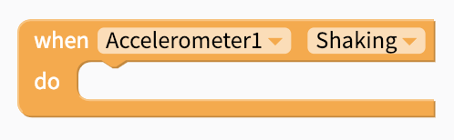
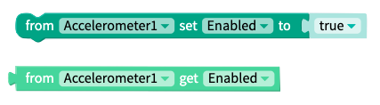

# Accelerometer

## Getting Started 

The accelerometer sensor is used to measure the force of acceleration acting on the phone. The sensor reports this force for each of the three principal axes, the x axis, y axis and, the z axis. The values obtained from the sensor are in metres per second squared, $$m/s^2$$.  

## Events

### Shaking

There may be some instances where you want to start an event by shaking your mobile device or when the mobile device is shook. There is a `Shaking` event that you can add to your blocks that has sensitivity levels of `high`, `medium` and `low`

### Accelerometer Changes

When the accelerometer sensor detects a change in the force acting on the phone the `Changes` event will be fired. Each time the event fires the four associated parameters will be updated.

| **Parameter** | Type | Returns |
| :--- | :--- | :--- |
| `xAcceleration` | Number | Change in speed of the phone, along the x axis, in $$m/s^2 $$  |
| `yAcceleration` | Number | Change in speed of the phone, along the y axis, in $$m/s^2 $$  |
| `zAcceleration` | Number | Change in speed of the phone, along the z axis, in $$m/s^2 $$  |
| `error` | String | Error message from sensor |

## Properties

By default the accelerometer sensor will be turned on, but you can use the `Enabled` property to read its current state and to change its state, i.e turn the sensor on and off.

| Property | Type | Default |
| :--- | :--- | :--- |
| `set Enabled` | Bool | True |
| `get Enabled` | Bool |  |

