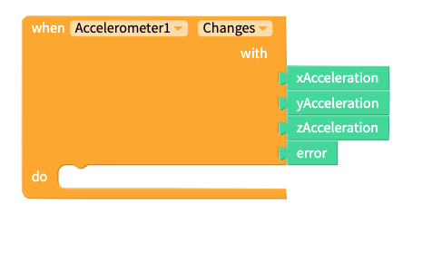
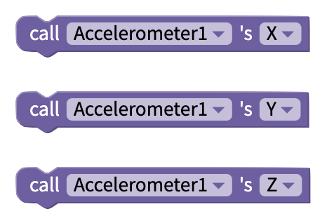
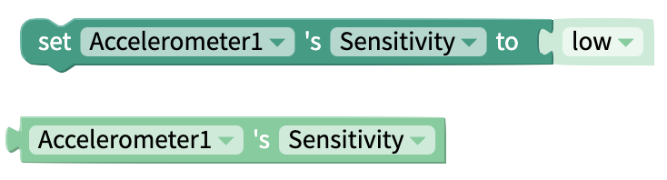

# Accelerometer

## Getting Started&#x20;

The accelerometer sensor is used to measure the force of acceleration acting on the phone. The sensor reports this force for each of the three principal axes, the x axis, y axis and, the z axis. The values obtained from the sensor are in metres per second squared, $$m/s^2$$.\

## Adding an Accelerometer to your app

To add an Accelerometer to your app:

1. Navigate to the **Blocks** tab of your project.
2. Under the App Features heading, locate **Sensors**.&#x20;
3. Click the ⊕ symbol next to Sensor.
4. Select **Accelerometer** from the provided menu.
5. Click **Add**.

You will see a settings panel where you can set:

* The **Name** of the Accelerometer
* Whether the Accelerometer is **Enabled**
* Whether the **Sensitivity** of the Accelerometer is low, medium or high

You can either confirm your choices and create the Accelerometer, or delete the Accelerometer.

.png>)

### Change Settings of Accelerometer

You will see the sensors you have added to your app underneath the Sensors section of your blocks.

\
If you click on the ⚙ icon next to your Accelerometer, you will be able to edit its settings as seen in the panels above. You can click on your Accelerometer's name to access its drawer of blocks.‌

## Properties

| Property    | Description                                                                                                  | Data Type                               |
| ----------- | ------------------------------------------------------------------------------------------------------------ | --------------------------------------- |
| Enabled     | Toggle whether the component is functioning in your app                                                      | True/False                              |
| Sensitivity | Set how sensitive the accelerometer is to movement, where higher sensitivity will react to smaller movements | Select from list: `[low, medium, high]` |

## Blocks

### Events

#### Shaking

There may be some instances where you want to start an event by shaking your mobile device or when the mobile device is shook. There is a `Shaking` event that you can add to your blocks that has sensitivity levels of `high`, `medium` and `low`

.png>)

#### Changes

When the accelerometer sensor detects a change in the force acting on the phone the `Changes` event will be fired. Each time the event fires the four associated parameters will be updated.

| Parameter       | Type   | Returns                                                       |
| --------------- | ------ | ------------------------------------------------------------- |
| `xAcceleration` | Number | Change in speed of the phone, along the x axis, in $$m/s^2$$  |
| `yAcceleration` | Number | Change in speed of the phone, along the y axis, in $$m/s^2$$  |
| `zAcceleration` | Number | Change in speed of the phone, along the z axis, in $$m/s^2$$  |
| `error`         | String | Error message from sensor                                     |

### Functions

#### Get Acceleration on X, Y, Z axes

You can get the values for xAcceleration, yAcceleration and zAcceleration at any time with the following blocks.

### Properties

#### Enabled

By default, the accelerometer sensor will be turned on, but you can use the `Enabled` property to read its current state and to change its state, i.e turn the sensor on and off.

| Property      | Type | Default |
| ------------- | ---- | ------- |
| `set Enabled` | Bool | True    |
| `get Enabled` | Bool |         |

#### Sensitivity

You can use the Sensitivity blocks to set the sensitivity of the Accelerometer and get its current level of sensitivity.

| Property          | Type                        | Default |
| ----------------- | --------------------------- | ------- |
| `set Sensitivity` | one of \[low, medium, high] | low     |
| `get Sensitivity` | one of \[low, medium, high] |         |
