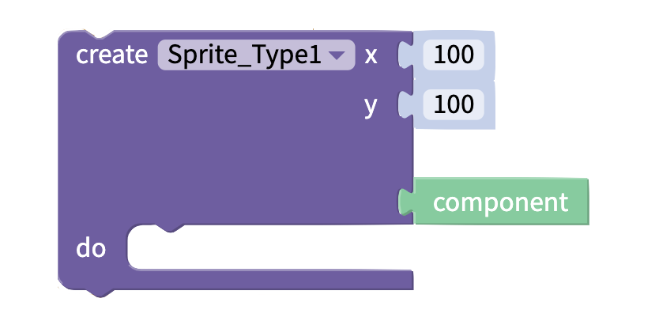

# Add & Remove

### Create Sprite Type 

Adds an instance of the sprite type at the x and y location

### Remove Sprite 

Remove the selected sprite from the canvas

### Get all Sprites in Sprite Type

Get a list of all of the sprites of the selected sprite type

## 

