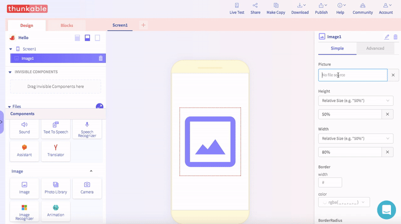
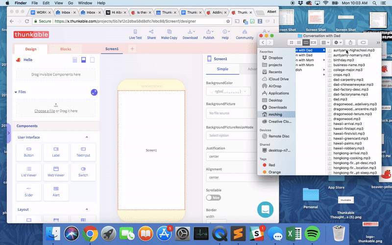
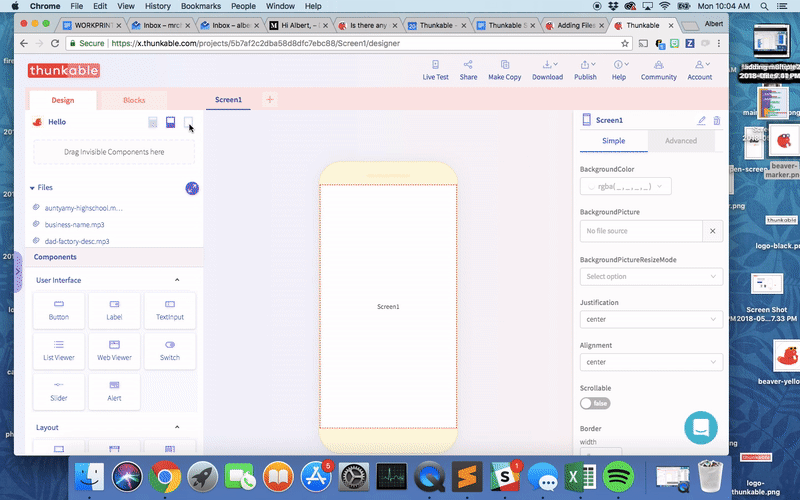

# Adding Files

## Adding a single file

To add a single file like an image or a sound file, simply click on the component that you want to associate with that file and there should be an option to upload your asset directly or type in a url

## Adding multiple files

If you are adding multiple files, we recommend using our drag and drop box located below the component tree \(You may have to hide the add components menu\)

## Managing files

There are [limits to the file size per app](app-limits.md) and to your account overall so we recommend using our file manager to remove any files that you will not use in your app. You can also rename your files here as well.

