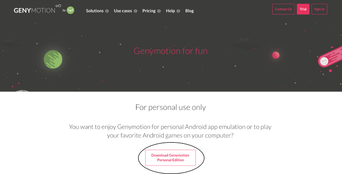
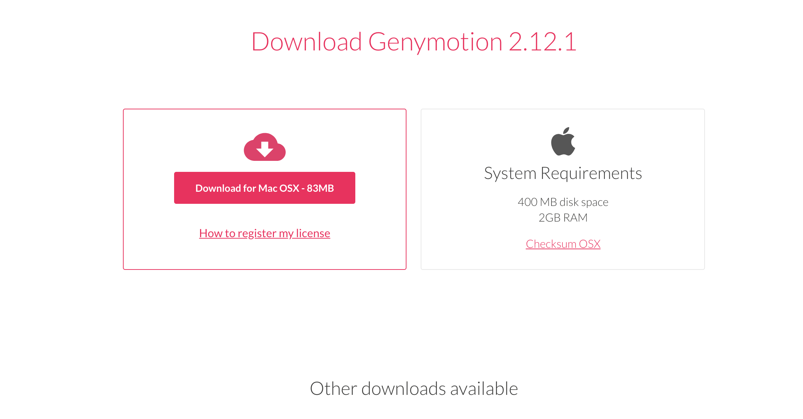
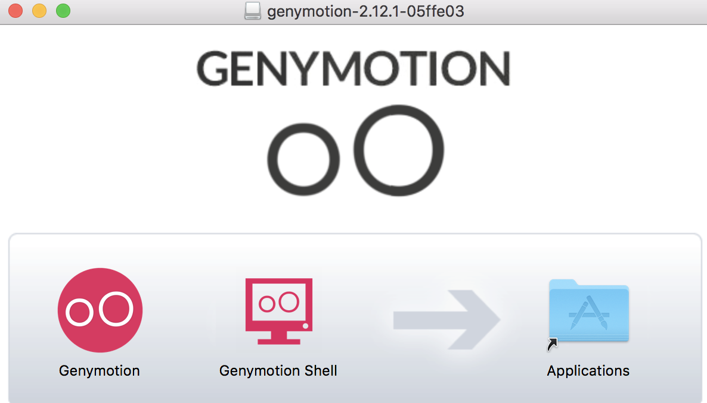
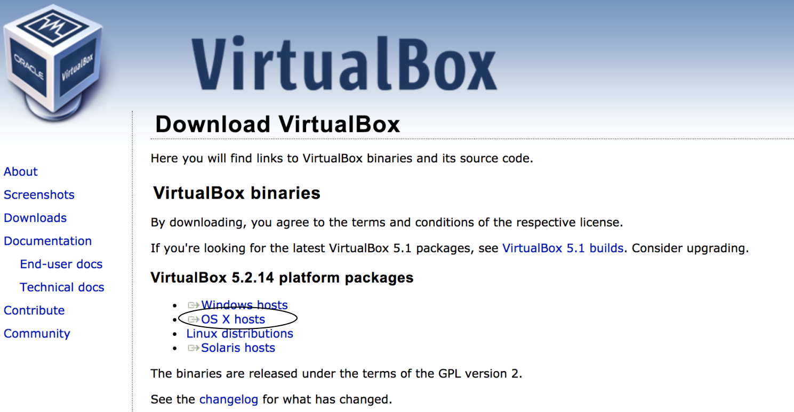
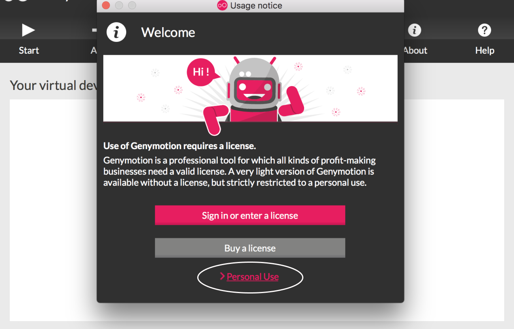
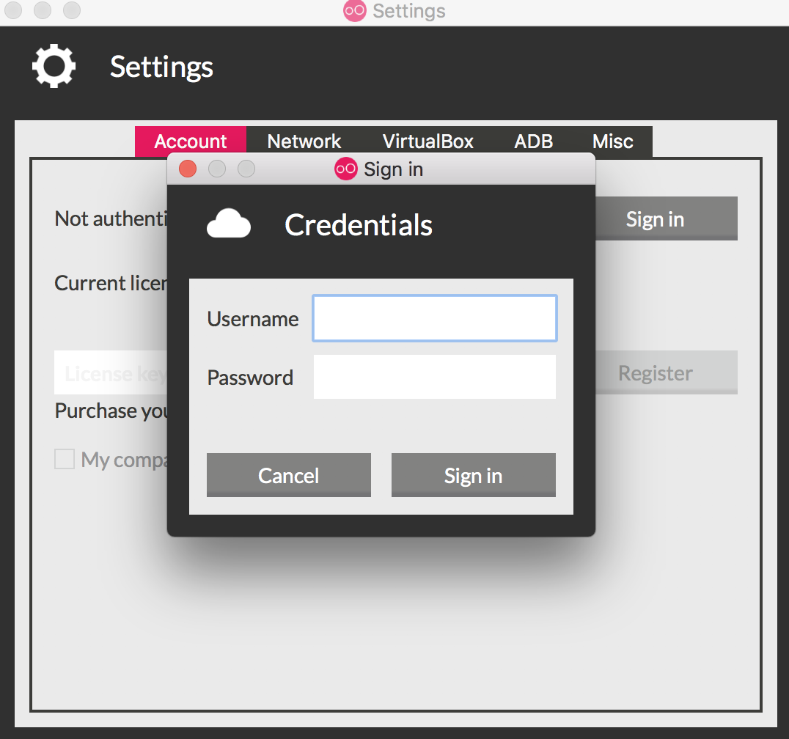
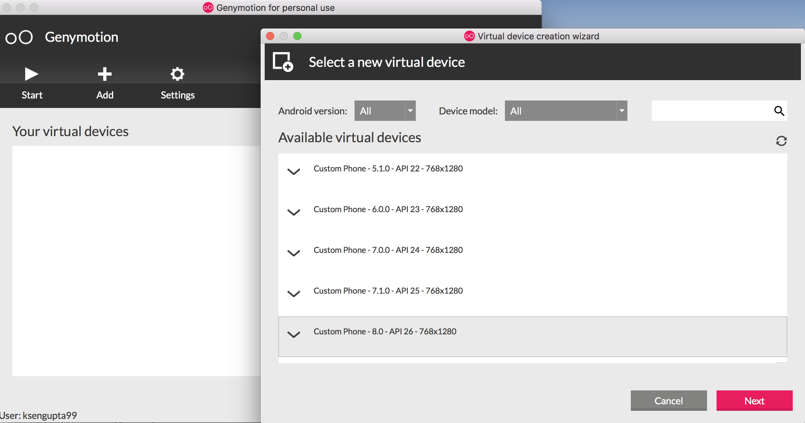
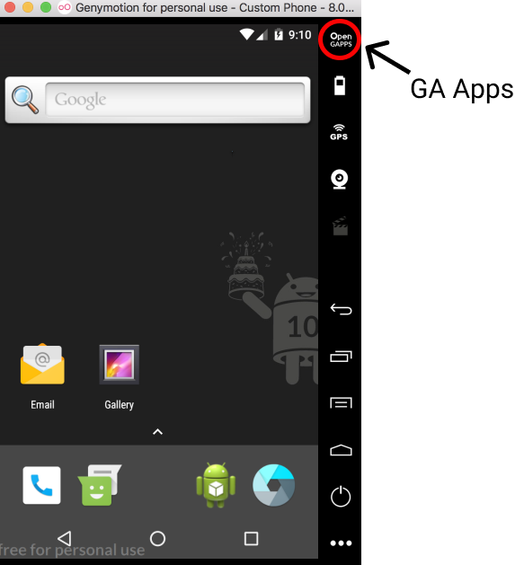
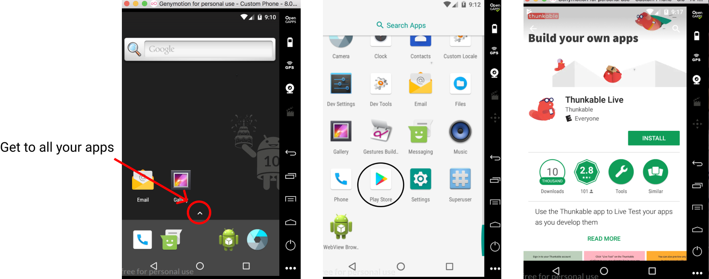
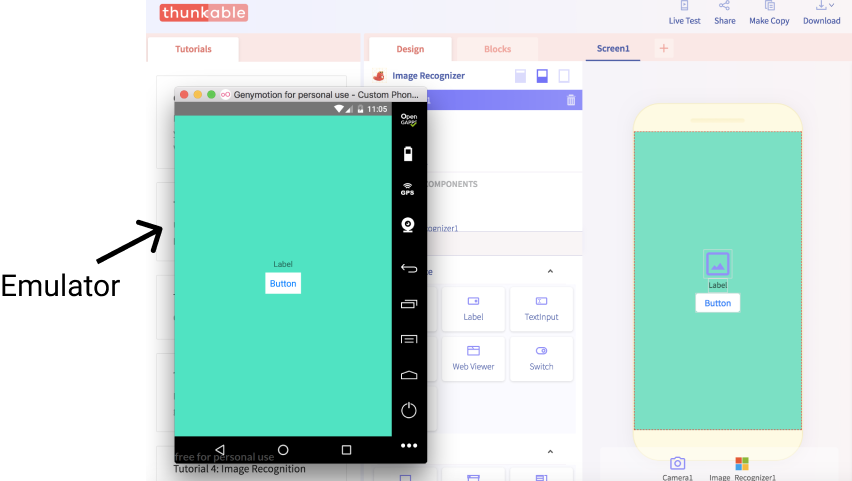

# App Services and Emulators

## Create an Account

Go to [https://www.genymotion.com/fun-zone/](https://www.genymotion.com/fun-zone/) and create an account by clicking the Download Genymotion Personal Edition button.

## Install the Emulator

Click the button that says “Download Genymotion Personal Edition” and install the emulator that fits your system, either Mac, Microsoft Windows or Ubuntu.

## Install VirtualBox

Use this link: [https://www.virtualbox.org/wiki/Downloads](https://www.virtualbox.org/wiki/Downloads) . Download and install the package for your specific system. Follow the directions that are prompted.

**IMPORTANT PLEASE READ:**

**There may be an error in installing for Macs. If so, go to System Preferences → Security & Privacy and you should see a message on the screen that says “System software from developer ‘Oracle America inc.’ was blocked from loading.**

## Open Genymotion

Did you finish downloading both Genymotion and VirtualBox? Now you're ready to download the emulator. After arriving at this screen, click "for personal use" and accept the terms and conditions. Then sign into your account.

## Add and Install a New Phone

Click the add button and install the phone "**Custom Phone 8.0 - API 26"**.

## Open the Virtual Phone

This is your new testing device! Upon getting to the home screen, download the GA apps, the button on the top right corner of the virtual phone. Then restart the device when prompted. This will download the Google Play store and will allow you to retrieve the apps you want.

## Download the Thunkable Live App

Click the up arrow towards the bottom of the screen, located just above the menu bar. This will show you all your apps. Scroll down and open **Google Play.** Search for Thunkable Live in the app store. Continue to install the app.

## Start Live Testing Your Apps!

