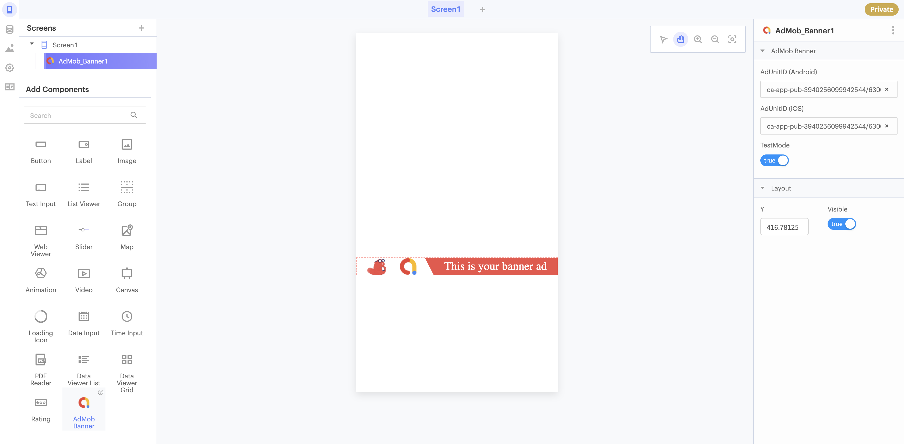
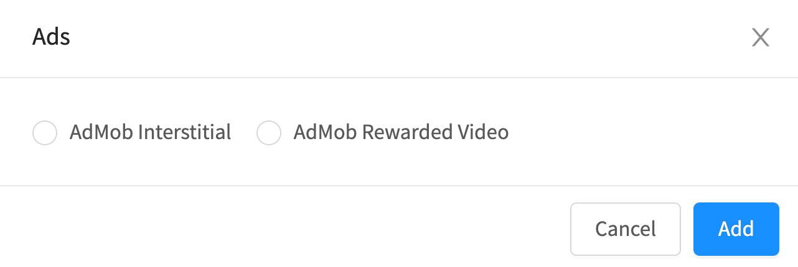
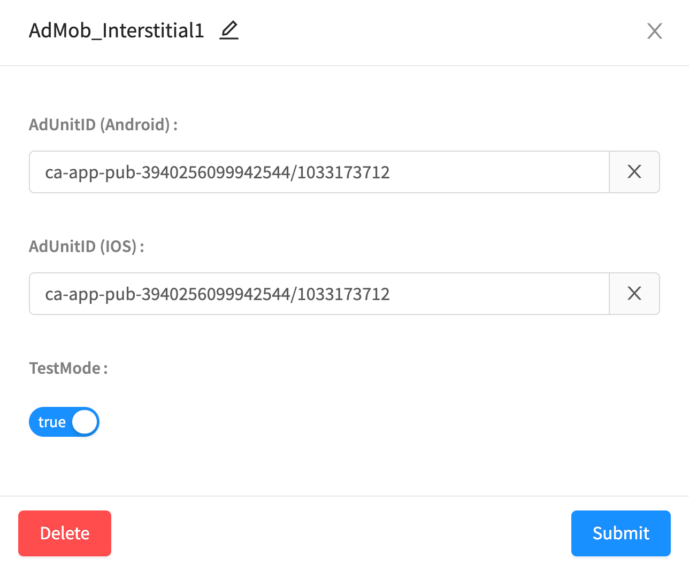
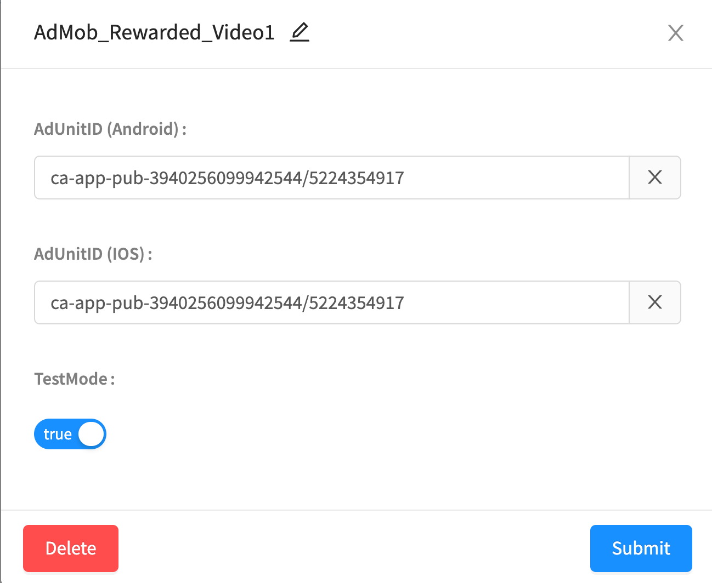

# Ads by AdMob


**AdMob is a**   **component.** All Thunkers can add AdMob to their projects and live test the ads in their apps. PRO Thunkers who [join our MCM network](admob.md#join-thunkables-mcm-network) can download and publish apps that contain ads.


* [Create an AdMob account](admob.md#create-an-admob-account)
* [Banner ads](admob.md#banner-ad)
* [Interstitial ads](admob.md#interstitial-ad)
* [Rewarded video ads](admob.md#rewarded-video-ad)
* [Live Test](admob.md#live-test)
* [Download and publish your app](admob.md#download-and-publish)
* [iOS and AdMob Permissions](admob.md#ios-and-admob-permissions)
* [Troubleshooting](admob.md#troubleshooting)

## AdMob Overview 

AdMob is the most popular ad network for monetizing mobile apps today. 

Apps with large audiences can use AdMob to not only generate revenue for the creator, but in some cases, create better user experiences. For example, users may prefer to watch a [Rewarded Video Ad](admob.md#rewarded-video-ad) to unlock extra content than pay money to unlock extra content.

We **highly recommend** that you only add ads to your app after you have a large audience of users \(otherwise, you won't generate much revenue anyway\).

## Create an AdMob Account

You need an [AdMob account](https://admob.google.com/home/get-started/) to show ads in your project.

Once you have an AdMob account, you will need to paste the following into the [AdMob section of your Project Settings](project-settings.md#admob-settings):

* [iOS app ID](https://support.google.com/admob/answer/7356431?hl=en) \(if publishing to App Store\)
* [Android app ID](https://support.google.com/admob/answer/7356431?hl=en) \(if publishing to Play Store\)
* [Tracking Usage Description](https://developer.apple.com/app-store/user-privacy-and-data-use/) \(if publishing to App Store\)
  * Default value: "This identifier will be used to deliver personalized ads to you."

You will also need individual [Ad Unit IDs](https://support.google.com/admob/answer/7356431?hl=en) for each AdMob component in your project.

## Banner ad

The Banner ad is a rectangular image or text ads that occupy a spot within an app's layout. 

AdMob banner ads are the simplest ad format to implement and are recommended for beginners. No blocks are needed to show your Banner ad to your end users.

The first banner ad will load when ready and will reload a new ad every minute.

There is a maximum of 1 Banner ad allowed per screen. You can show multiple banners in a single multi-screen app.

### Properties

#### AdMob Banner

| Name | Description | Data Type |
| :--- | :--- | :--- |
| Ad Unit ID \(Android\) | [Ad Unit ID](admob.md#create-an-admob-account) for showing your ad on Android devices | Text |
| Ad Unit ID \(iOS\) | [Ad Unit ID](admob.md#create-an-admob-account) for showing your ad on iOS devices | Text |
| Test Mode | Toggle whether real ads or sample ads should display in your app.  **Set this to true while testing your own app.** | True/False |

#### Layout

| Name | Description | Data Type |
| :--- | :--- | :--- |
| Y | Location of top left corner of Banner ad on Y-axis, where the top side is Y=0 | Number |
| Visible | Set whether the Banner ad component is visible | True/False |

## Interstitial Ad

Interstitial ads are full-screen ads that cover the interface of their host app. 

These should displayed at natural transition points in the flow of an app, eg. between activities, between levels in a game. The user can click on or close the ad.

There is a limit of one interstitial ad component per app, but you can show the ad multiple times.

To show an interstitial app, you need to first add the component and then add the [Show Ad block ](admob.md#blocks)after the appropriate event in your app.

### Adding an Interstitial ad to your app

To add an Interstitial ad to your app:

1. Go to your Blocks tab 
2. Click on the icon next to the Ads drawer of blocks
3. Select **AdMob Interstitial**

### Properties

You will see a dialog where you can set the following properties:

| Name | Description | Data Type |
| :--- | :--- | :--- |
| Ad Unit ID \(Android\) | [Ad Unit ID](admob.md#create-an-admob-account) for showing your ad on Android devices | Text |
| Ad Unit ID \(iOS\) | [Ad Unit ID](admob.md#create-an-admob-account) for showing your ad on iOS devices | Text |
| Test Mode | Toggle whether real ads or sample ads should display in your app.  **Set this to true while testing your own app.** | True/False |

### Blocks

#### Events

Use the **when Ad Open** and **when Ad Close** blocks to trigger events to happen when the interstitial ad opens or closes.

#### Functions

Use the **Show Ad** block to show an interstitial ad in your app. If there is an error, the **error** block will catch and return it.

#### Properties

Set and get [properties](admob.md#properties-1) of your Interstitial ad.

Ad Unit ID \(Android\):

Ad Unit ID \(iOS\):

Test Mode:

## R**ewarded Video** Ad

Rewarded Video Ads are full-screen video ads that users have the option of watching in full [in exchange for in-app rewards](https://support.google.com/admob/answer/7313578). 

Rewarded video ads are recommended after a user has completed a heavy task in your app and would be willing to watch a long video to continue. 

There is a limit of one rewarded video ad component per app, but you can show the ad multiple times.

To show a rewarded video app, you need to first add the component and then add the [`Show Ad` block ](admob.md#rewarded-video-ad-blocks)after the appropriate event in your app. 

You'll then want to add a [`Reward User` event](admob.md#rewarded-video-ad-blocks) to reward your user in the app. 

### Adding a Rewarded Video ad to your app

To add an Rewarded Video ad to your app:

1. Go to your Blocks tab 
2. Click on the icon next to the Ads drawer of blocks
3. Select **AdMob Rewarded Video**

### Properties

You will see a dialog where you can set the following properties:

| Name | Description | Data Type |
| :--- | :--- | :--- |
| Ad Unit ID \(Android\) | [Ad Unit ID](admob.md#create-an-admob-account) for showing your ad on Android devices | Text |
| Ad Unit ID \(iOS\) | [Ad Unit ID](admob.md#create-an-admob-account) for showing your ad on iOS devices | Text |
| Test Mode | Toggle whether real ads or sample ads should display in your app.  **Set this to true while testing your own app.** | True/False |

### Blocks

#### Events

Use the **when Ad Close** block to trigger events to happen when the interstitial closes.

#### Functions

Use the **Show Ad** block to show the ad video, and the **Reward User** block to reward the user after displaying the video.

#### Properties

Set and get [properties](admob.md#properties-2) of your Rewarded Video ad.

Ad Unit ID \(Android\):

Ad Unit ID \(iOS\):

Test Mode:

## Live Test 

For your convenience, we have provided a test  `Ad Unit ID` for you to see how a particular ad format may appear in your app. 

During live test, all AdMob ads will be set to `test mode = true`, which means clicks and impressions will not be counted. 

This is true even if you add your own `Ad Unit ID` and set `test mode = false`.

## Download and Publish  

### Set `test mode = false` 

To protect the integrity of your account, we have by default set `test mode = true`.

When you are ready activate your ads when you publish, you'll simply need to set `test mode = false`.


Downloading your app with `test mode = false`to generate more impressions/clicks for your ads is considered [invalid traffic](https://support.google.com/admob/answer/3342054?hl=en&ref_topic=9756841) and may lead to your AdMob account being suspended or disabled.


### Join Thunkable's MCM Network

To download and publish Thunkable apps that contain ads, you must be a member of Thunkable's MCM network. 

An invitation to this network will be sent to you the first time you [submit your app for review](admob.md#submit-your-app-for-review).

By joining this network, you consent to sharing 10% of your AdMob revenue with Thunkable to support maintenance costs.

### Submit Your App For Review

Thunkable has partnered with AdMob to ensure that apps created on our cross-platform use ads to monetize apps in a way that both provides high quality traffic to advertisers and a high quality user experience for end users of apps.

All apps with AdMob must be first approved by Thunkable before they can be downloaded or published. AdMob has its [own policies](https://support.google.com/admob/answer/7313578) that an app must comply with including but not limited to: 

* Inappropriate content that advertisers do not want to be associated with e.g. copyrighted, adult
* Invalid activity that lowers the quality of traffic to advertisers e.g. ad placements that encourage clicks

Thunkable will review apps for compliance with AdMob policies but will specifically **reject apps** that are:

* Incomplete apps - apps that are still in their early stages and won't show how ads will be used in the app
* Earning apps - apps that encourage users to clicks ads in exchange for some form of payment
* Auto-impression apps  - apps that repeatedly load banner ads in the background of apps
* Apps that show an Interstitial ad or Video ad on startup - these ads must be implemented properly in your app

**Thunkable reserves the right to change an app's approval status subject to any violation of our guidelines.**

If your app is rejected, you will be provided with an explanation and a recommendation for changes to make to your app to get it approved.

You are welcome to submit the same app for approval multiple times.

### **Build Your App!**

Once approved, apps can be downloaded and published without further review.

## iOS and AdMob Permissions

With iOS 14.5, your app users will be asked if they consent to an advertising identifier being used to show them personalized ads. This is what the dialog looks like:

  
You can set a personalized Tracking Usage Description in your [Project Settings](https://app.gitbook.com/@thunkable/s/thunkable-docs/~/drafts/-M_Zx-u6yI9rGYrOR5dc/projects/settings#tracking-usage-description-ios-only).‌  
  
If this permission is declined, your app will still show ads. These will be more generic ads and won't be targeted at the user.  
  
If the user has turned off the `Allow Apps to Request to Track` property in their device settings, this permission will be declined by default and they will not see this dialog.

## **Troubleshooting**

If you are not seeing ads appear in your app, it may be due to the following reasons:

* Your AdMob account has been disabled due to a policy violation. Please sign in to your AdMob account
* Your AdMob component property `test mode = true`. To activate, you'll need to flip the switch to `test mode = false`
* Your  `Ad Unit ID` has not yet been activated. This may take up to a few hours
* You have entered the App ID or the Publisher ID instead of the Ad Unit ID which begins with `ca-app-pub-xxx`
* Please check the mobile device internet connectivity or disable ad blockers on the mobile device
* Your setup is correct. The issue is that AdMob does not always have an ad to return for every request. This may happen particularly if you have just registered your AdMob publisher ID, as it takes some time and multiple requests before the new ID starts returning ads
* [Check the community forum for other potential errors](https://community.thunkable.com/)

