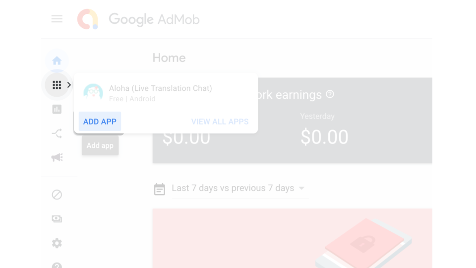
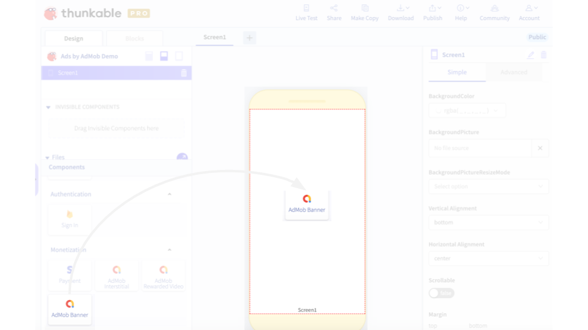

# Ads by AdMob

AdMob is the most popular ad network for monetizing mobile apps today. Apps with large audiences can use AdMob to not only generate revenue for the creator but in some cases \(like with AdMob Rewarded Video\), create better user experiences than the alternative \(e.g. in-app purchases to play a new game level\). 

We highly recommend that you only add ads to your app after you have a large audience of users \(otherwise, you won't generate much revenue anyway\).

* [AdMob ad formats](admob.md#admob-ad-formats)
* [Apps with AdMob review guidelines](admob.md#apps-with-admob-review-guidelines)
* [Sample apps - coming soon!](admob.md#sample-apps-coming-soon)
* [Set up](admob.md#set-up)
* [Banner ad](admob.md#banner-ad)
* [Interstitial ad](admob.md#interstitial-ad)
* [Rewarded video ad](admob.md#rewarded-video-ad)
* [Troubleshooting](admob.md#troubleshooting)


AdMob is our first premium component, available to only PRO members. All Thunkers can  add AdMob to their app projects and live test the ads on test mode but only PRO Thunkers can download and publish their apps with AdMob.

All apps must be approved by Thunkable subject to our [review guidelines](admob.md#apps-with-admob-review-guidelines). If you are a PRO Thunker, you can [submit your app for review here](https://airtable.com/shr3qok3ARKXY7cBt). Once approved, apps can be downloaded and published without further review.

Thunkable reserves the right to change an app's approval status subject to any violation of our guidelines.

Thunkable also reserves the right to charge up to a 10% maintenance fee for revenue earned via AdMob. \(During the initial period, Thunkable will not charge a maintenance fee\)


## AdMob ad formats

|  | Banner ad | Interstitial ad | Rewarded video ad |
| :--- | :--- | :--- | :--- |
| Description | Banner ads are rectangular image or text ads that occupy a spot within an app's layout. They stay on screen while users are interacting with the app, and can refresh automatically after a certain period of time. If you're new to mobile advertising, they're a great place to start. | Interstitial ads are full-screen ads that cover the interface of their host app. They're typically displayed at natural transition points in the flow of an app, such as between activities or during the pause between levels in a game. When an app shows an interstitial ad, the user has the choice to either tap on the ad and continue to its destination or close it and return to the app. | Full-screen video ads that users have the option of watching in full [in exchange for in-app rewards](https://support.google.com/admob/answer/7313578).  |
| Recommended for | Single-screen apps | Multi-screen apps | Multi-level games |
| Limit | 1 per screen | 1 per app | 1 per app |

## Apps with AdMob review guidelines

Thunkable has partnered with AdMob to ensure that apps created on our cross-platform use ads to monetize apps in a way that both provides high quality traffic to advertisers and a high quality user experience for end users of apps.

All apps with AdMob must be first approved by Thunkable before they can be downloaded or published. AdMob has its [own policies](https://support.google.com/admob/answer/7313578) that an app must comply with including but not limited to: 

* Inappropriate content that advertisers do not want to be associated with e.g. copyrighted, adult
* Invalid activity that lowers the quality of traffic to advertisers e.g. ad placements that encourage clicks

Thunkable will review apps for compliance with AdMob policies but will specifically **reject apps** that are:

* Earning apps - apps that encourage users to clicks ads in exchange for some form of payment
* Auto-impression apps  - apps that repeatedly load banner ads in the background of apps

Once approved, apps can be downloaded and published without further review.

**Thunkable reserves the right to change an app's approval status subject to any violation of our guidelines.**

## **Sample apps - coming soon!**

## **Set up**

Before you can start testing ads in your app, you'll need to complete a few steps on the AdMob side to retrieve an `Ad Unit ID` \(which you'll need to enter into Thunkable\). It will take up to an hour for `Ad Unit ID` to be activated and start showing ads

* [Create an AdMob account](https://admob.google.com/home/)
* Set up an app
* Create an ad unit and retrieve the `Ad Unit ID`

Below is a visual walkthrough of the steps after you have created your AdMob account:

## Banner ad

AdMob banner ads are the simplest ad format to implement and are recommended for beginners.

### Interstitial ad

### R**ewarded video** ad

### **Troubleshooting**

\*\*\*\*

\*\*\*\*

