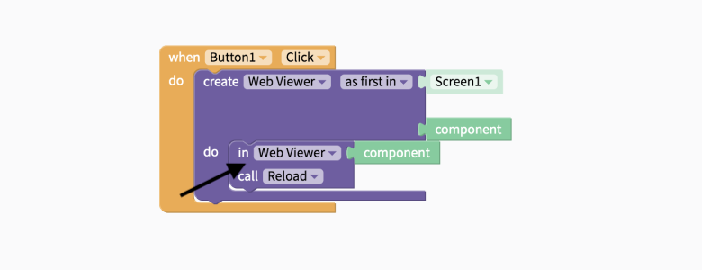

# "Any Component" Blocks

The components in the ‘Any Component’ drawer are great tools to use instead of repeatedly using the same combination of blocks. They will also help you use fewer blocks in your app.

For example, to change the colour of any button on the screen to blue \(the blocks on the left\) we have to use 6 blocks. Using the ‘Any Component’ Blocks \(on the right\), we only need to use 2 blocks. ****

## **What is the Generic Event Block?**

With the Generic Event block, you can set when an event will take place.   
****

For example, in the picture below, any button you click on the screen will change the text of Label1 to be “Thunking Is Fun!”. 

For example, in the picture below, any button you click on the screen will change the text of Label1 to be “Thunking Is Fun!”.

## **Using the Generic Event Block**

With the first dropdown menu, you can select what type of component you want to handle events for.

With the second dropdown menu, you can choose when an event will take place. 

## **The Component Item Block**

If you want to customize the button that you clicked on the screen, you can use this block.

With these blocks, anytime a button is clicked, the text of that button will be set to “I Love Thunkable!”.

## **What is the Create Block?**

With the Create Block, you can program your app to create visible components \(things you can see--like button or images\) while it is running.  

When you use the create block, your app will automatically create something. For example:  
****

This picture shows that when Screen1 Opens, your app will create a button and put it on Screen1.

## **Using the Create Block**

With the first dropdown menu, you can select what type of visible component you want to create. 

With the second dropdown menu, you can select where you want to position the component you are creating on the app’s screen.

_**Note: The options in the second and third drop down will vary depending on which component you select from the first dropdown.**_  
  
****The following block creates a new button and places it as the first item on Screen1.

The table below explains the different block options:

| **Property** | **Description** |
| :--- | :--- |
| **As first in** | **This creates and positions the component as the first item in the specified row, column or screen.** |
| **As last in** | **This creates and positions the component as the last item in the specified row, column or screen.** |
| **Before** | **This creates and positions the component before the component selected in the third dropdown menu.** |
| **After** | **This creates and positions the component after the component selected in the second dropdown menu.** |

_**Note: You can replace the third dropdown with any block that represents a visible component using the component block. It can also be a variable function parameter, or any block whose value is a component.**_

## **The Component Item Block**

If you want to customize the component you just created, you can use this block.

These blocks say, when any button on the screen1 is clicked, create a new label. Next, set the new label’s text to “I was just created!”.   
 

## **What is the Clone Block?**

The clone block makes a copy of an existing component in your app. For example, if you have a button on your screen and want to create another button that looks exactly the same, you can use the clone block to do that.

You can use the clone block instead of repeatedly using the same combination of blocks. This will also help you use less blocks.

_**Note: You cannot clone screens and invisible components with the clone block.**_

## **Using the Clone Block**

With the first dropdown menu, you can select the component that you want to clone.

With the second dropdown menu, you can select where you want to position the cloned component relative to another component on the app’s screen.

| **Property** | **Description** |
| :--- | :--- |
| **As first in** | **This clones and positions the component as the first item in the specified row, column or screen.** |
| **As last in** | **This clones and positions the component as the last item in the specified row, column or screen.** |
| **Before** | **This positions the cloned component before the component selected in the third dropdown menu.** |
| **After** | **This positions the cloned component after the component selected in the third dropdown menu.** |

_**Note: The options in the third drop down will vary depending on which component you select from the first dropdown**_**.**

## **The Clone Item Block**

If you want to customize a cloned component, you can use this block. 

When Screen1 opens, these blocks will tell your app to clone Button2, and then set the clone’s text to be “I was just cloned!” \(Try this out for yourself [here](https://x.thunkable.com/copy/1b3d78230c9ce0d91ea6c47e22703800)\).

## **What is the Generic Method Block** 

The Generic Method Block can be used to call functions for components that were made with the clone or create blocks. 

The blocks above say that when Button1 is clicked, create a Web Viewer component and call the reload function for it.

## **Using the Generic Method Block**

With the first dropdown menu, you can select the component you want to call a function for. 

The second dropdown menu allows you to select which function you want to call.

_**Notes: The options in the second drop down will vary depending on which component you select from the first dropdown. Also, the component you plug-in needs to be of the same type as the one in the first dropdown.**_

## What is the Generic Set Block?

The Generic Set Block allows you to change properties such as text and colour of any component that is on the app’s screen.

Using the Generic Set Block

There are two ways to change the text of a component using the Generic Set Block.

1. Use the dropdown menu to select the component whose text you want to set 

2. You can use the Component Item Block with the Generic Set Block     to change the text of the component that was clicked.

## **What is the Generic Get Block?**

The Generic Get Block allows you to get properties \(such as text and color\) of any component that is on the app’s screen. ****

You can use the dropdown menu to select the component whose text you want to get.

## **Using the Generic Get Block**

There are two ways to get the text of a component using the Generic Get Block. 

1. Use the dropdown menu to select the component you want to get the text for.

2\) You can use the Component Block, as well as the Component Item Block, with the Generic Get Block to select the component you want to get the text of.

## **What is the ‘All Components in Container’ Block?**

The ‘All Components in Container’ block groups together all the visible components in a container \(ie. Row, Column or Screen\) that are of the same type, in a list.

In the block above, all of the buttons that are on Screen1 are stored in list.

## Using the ‘All Components in Container’ Block?

The ‘All Components in Container’ block can be used with the loop block from the control drawer.

The combination of blocks above goes through all the buttons on screen1 and sets the text of each button to “Thunkable!”.

## **What is the Remove Block?**

The Remove Block allows you to delete a component from your app. You can delete a component that you dragged out from the designer, cloned, or made with the create block.

##  **Using the Remove Block?**

There are two ways to delete a component using the Remove Block.

1. Use the dropdown menu to select the component you want to remove from the app.

   2. You can use the Component Item Block with the Remove Block to remove    the component that was clicked. You can also use a variable, function parameter or any block whose value is a component.

## **The Component Block**

The Component Block has a dropdown menu which lists all the components that are on the screen.

 You can select one of the components from the menu and use it within any of the blocks that have an input for a component. Some examples include: the clone, create or generic event block.  

With these blocks, when Screen1 is opened, the Component Block sets the text of Button3 to be “I Love Thunkable!”.  

