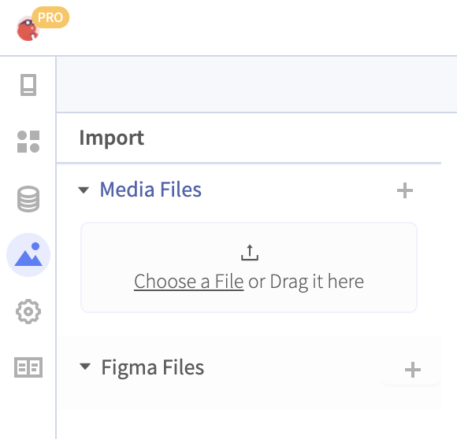
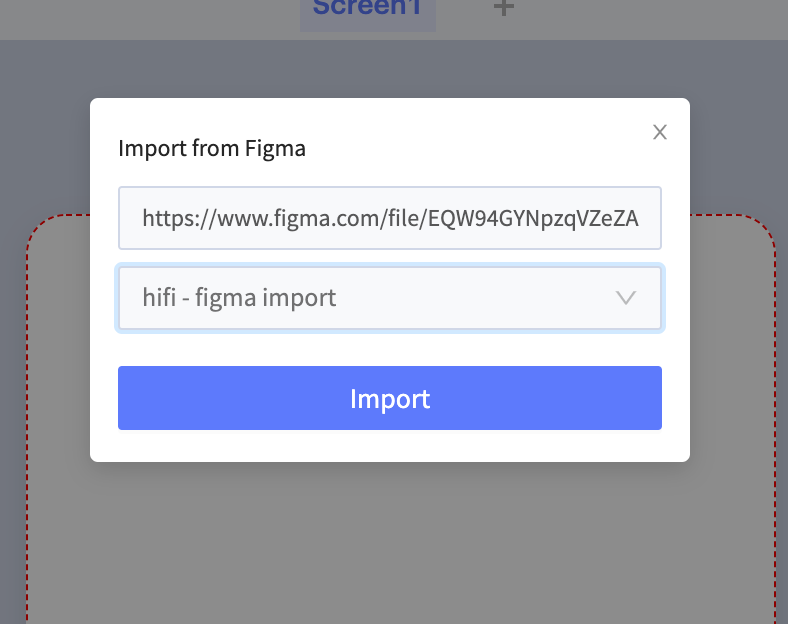

# Figma Integration

## Importing a Figma File

You can import a Figma file into your Thunkable project.&#x20;

Click on the Assets tab and click the + icon next to the text **Figma Files**.

You will be asked to Authenticate with your Figma account. You will only need to do this once.

Paste in the URL of your Figma Project and select a Page in the dropdown menu.&#x20;


At the moment, we are only supporting imports for mobile designs at 375x667 px in portrait mode.&#x20;


The Figma importer will add all Artboards in a single page, so we recommend creating a designated Page in Figma with the Artboards you intend on importing. &#x20;

### What gets imported?

Thunkable imports your Figma files in a way that best preserves your original designs.&#x20;

Shapes such as rectangle or a circle will be imported as a shape. \
You can continue to edit its style within Thunkable. \
Images and text will be imported as a svg and saved like a normal [asset](../settings/assets.md) that has been uploaded to Thunkable. \
We have done this intentionally to preserve the original font styles. \
If you want text to be editable, we recommend you replace that image with a Thunkable [label](ui-components/basic-components/label.md).&#x20;

## Supported Objects

The following Figma objects are supported by the integration:&#x20;

* Canvas
* Component
* Ellipse
* Frame
* Group
* Instance
* Line
* Rectangle
* Text
* Vector

## Updating a file

As you change and update your original designs, keep Thunkable up to date by re-syncing a Screen.

Find your imported Screen name in the Design tab and click the 🔄 icon.


There might be a few differences with your Figma file and the output in Thunkable. Re-syncing your Screen with Figma may improve your imported Screen's appearance!


## Blocks

All imported Figma items will have some standard blocks.&#x20;

You can use these imported components as a button by adding a `Click` block. You can also choose to change its background color, or add text or a picture, among other actions.

