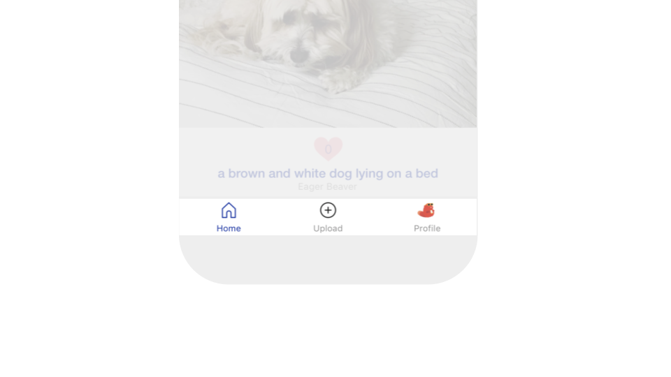

# Screens and Navigators

## Screens&#x20;

To go from an idea to an app, we strongly recommend sketching out your vision using the below app templates. It's important to design a roadmap for how people will interact with your app.&#x20;

.png>)


[screen.md](screen.md)


## Arrange Screens with Navigators

Most apps navigate through screens using navigators. Four navigator options are available in Thunkable: bottom tab, top tab, drawer, and stack navigators.&#x20;

### Bottom Tab Navigator

This navigator allows your app's user to change screens by clicking on icons at the bottom.&#x20;


[bottom-tab-navigator.md](../../bottom-tab-navigator.md)


### Top Tab Navigator

This navigator allows your app's user to change screens by clicking on icons at the top.&#x20;


[top-tab-navigator.md](../../top-tab-navigator.md)


### Drawer Navigator

This navigator pulls out a side menu or drawer of navigation options for the app user to select.


[drawer-navigator.md](../../drawer-navigator.md)


### Stack Navigator

This navigator stacks screens from left to right or top to bottom.

<figure><figcaption></figcaption></figure>


[stack-navigator.md](stack-navigator.md)

