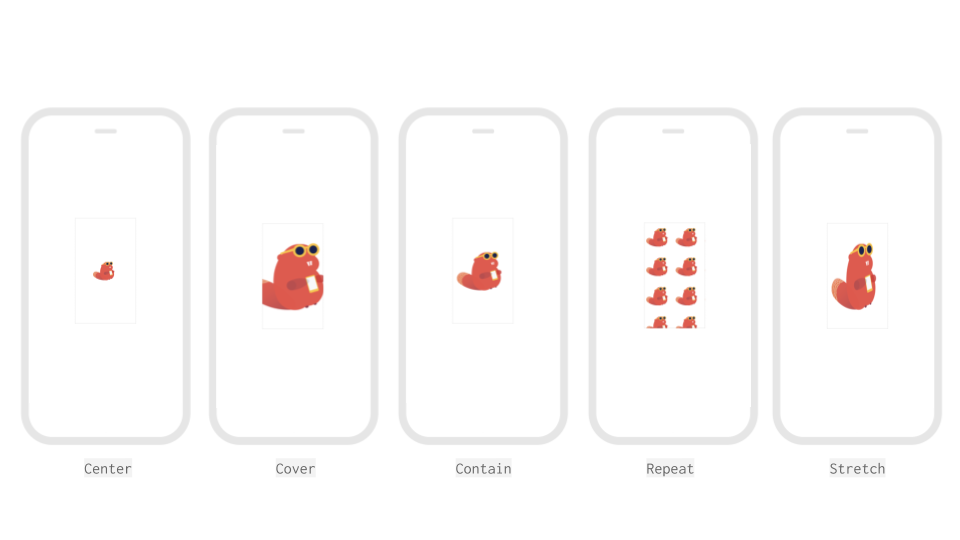

# Image Component

## Overview

The image component is used to display visual content, such as pictures, icons, logos, and other types of images, within the user interface of an app. The image component is foundational in creating visually appealing and engaging mobile app interfaces.

<figure><figcaption></figcaption></figure>

## Properties

You can customize your image using the following properties:&#x20;

### Image

| Property            | Value                                                                                | Description                                                                                                                                                |
| ------------------- | ------------------------------------------------------------------------------------ | ---------------------------------------------------------------------------------------------------------------------------------------------------------- |
| Picture             | 
PNG, JPG, GIF, SVG, etc. Can also use a URL that ends in a file extension.
 | The image file displayed in the image component.                                                                                                           |
| Picture Resize Mode | Select from: cover, contain, stretch, repeat, and center.                            | Define how the image is displayed if the file and the image component have different dimensions/aspect ratios. See the definitions of each setting below.  |

#### Picture Resize Mode

* **Center:** The image is displayed at its original size within the container, and it is centered both vertically and horizontally. This means that if the image is larger than the container, parts of it may extend beyond the container's edges.
* **Cover:** The image is resized to completely cover the container while maintaining its aspect ratio. This mode ensures that the entire container is filled with the image, and any excess image parts are cropped if necessary. This can result in parts of the image being clipped.
* **Contain:** The image is resized to fit entirely within the container while maintaining its aspect ratio. This mode ensures that the entire image is visible within the container, and it may result in empty space around the image if the container's aspect ratio differs from the image's aspect ratio.
* **Repeat:** The image is tiled or repeated to fill the entire container, both horizontally and vertically. This mode is often used for creating patterns or backgrounds that seamlessly repeat across the container.
* **Stretch:** The image is resized to fully cover the container without maintaining its original aspect ratio. This can distort the image and may result in an unnatural appearance, so it's generally not recommended for most scenarios.

When working with these resize modes, it's important to consider the context of your app's design and the type of content you're displaying. Different situations might call for different resize modes to achieve the desired visual outcome. For instance, cover might be suitable for background images, while contain could work well for displaying profile pictures. Always strive to maintain a visually pleasing and user-friendly experience while keeping the specific characteristics of each resize mode in mind.

### Layout

| Property    | Value            | Desciption                                                                                              |
| ----------- | ---------------- | ------------------------------------------------------------------------------------------------------- |
| X           | coordinate value | Position of the upper left corner of the image on the X-axis, where the left side of the screen is X=0. |
| Y           | coordinate value | Position of the upper left corner of the image on the Y-axis, where the top of the screen is Y=0.       |
| Height      | number in pixels | The image's height is defined by a custom number of pixels.                                             |
| Width       | number in pixels | The image's width is defined by a custom number of pixels.                                              |
| Resize Mode | Stretch          | Stretches the image to fit the dimensions of the device's screen.                                       |
| Resize Mode | Float in Place   | Renders the image in the same aspect ratio as the design, regardless of the device size.                |

### Style

| Property        | Value                    | Description                                                                                                |
| --------------- | ------------------------ | ---------------------------------------------------------------------------------------------------------- |
| Visible         | visible                  | Users can see the image.                                                                                   |
| Visible         | invisible                | Users cannot see the image.                                                                                |
| Border: Color   | color                    | The image's border is the color selected.                                                                  |
| Border: Width   | number in pixels         | The width of the image's border is defined by a custom number of pixels.                                   |
| Border: Radius  | number in pixels         | The radius of the image border’s corners is defined by a custom number of pixels.                          |
| Shadow: Color   | color                    | The image's shadow is the color selected.                                                                  |
| Shadow: Opacity | number between 0 and 100 | The opacity of the image's shadow.                                                                         |
| Shadow: Radius  | number in pixels         | The radius of the image shadow’s corners is defined by a custom number of pixels.                          |
| Shadow: Offset  | number in pixels         | How far the image's shadow should be offset, in height and width, is defined by a custom number of pixels. |

## Image Blocks

To access the blocks specific to the switch component:

1. On the Design tab, add a **Image** component to a screen.
2. Navigate to the **Blocks** tab.
3. In the component tree on the left, click the name of the image component.
4. A drawer of image-specific blocks opens.

| Block Image                                              | Description                                                                                                        |
| -------------------------------------------------------- | ------------------------------------------------------------------------------------------------------------------ |
| .png>)          | This event will fire when the user clicks on the image.                                                            |
|                | Set the image component's Picture.                                                                                 |
|                | Get the image component's Picture.                                                                                 |
|          | Set the image component's [resize mode](image-1.md#picture-resize-mode)                                            |
| .png>)   | Get the image component's [resize mode](image-1.md#picture-resize-mode)                                            |
|          | Set the image component's height.                                                                                  |
|          | Get the image component's height.                                                                                  |
|  | Returns the height of the image component in pixels after it has been rendered on-screen.                          |
|           | Set the image component's width.                                                                                   |
|           | Get the image component's width.                                                                                   |
|   | Returns the width of the image component in pixels after it has been rendered on-screen                            |
|         | Set whether the image component is visible on the screen.                                                          |
|         | Get whether the image component is visible on the screen.                                                          |
|               | Set the position image the upper left corner of the image on the X-axis, where the left side of the screen is X=0. |
|               | Get the position of the upper left corner of the image on the X-axis, where the left side of the screen is X=0.    |
|               | Set the position of the upper left corner of the image on the Y-axis, where the top of the screen is Y=0.          |
|               | Get the position of the upper left corner of the image on the Y-axis, where the top of the screen is Y=0.          |

