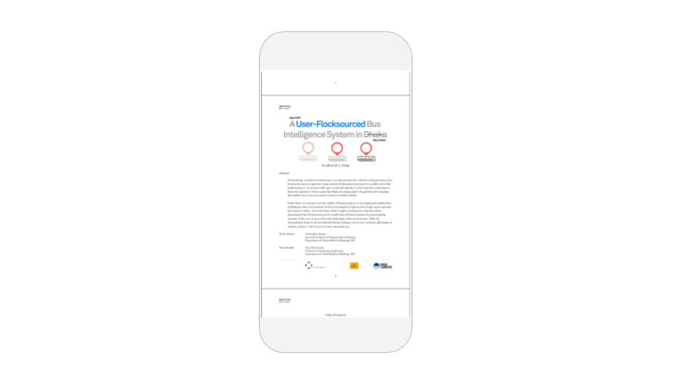

# PDF Reader Component

## PDF Reader Overview

Allow your users to view your favorite PDFs -- legal contracts, art posters or maybe even a PhD dissertation -- all from the convenience of your app

## Properties

### PDF Reader

| Property | Description                           | Data Type                        |
| -------- | ------------------------------------- | -------------------------------- |
| File     | PDF to be displayed in the PDF Reader | PDF file or URL ending in `.pdf` |

There are two ways to set a file to display in the PDF Reader.

#### Upload PDF

You can upload a PDF as an [Asset](../../../settings/assets.md) to your app and display it in the PDF Viewer. Be careful of the Thunkable 50 MB [app size limit](../../../settings/assets.md#app-size-limits-50-mb-per-app) if you choose to upload a file to your project.

#### Use URL

You can enter a URL that points to a PDF on the web to display in your PDF. Make sure this URL ends in `.pdf`

<figure><figcaption></figcaption></figure>

Once you upload the PDF, you will be able to view it in your app and pinch to zoom in.&#x20;

### Layout

| Property    | Description                                                                          | Data Type                                    |
| ----------- | ------------------------------------------------------------------------------------ | -------------------------------------------- |
| X           | Location of top left corner of PDF Reader on X-axis, where the left hand side is X=0 | Number                                       |
| Y           | Location of top left corner of PDF Reader on Y-axis, where the top side is Y=0       | Number                                       |
| Height      | Height of PDF Reader in pixels                                                       | Number                                       |
| Width       | Width of PDF Reader in pixels                                                        | Number                                       |
| Resize Mode | Define dimensions of the PDF Reader component/container                              | Select from list `[Stretch, Float in Place]` |

## Blocks

### Properties

Set and get [properties](pdf-reader.md#properties) of the PDF Reader.

#### File&#x20;

#### Computed Height and Width&#x20;

Returns the height/width of the PDF Reader on the device screen in pixels.

.png>)

#### Visible

.png>)

