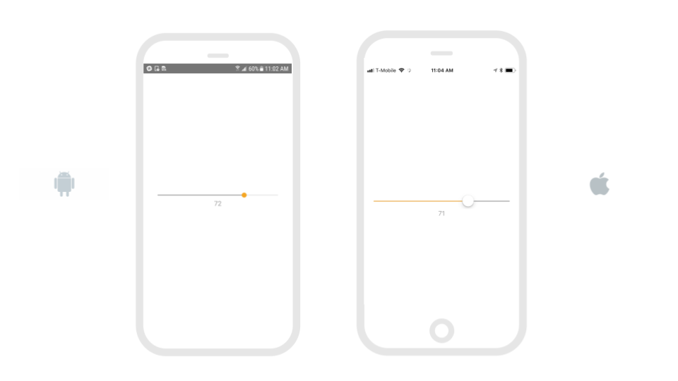
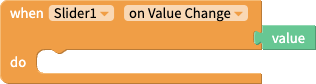
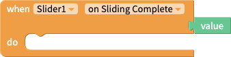
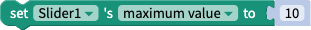
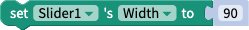

---
layout:
  title:
    visible: true
  description:
    visible: false
  tableOfContents:
    visible: true
  outline:
    visible: true
  pagination:
    visible: true
---

# Slider Component

## Overview

The slider component is a horizontal track with a control, called a thumb, that app users can adjust between a minimum and maximum value. As a slider’s value changes, the portion of track between the minimum value and the thumb fills with color..

## Properties

### Slider

| Property            | Value      | Description                                                                             |
| ------------------- | ---------- | --------------------------------------------------------------------------------------- |
| Value               | Number     | Initial value of the slider                                                             |
| Step                | Number     | Step between values on the slider                                                       |
| Minimum Value Range | Number     | Minimum value the user can select. Must be less than Maximum Value.                     |
| Maximum Value Range | Number     | Maximum value the user can select. Must be greater than Minimum Value.                  |
| Min Track           | Color      | Color of slider track between minimum value and current value                           |
| Max Track           | Color      | Color of slider track between current value and maximum value                           |
| Thumb Color         | Color      | Color of the slider thumb widget                                                        |
| Disabled            | True/False | A disabled component is temporarily inactive and cannot be interacted with by the user. |

### Layout

| Property    | Value            | Desciption                                                                                               |
| ----------- | ---------------- | -------------------------------------------------------------------------------------------------------- |
| X           | coordinate value | Position of the upper left corner of the slider on the X-axis, where the left side of the screen is X=0. |
| Y           | coordinate value | Position of the upper left corner of the slider on the Y-axis, where the top of the screen is Y=0.       |
| Height      | number in pixels | The slider's height is defined by a custom number of pixels.                                             |
| Width       | number in pixels | The slider's width is defined by a custom number of pixels.                                              |
| Resize Mode | Stretch          | Stretches the slider to fit the dimensions of the device's screen.                                       |
| Resize Mode | Float in Place   | Renders the slider in the same aspect ratio as the design, regardless of the device size.                |

### **Style**

| Property        | Value                    | Description                                                                                                 |
| --------------- | ------------------------ | ----------------------------------------------------------------------------------------------------------- |
| Visible         | visible                  | Users can see the slider.                                                                                   |
| Visible         | invisible                | Users cannot see the slider.                                                                                |
| Border: Color   | color                    | The slider's border is the color selected.                                                                  |
| Border: Width   | number in pixels         | The width of the slider's border is defined by a custom number of pixels.                                   |
| Border: Radius  | number in pixels         | The radius of the slider border’s corners is defined by a custom number of pixels.                          |
| Shadow: Color   | color                    | The slider's shadow is the color selected.                                                                  |
| Shadow: Opacity | number between 0 and 100 | The opacity of the slider's shadow.                                                                         |
| Shadow: Radius  | number in pixels         | The radius of the slider shadow’s corners is defined by a custom number of pixels.                          |
| Shadow: Offset  | number in pixels         | How far the slider's shadow should be offset, in height and width, is defined by a custom number of pixels. |

## Blocks

To access the blocks specific to the slider component:

1. On the Design tab, add a **Slider** component to a screen.
2. Navigate to the **Blocks** tab.
3. In the component tree on the left, click the name of the slider component.
4. A drawer of slider-specific blocks opens.

| Block Image                                                | Description                                                                                                      |
| ---------------------------------------------------------- | ---------------------------------------------------------------------------------------------------------------- |
|             | This event will fire as the value of the slider changes. Returns the current value of the slider.                |
|         | This event will fire when the user takes their thumb off the Slider. Returns the current value of the slider.    |
|           | Set the slider's minimum value.                                                                                  |
|           | Get the slider's minimum value.                                                                                  |
|           | Set the slider's maximum value.                                                                                  |
|           | Get the slider's maximum value.                                                                                  |
|                  | Set the slider's initial value.                                                                                  |
| .png>)           | Get the slider's initial value.                                                                                  |
|                   | Set the slider's step value.                                                                                     |
|                   | Get the slider's step value.                                                                                     |
|                 | Set the slider component's height.                                                                               |
|                 | Get the slider component's height.                                                                               |
|         | Returns the height of the slider component in pixels after it has been rendered on-screen.                       |
|                  | Set the slider component's width.                                                                                |
|                  | Get the slider component's width.                                                                                |
| .png>)   | Returns the width of the slider component in pixels after it has been rendered on-screen                         |
|                | Set whether the slider component is visible on the screen.                                                       |
|                | Get whether the slider component is visible on the screen.                                                       |
|                      | Set the position of the upper left corner of the slider on the X-axis, where the left side of the screen is X=0. |
|                      | Get the position of the upper left corner of the slider on the X-axis, where the left side of the screen is X=0. |
|                      | Set the position of the upper left corner of the slider on the Y-axis, where the top of the screen is Y=0.       |
|                      | Get the position of the upper left corner of the slider on the Y-axis, where the top of the screen is Y=0.       |
|  | Set the slider's minimum track tint color i.e. the color of the track the slider when set to its lowest value.   |
|  | Get the slider's minimum track tint color                                                                        |
|  | Set the slider's minimum track tint color i.e. the color of the track the slider when set to its highest value.  |
|  | Get the slider's maximum track tint color                                                                        |
|               | Set the slider's disabled value (true/false).                                                                    |
| .png>)        | Get the slider's disabled value (true/false).                                                                    |
|         | Set the slider's thumb tint color i.e. the color of the thumb at any given position.                             |
|         | Get the slider's thumb tint color.                                                                               |

