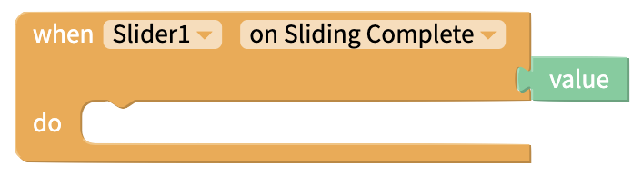
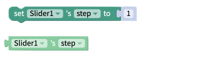

# Slider Component

## Slider Overview

The Slider is a great UI element to enable users easily select a value from a fixed range of values.

## Properties

### Slider

| Property            | Description                                                            | Data Type  |
| ------------------- | ---------------------------------------------------------------------- | ---------- |
| Value               | Initial value of the Slider                                            | Number     |
| Step                | Step between values on the Slider                                      | Number     |
| Minimum Value Range | Minimum value the user can select. Must be less than Maximum Value.    | Number     |
| Maximum Value Range | Maximum value the user can select. Must be greater than Minimum Value. | Number     |
| Min Track           | Color of Slider track between minimum value and current value          | Color      |
| Max Track           | Color of Slider track between current value and maximum value          | Color      |
| Thumb Color         | Color of the Slider thumb widget                                       | Color      |
| Disabled            | Toggle whether value Switch can be changed by user                     | True/False |

### Layout

| Property    | Description                                                                      | Data Type                                    |
| ----------- | -------------------------------------------------------------------------------- | -------------------------------------------- |
| X           | Location of top left corner of Slider on X-axis, where the left hand side is X=0 | Number                                       |
| Y           | Location of top left corner of Slider on Y-axis, where the top side is Y=0       | Number                                       |
| Height      | Height of Slider in pixels                                                       | Number                                       |
| Width       | Width of Slider in pixels                                                        | Number                                       |
| Resize Mode | Define dimensions of the Slider component/container                              | Select from list `[Stretch, Float in Place]` |

### **Style**

| Property       | Description                                                                             | Data Type                                  |
| -------------- | --------------------------------------------------------------------------------------- | ------------------------------------------ |
| Visible        | Toggle whether your end users can see the Slider                                        | True/False                                 |
| Border Style   | Set whether border style is solid, dotted or dashed  (only visible if border width > 0) | Select from list `[solid, dotted, dashed]` |
| Border Color   | Color of border (only visible if border width > 0)                                      | Color                                      |
| Border Width   | Width of border around Slider in pixels                                                 | Number                                     |
| Border Radius  | Radius of corners of border on Slider in degrees                                        | Number                                     |
| Shadow Color   | Color of Slider's shadow                                                                | Color                                      |
| Shadow Opacity | Opacity of Slider's shadow                                                              | Number between 0 and 100                   |
| Shadow Radius  | Radius of corners of Slider's shadow in pixels                                          | Number                                     |
| Shadow Offset  | How far Slider's shadow should be offset, in Height and Width, in pixels                | Number                                     |

## Blocks

### Events&#x20;

#### On Value Change

Fires as the value of the slider changes. Returns the current value of the Slider.

#### On Sliding Complete

Fires when the user takes their thumb off the Slider. Returns the current value of the Slider.

### Properties

Set and get the [properties](slider.md#properties) of the Slider.

#### Minimum Value

#### Maximum Value

#### Value&#x20;

.png>)

#### Step&#x20;

#### Get Computed Height&#x20;

.png>)

Returns Height of the Slider in pixels as it appears on the screen.

#### Get Computed Width

.png>)

Returns Width of the Slider in pixels as it appears on the screen.

#### Visible&#x20;

.png>)

#### Maximum Track Tint Color

###

#### Minimum Track Tint Color&#x20;

#### Disabled

.png>)

#### Thumb Tint Color&#x20;

.png>)
