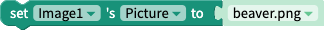

---
layout:
  title:
    visible: true
  description:
    visible: false
  tableOfContents:
    visible: true
  outline:
    visible: true
  pagination:
    visible: true
---

# Switch Component

## Overview​ 

The switch component is a two-state toggle that allows users to select between two options. It is commonly used in selecting on/off for things like sound, Bluetooth, WiFi etc.

<figure><figcaption></figcaption></figure>

## Properties 

### Switch

| Property         | Value      | Description                                        |
| ---------------- | ---------- | -------------------------------------------------- |
| Value            | True/False | Initial value of Switch                            |
| Tint Color       | Color      | Color of background when Switch is **false**       |
| On Tint Color    | Color      | Color of background when Switch is **true**        |
| Thumb Tint Color | Color      | Color of the Switch's slider                       |
| Disabled         | True/False | Toggle whether value Switch can be changed by user |

### Layout

| Property    | Value            | Desciption                                                                                               |
| ----------- | ---------------- | -------------------------------------------------------------------------------------------------------- |
| X           | coordinate value | Position of the upper left corner of the switch on the X-axis, where the left side of the screen is X=0. |
| Y           | coordinate value | Position of the upper left corner of the switch on the Y-axis, where the top of the screen is Y=0.       |
| Height      | number in pixels | The switch's height is defined by a custom number of pixels.                                             |
| Width       | number in pixels | The switch's width is defined by a custom number of pixels.                                              |
| Resize Mode | Stretch          | Stretches the switch to fit the dimensions of the device's screen.                                       |
| Resize Mode | Float in Place   | Renders the switch in the same aspect ratio as the design, regardless of the device size.                |

## Blocks 

To access the blocks specific to the switch component:

1. On the Design tab, add a **Image** component to a screen.
2. Navigate to the **Blocks** tab.
3. In the component tree on the left, click the name of the image component.
4. A drawer of image-specific blocks opens.

| Block Image                                              | Description                                                                                                        |
| -------------------------------------------------------- | ------------------------------------------------------------------------------------------------------------------ |
| .png>)          | This event will fire when the user clicks on the image.                                                            |
|                | Set the image component's Picture.                                                                                 |
|                | Get the image component's Picture.                                                                                 |
|          | Set the image component's [resize mode](switch.md#picture-resize-mode)                                             |
| .png>)   | Get the image component's [resize mode](switch.md#picture-resize-mode)                                             |
|          | Set the image component's height.                                                                                  |
|          | Get the image component's height.                                                                                  |
|  | Returns the height of the image component in pixels after it has been rendered on-screen.                          |
|           | Set the image component's width.                                                                                   |
|           | Get the image component's width.                                                                                   |
|   | Returns the width of the image component in pixels after it has been rendered on-screen                            |
|         | Set whether the image component is visible on the screen.                                                          |
|         | Get whether the image component is visible on the screen.                                                          |
|               | Set the position image the upper left corner of the image on the X-axis, where the left side of the screen is X=0. |
|               | Get the position of the upper left corner of the image on the X-axis, where the left side of the screen is X=0.    |
|               | Set the position of the upper left corner of the image on the Y-axis, where the top of the screen is Y=0.          |
|               | Get the position of the upper left corner of the image on the Y-axis, where the top of the screen is Y=0.          |

### Events&#x20;

#### On Value Change

This event fires every time the switch is clicked.

Returns `newValue` output block, which returns the new value of the Switch (`true` or `false`).

### Properties

Use these blocks to set and get the named [properties](switch.md#getting-started) of the Switch.

#### Value&#x20;

#### Tint Color&#x20;

#### On Tint Color&#x20;

#### Thumb Tint Color&#x20;

#### Disabled&#x20;

#### X&#x20;

#### Y

#### Height&#x20;

#### Width&#x20;

####

#### Visible&#x20;

