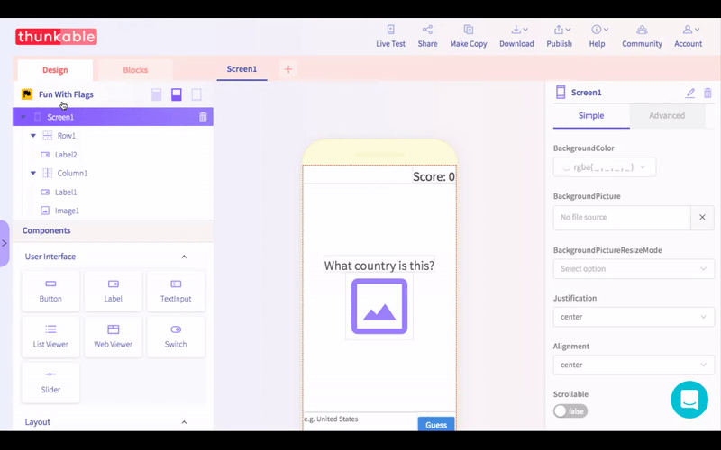
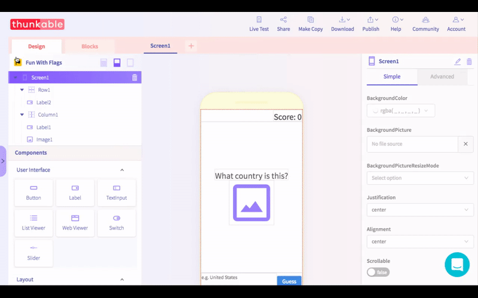

# App Icon + Name

Thunkable supports uploading a separate image file for your custom icon and adding your app name -- the name that appears next to your app icon on your phone \(this is different from your project name when you create a new app\).

## App Icon

For the app icon, please make sure the file you upload does not have the same name as one uploaded in your files. This will cause an error.

Click on your app name and on the right hand side of the screen upload your file.

## App Name

Click on your app name in the top left of the screen to open the App Setting. Here you will see options to specify Team ID, App Name and App \(Bundle\) ID.


Avoid using the character "&" in your app name; at the moment, it prevents your app from being installed on your device


## Best Practices

| App Icon | App Name |
| :--- | :--- |
| **192 x 192 px \(minimum\)**; square \(equal height and width\) and preferably .png \(vs. jpg\). For publishing to iOS App Store, you will also need an app icon that does not have any transparency or it may cause an error | Since space is limited, we recommend a **short one or two word** app name |

## Publishing Your App


For publishing your app to the Play and App stores, you will need to create a separate icon with a higher resolution. For Play, the current requirement is 500 x 500 px. For the App Store, it's 1024 x 1024 px.


