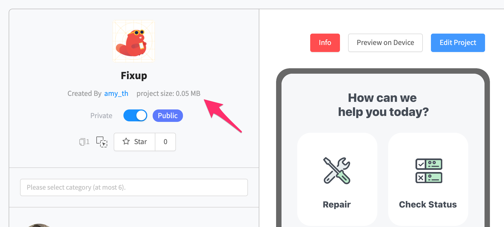

# Assets

Use the **Assets Panel** to upload, rename and manage all of the assets you've uploaded to your project. You can also mage Figma files within this panel. To learn more about how to use the Figma upload feature, check it out [here](figma.md).&#x20;

## Account Storage Limits

Each plan has a limited storage capacity.&#x20;

| Free  | Starter | Pro | Business  |
| ----- | ------- | --- | --------- |
| 200MB | 500MB   | 1GB | Unlimited |

You can view your total account storage size in your account settings.

.png>)

## App Limits

| Element  | Limit                                                               |
| -------- | ------------------------------------------------------------------- |
| App size | 50 MB for Free and [PRO](https://thunkable.com/#/pricing) accounts. |

## Uploading & Managing Assets

Assets can be uploaded from multiple parts of Thunkable, however, with limited storage capacity, it's best to delete assets that aren't being used. To access your assets, click the Assets button on the left panel.

### Maximum recommended asset size&#x20;

We recommend that each of your asset files not exceed 50KB -100KB. Using smaller file sizes in your project will result in faster loading times for your users.

### Naming assets

We recommend using a consistent naming method for your assets. This will make it easier to manage them if you use many asset files in your project.

Here are two naming methods we recommend:\

1. [Snake Case](https://en.wikipedia.org/wiki/Snake\_case) - each space is replaced by an [underscore](https://en.wikipedia.org/wiki/Underscore) (\_) character, and the first letter of each word written in lowercase.
   * example\_one.png
   * here\_is\_another\_example.html
2. [Camel Case](https://en.wikipedia.org/wiki/Camel\_case) - writing phrases without spaces or punctuation, indicating the separation of words with a single [capitalized](https://en.wikipedia.org/wiki/Capitalization) letter, and the first word starting with either case.
   * exampleOne.png
   * hereIsAnotherExample.html


Avoid using whitespace characters (" ") in your file names


.png>)

You can manage your files directly in the lefthand panel. Else if can do this in the media files modal by clicking the **+** beside the **Media Files** title.

.png>)

## How much space am I using?

Check the size of an individual project by visiting the project details page .

.png>)

To check how much space you're using for all of your projects and assets, go to your [account **Settings** page](https://x.thunkable.com/account/settings).
