# Assistant by Dialogflow

The Assistant component by Google's Dialogflow gives you the power of a Google Home or Amazon Alexa all from the comfort of your mobile device's built-in microphone.&#x20;

## Getting Started

### **Create a** [**free Dialogflow**](https://dialogflow.com/) **account**

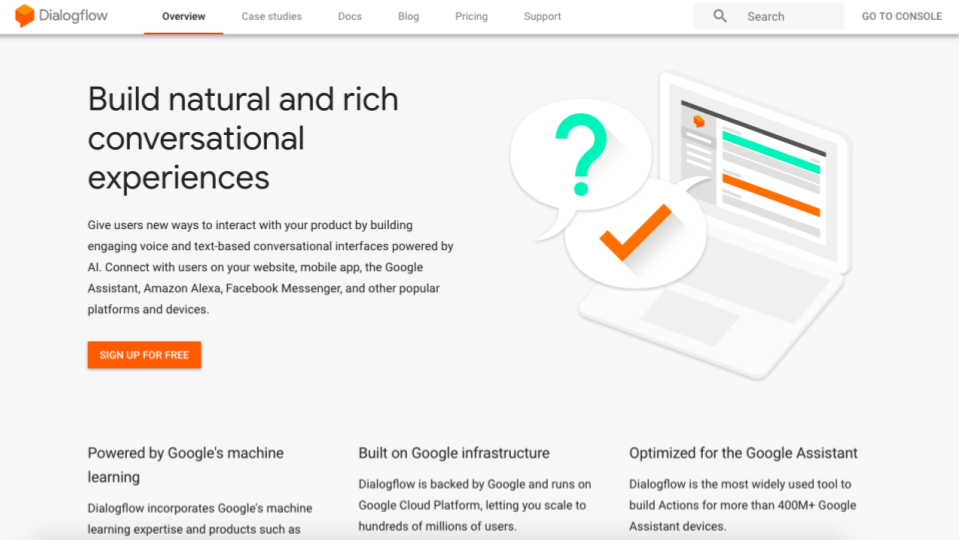

### Create a New Agent

An agent is the voice-enabled chatbot that is programmed to listen and respond to your given conversation

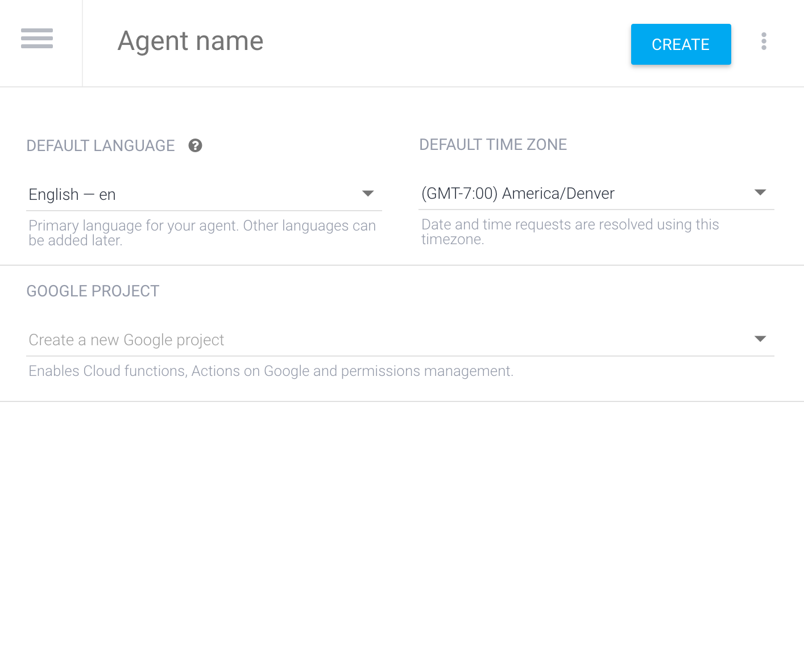

### Connect Your Dialogflow Agent with Thunkable

There are 3 fields you'll need to fill out on the Thunkable properties panel to connect it to Dialogflow: `Client Email`, `Private Key` and `Project Id`.&#x20;

### `Project Id`

To get the `Project Id`, simply navigate to the ⚙settings on your Dialogflow account.

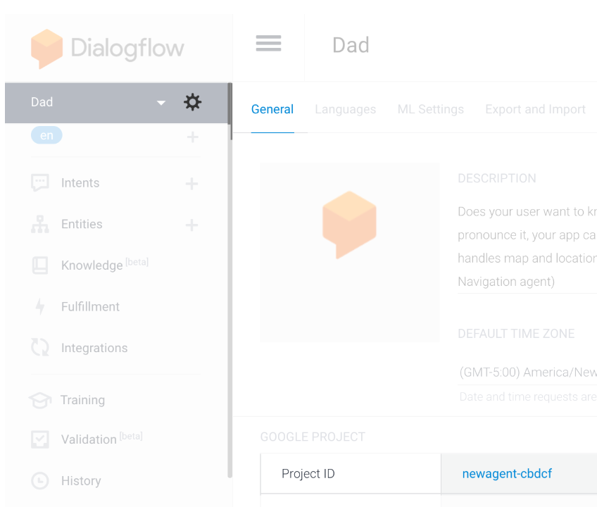

### `Client Email` and `Private Key`

To get the `Client Email` and `Private Key`, will require you to create a new Google Cloud Platform Service Account. This is a bit of an extra step but it is put in places to provide extra security so that Google knows it is only you accessing your app.

To get to the Google Cloud Platform, simply click on the Service Account link that is below the Project Id field.

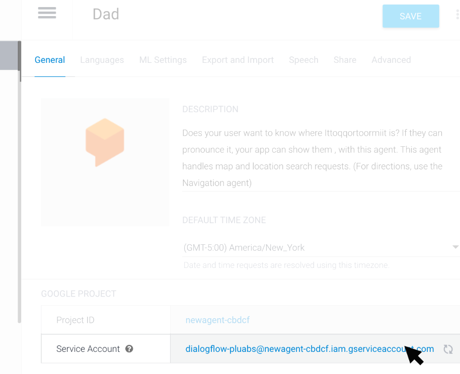

That will take you to the page below on the Google Cloud platform account.


Make sure you are signed in with the same Google account otherwise you may get an error


After signing in, select the three-dotted menu button and select the option to **Create key**.

.png>)

It will then prompt you to select the format of the key.  Select **JSON** and select **Create**.

.png>)

This will download the JSON file to your computer.

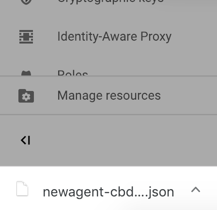

Open the JSON file in your favorite text editor and you'll find the Client Email and Private Key as fields in the file. Copy and paste these to the appropriate fields in your Assistant properties panel on Thunkable.

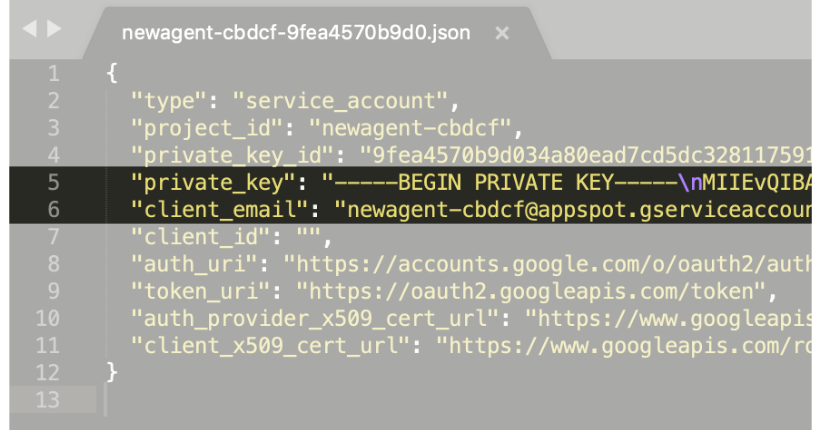

Phew!  That's it for set-up. You are now ready to program your Assistant.

## Program the Assistant

### Create intents and responses

The magic of the Assistant component is that it can listen for certain spoken phrases or **intents** and trigger a **response** based on those phrases. The more intents The more intents that you create, the more commands or questions the Assistant will be able to respond to. Since the Assistant is powered by a breakthrough technology called natural language processing, the user won't have to always say exactly what is specified in the intents (although the more expressions the better).

To program an intent, you simply create new intents in the Dialogflow interface.

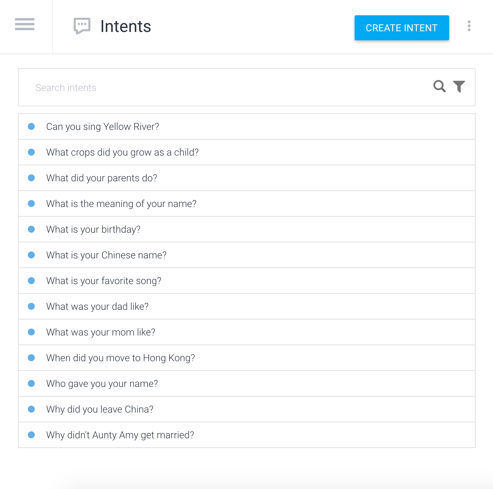

&#x20;**Intents** are meant to trigger a specific **response**, and for most users, this will simply be a simple **text response.**

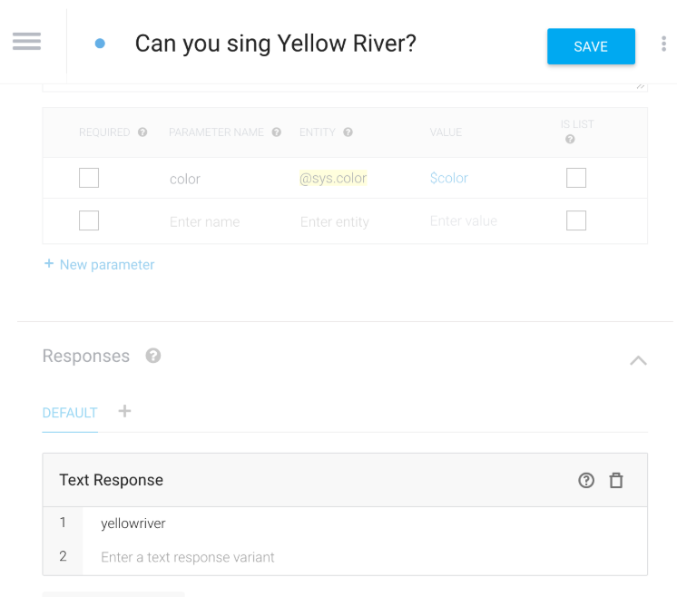

The text response above can **** then be programmed with Thunkable blocks to complete a certain action e.g. play a specific sound file as in the [**sample app, Dad**](https://x.thunkable.com/projects/5aac3404264501000175f715/Welcome/designer).

The `text response` you program in Dialogflow is the same as the `value` output of the Start listening block on Thunkable as shown below.

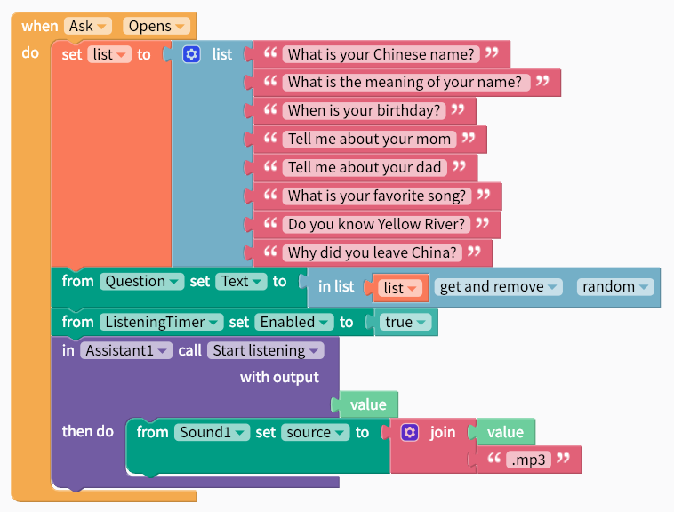

The following event blocks are available to program into your app on Thunkable.&#x20;

| Event           | Description                                                                                                                                                                                                                                                       |
| --------------- | ----------------------------------------------------------------------------------------------------------------------------------------------------------------------------------------------------------------------------------------------------------------- |
| Start Listening | Asks the Assistant to start listening to a voice query. You must use both the Start Listening and Stop Listening events to. When it detects a programmed intent, it will respond accordingly with a `value` if it's a text response or with an action (see below) |
| Stop Listening  | Asks the Assistant to stop listening to a voice query                                                                                                                                                                                                             |
| Query (`text`)  | Submits a query to the Assistant in text form                                                                                                                                                                                                                     |

### Create an action

For more advanced users, Dialogflow also allows you to program actions in the following 3rd party applications. Each application has a different integration process so follow the instructions carefully if you want to use this option.

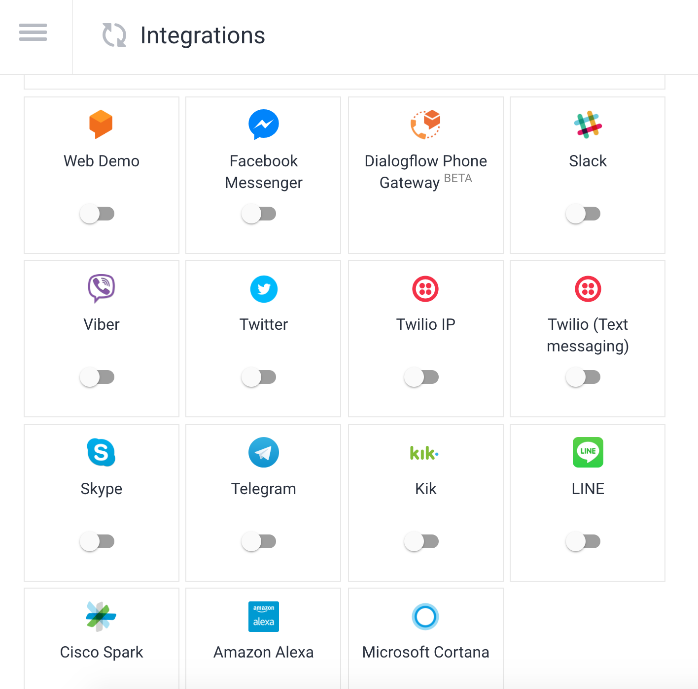

### Select listening language

The agent is currently available to understand the following languages with more added periodically (apologies if the list below is not up to date):&#x20;

| Property | Description                                                                                                                                                                                                                                                                                                                                    |
| -------- | ---------------------------------------------------------------------------------------------------------------------------------------------------------------------------------------------------------------------------------------------------------------------------------------------------------------------------------------------- |
| Language | Refers to both the language recognized by the Assistant and the language which it speaks aloud. Currently available: `ENGLISH`,`ENGLISH_GB`, `ENGLISH_US`,`CHINESE_CHINA`,`CHINESE_HONGKONG`,`CHINESE_TAIWAN`,`DUTCH`, `FRENCH`,`GERMAN`,`GREEK`,`ITALIAN`,`JAPANESE`,`KOREAN`,`PORTUGUESE`,`PORTUGUESE_BRAZIL`,`RUSSIAN`,`SPANISH`,`UKRANIAN` |

To change the language, simply change it in the Assistant properties panel and in your Dialogflow dashboard

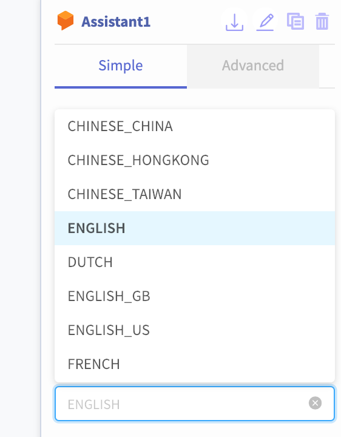

## Upgrade from V1 to V2


**Warning:** V1 of Dialogflow's API will be shut down on October 23, 2019. Please follow these instructions to upgrade to V2.


Upgrading from V1 to V2 involves two steps.&#x20;

First, navigate to the Dialogflow ⚙settings page and make sure the V2 API is selected&#x20;

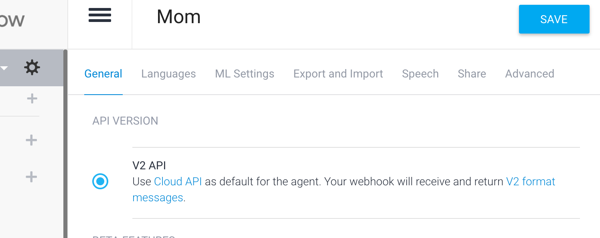

Second, you'll need to follow these steps to [re-connect your Dialogflow agent with Thunkable](assistant.md#connect-your-dialogflow-agent-with-thunkable).

You'll have to retrieve the `Project Id` from the Dialogflow page you visited and create a new security key on the Google Cloud Service Account to retrieve the `Client Email` and `Private Key`. It sounds like a lot but if you follow the instructions, it should be relatively painless.
