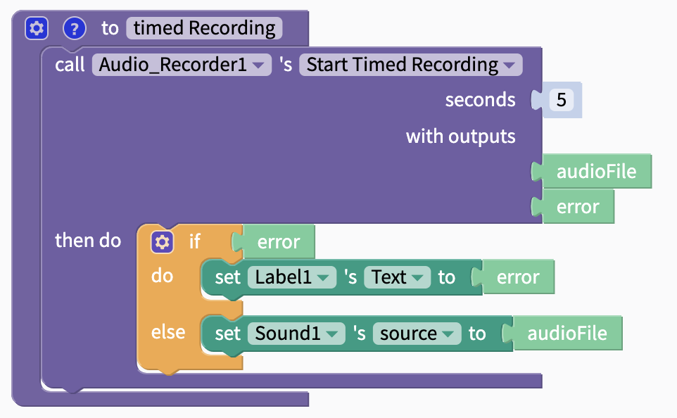
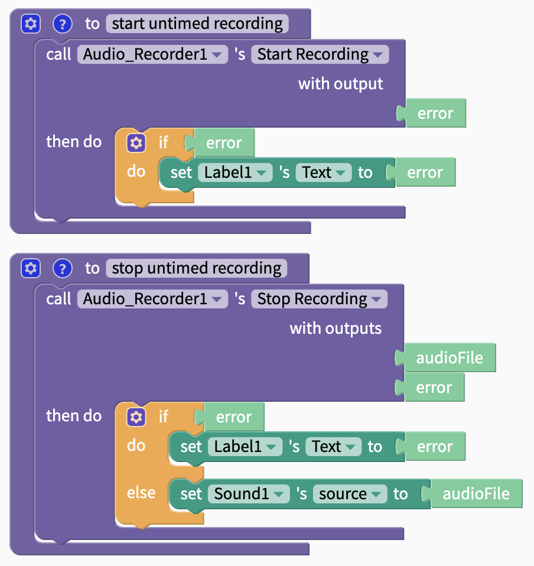

# Audio Recorder

## Blocks

### Start Timed Recording

Records for a set amount of time in seconds. Can type number of seconds into ghost block. Can also use [Math](math.md) blocks or [variables](variables.md) to set this time.

#### Outputs

| Name | Data Type | Data |
| :--- | :--- | :--- |
| audioFile | Sound | Sound from recording |
| error | Text | if error, returns error; else, returns `null` |

### Start Recording/Stop Recording

Create an untimed recording. 

#### Start Recording Output

| Name | Data Type | Data |
| :--- | :--- | :--- |
| error | Text | if error, returns error; else, returns `null` |

#### Stop Recording Outputs

| Name | Data Type | Data |
| :--- | :--- | :--- |
| audioFile | Sound | Sound from recording |
| error | Text | if error, returns error; else, returns `null` |

