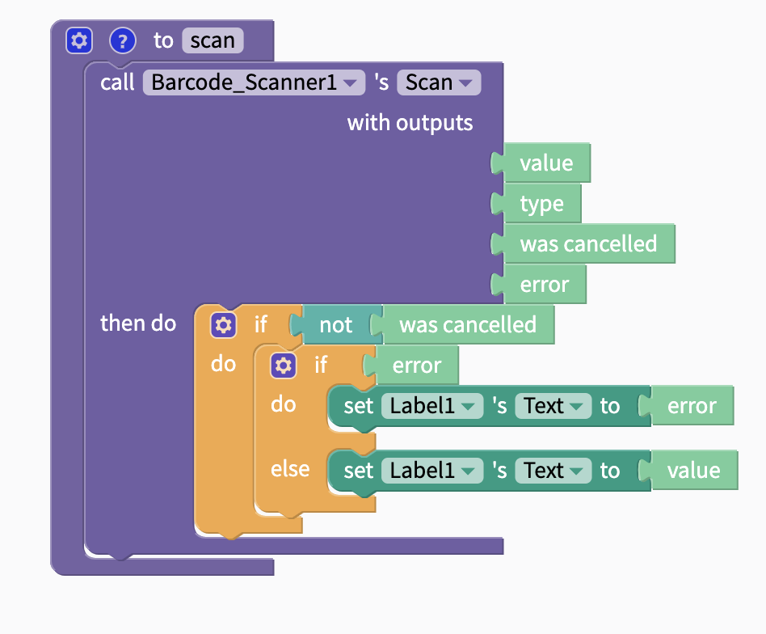

# Barcode Scanner

## Barcode Scanner Overview

Barcodes and QR codes can be useful features in many types of apps from social apps like WeChat and Venmo to connect friends together or location-based games like scavenger hunts. The Barcode Scanner component uses the camera to read any barcode or QR code.

## Blocks

The Barcode Scanner is among the easiest components to set-up and use. After adding the component to your app, you can connect it with a button and a label like the blocks below.

### Scan

#### Outputs

| Name | Data Type | Data |
| :--- | :--- | :--- |
| value | text | value from scanned barcode/QR code |
| type | text | `barcode` or `QR code` |
| was cancelled | True/False | If user cancelled action, returns `true`; else returns `false` |
| error | Text | If error, returns error; else returns `null` |

In most cases you'll use the default `back` camera in your mobile device but you also have the option to specify the front camera in certain cases.

