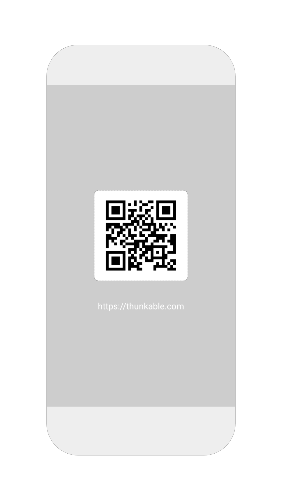
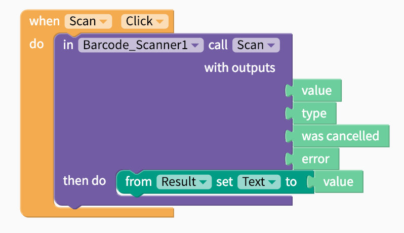
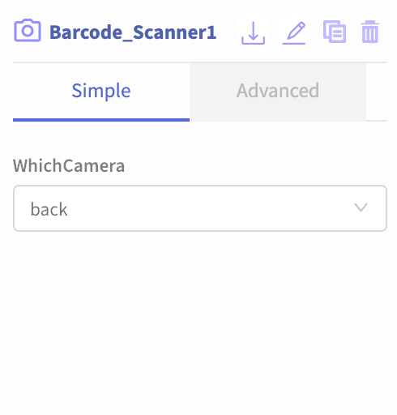

# Barcode Scanner

## Barcode Scanner Overview

* [Getting Started](barcode-scanner.md#getting-started)

Barcodes and QR codes can be useful features in many types of apps from social apps like WeChat and Venmo to connect friends together or location-based games like scavenger hunts. The Barcode Scanner component uses the camera to read any barcode or QR code.

## Getting Started

The Barcode Scanner is among the easiest components to set-up and use. After adding the component to your app, you can connect it with a button and a label like the blocks below.

The `value` is the code within the barcode and QR code. You can also detect the `type` \(either **barcode** or **qr**\). 

In most cases you'll use the default `back` camera in your mobile device but you also have the option to specify the front camera in certain cases.

