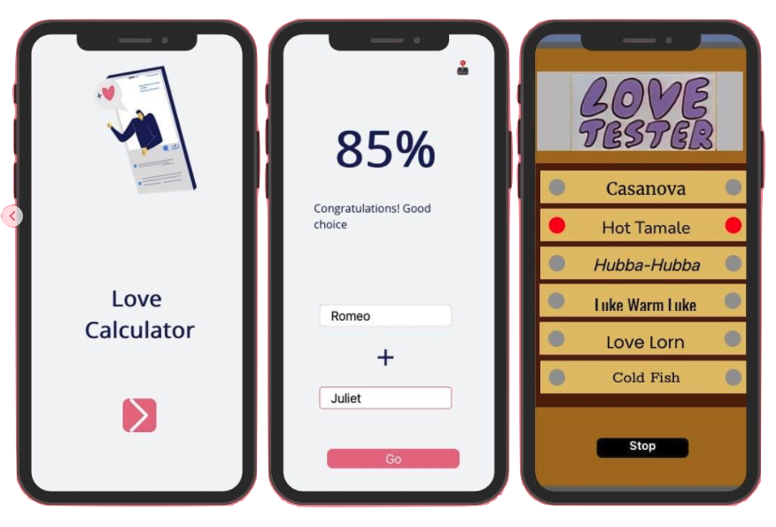
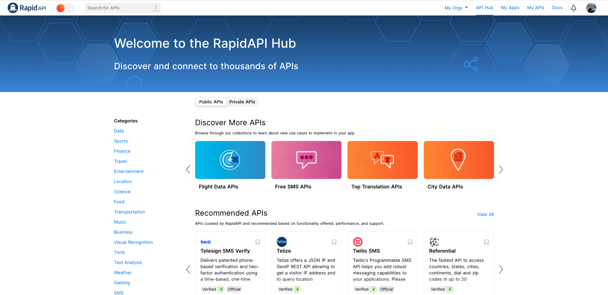

# API Keys

## What is an API Key?

With all the APIs in this section, the first thing you will need to do is register for an account with the API owner. Having an account with the API developer will allow you to create your own developer key. Similar to a physical key, your developer API key will grant you access to that information that is "locked away" on the API server. Unlike a physical key however, your developer key is unique so the API owner can see who is accessing the server, when they're accessing it and how many requests they're making. Since usage can often be tied to billing it is recommended that you treat your keys as secrets and don't share them with anyone else.&#x20;

### Overview


**Remix Link:** [**https://x.thunkable.com/projectPage/62013029b08ede0011f1c03d**](https://x.thunkable.com/projectPage/62013029b08ede0011f1c03d)****


In this tutorial we're going to learn how to generate an API key on RapidAPI and use it to build a digital version of the classic pen-and-paper Compatibility Calculator game that some of you may remember from your childhood.

<figure><figcaption></figcaption></figure>

## Rapid API

RapidAPI is a platform that makes discovering and connecting to APIs easier. If you want an API for restaurants, public transport schedules, flight data or, well pretty much anything really then you can just search RapidAPI for some examples. Their blog post on the [Top 50 Most Popular APIs ](https://rapidapi.com/blog/most-popular-api/)gives a good sense of the variety that's on offer.&#x20;

<figure><figcaption></figcaption></figure>

### Love Calculator

Ranked at #7 on the Top 50 for 2022 is the [Love Calculator API](https://rapidapi.com/ajith/api/love-calculator). It's so easy to use and understand we can see why their users have fallen for it!

### Query Parameters

