# Bluetooth Low Energy Blocks

Description

Bluetooth Low Energy, or BLE, is used to wirelessly connect two devices to one another. The BLE component allows you to find and connect to BLE devices and to communicate directly with them.


BLE functionality can't be tested with the [Thunkable Live](https://docs.thunkable.com/get-started/live-test) app on iOS. \
To test the BLE functionality in your app on iOS, please [download](https://docs.thunkable.com/download#download-and-install-ios-app) your app.


## Add a Bluetooth component to Thunkable

To add a Bluetooth component to your app:

* Go to your Blocks tab
* Find the `Advanced` drawer of blocks. Click the drop-down menu icon to show the Advanced invisible components
* Click the ⊕ icon next to the `Bluetooth` drawer

.png>)

You will see a dialog to create your Bluetooth component. Click Submit to create the component, or Delete to dismiss the dialog without creating the component.

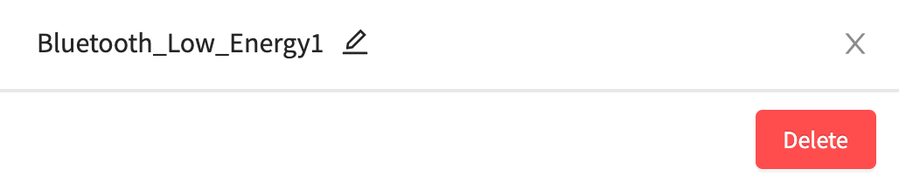

### Deleting your Bluetooth Component

Once you have added at least one Bluetooth component to your app, you will be able to view all of your Bluetooth components under the `Bluetooth` drawer in the Advanced section of the Blocks tab.&#x20;

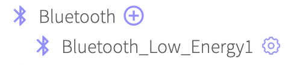

To delete a Bluetooth component, click on the ⚙ icon next to the component's name to bring up the properties dialog and click Delete.

## Functions

Version 1 of the BLE component in Thunkable ✕ contains 5 functions, each of which are documented in greater detail below.

* [Scan](bluetooth-low-energy.md#scan)
* [Connect to Device Id](bluetooth-low-energy.md#connect-to-device-id)
* [Connect to Device Name](bluetooth-low-energy.md#connect-to-device-name)
* [Disconnect](bluetooth-low-energy.md#disconnect)
* [Receive String](bluetooth-low-energy.md#receive-string)
* [Receive Byte Array](bluetooth-low-energy.md#receive-byte-array)
* [Listen for Disconnection](bluetooth-low-energy.md#listen-for-disconnection)
* [Transmit String](bluetooth-low-energy.md#transmit-string)
* [Transmit Byte Array](bluetooth-low-energy.md#transmit-byte-array)
* [Transmit Hexadecimal](https://docs.thunkable.com/bluetooth-low-energy#transmit-hexadecimal)

### Scan

This function is used to scan for nearby BLE or Bluetooth enabled devices. Scanning happens for 10 seconds. Once scanning has successfully completed then a list of the available device ids and a list of available names will be returned. If the scanning function can not be completed then an error will be returned.

<figure>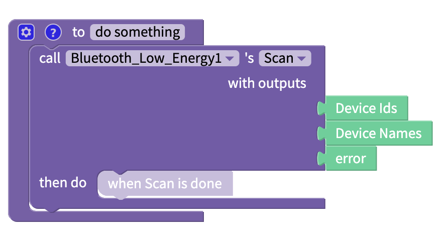<figcaption></figcaption></figure>

#### Outputs

| Output Name  | Data Type | Description                                          |
| ------------ | --------- | ---------------------------------------------------- |
| Device Ids   | List      | Returns a list of the IDs of the available devices   |
| Device Names | List      | Returns a list of the names of the available devices |
| error        | Text      | Returns an error message from the function           |

### Connect to Device Id

The `Connect to Device Id` function allows your app to connect to a BLE enabled device based in the Id of that device.

<figure>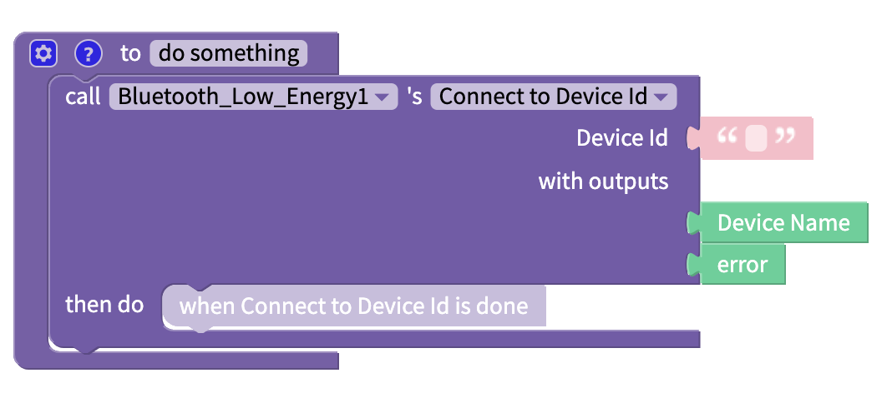<figcaption></figcaption></figure>

#### Inputs

| Input Name | Data Type | Description                                                     |
| ---------- | --------- | --------------------------------------------------------------- |
| Device Id  | Text      | Expects a text string with the device id you want to connect to |

#### Outputs

| Output Name | Data Type | Description                                                             |
| ----------- | --------- | ----------------------------------------------------------------------- |
| Device Name | Text      | Returns the name of the device you have just connected to               |
| error       | Text      | If an error message is returned, returns the error. Else returns `null` |
|             |           |                                                                         |

### Connect to Device Name

When you know the name of the BLE device that you want to connect to you can use the `Connect to Device Name` block to connect directly to it. Please note that device names are not unique and it is relatively easy to change the name of a BLE device.

<figure>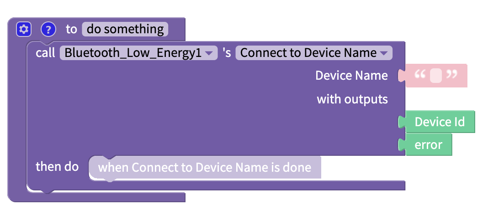<figcaption></figcaption></figure>

#### Inputs

| Input Name  | Data Type | Description                                                    |
| ----------- | --------- | -------------------------------------------------------------- |
| Device Name | Text      | Expects a text block with the name of the device to connect to |

#### Outputs

| Output Name | Data Type | Description                                                             |
| ----------- | --------- | ----------------------------------------------------------------------- |
| Device Id   | Text      | Returns the ID of the device that you have just connected to            |
| error       | Text      | If an error message is returned, returns the error. Else returns `null` |

### Disconnect

<figure>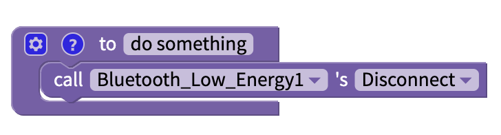<figcaption></figcaption></figure>

If connected to another Bluetooth device, this block will disconnect your app from the device.

### Receive String

If you have a BLE device that is capable of sending data to another device then you will need to use the `Receive String` function in your app in order to listen to, or receive, data coming from the BLE device in String format.

You need to be connected to another Bluetooth device in order to use this block.

<figure>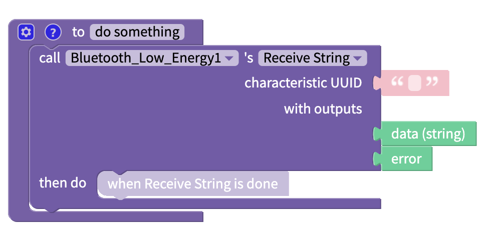<figcaption></figcaption></figure>

#### Inputs

| Input Name          | Data Type | Description                                                                           |
| ------------------- | --------- | ------------------------------------------------------------------------------------- |
| characteristic UUID | Text      | Expects a text block with a 32-bit UUID for the BLE type, service or profile required |

#### Outputs

| Output Name   | Type | Description                                                              |
| ------------- | ---- | ------------------------------------------------------------------------ |
| data (string) | Text | Returns a string containing the information received from the BLE device |
| error         | Text | If an error message is returned, returns the error. Else returns `null`  |
|               |      |                                                                          |

### Receive Byte Array

If you have a BLE device that is capable of sending data to another device then you will need to use the `Receive Byte Array` function in your app in order to listen to, or receive, data coming from the BLE device in Byte Array format.

You need to be connected to another Bluetooth device in order to use this block.

<figure>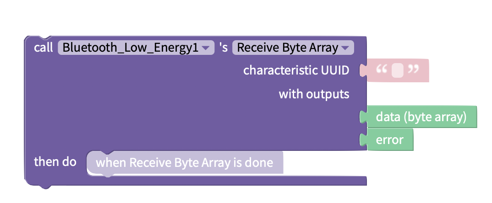<figcaption></figcaption></figure>

#### Inputs

| Input Name          | Data Type | Description                                                                           |
| ------------------- | --------- | ------------------------------------------------------------------------------------- |
| characteristic UUID | Text      | Expects a text block with a 32-bit UUID for the BLE type, service or profile required |

#### Outputs

| Output Name       | Data Type                                   | Description                                                                  |
| ----------------- | ------------------------------------------- | ---------------------------------------------------------------------------- |
| data (byte array) | array ([list](../blocks/lists.md)) of bytes | Returns a byte array containing the information received from the BLE device |
| error             | Text                                        | If an error message is returned, returns the error. Else returns `null`      |

### Listen for Disconnection

This asynchronous function listens for when your device disconnects from a named Bluetooth device.

You can program some events to happen when your device disconnects from the named device in the `then do` section of this block.

<figure>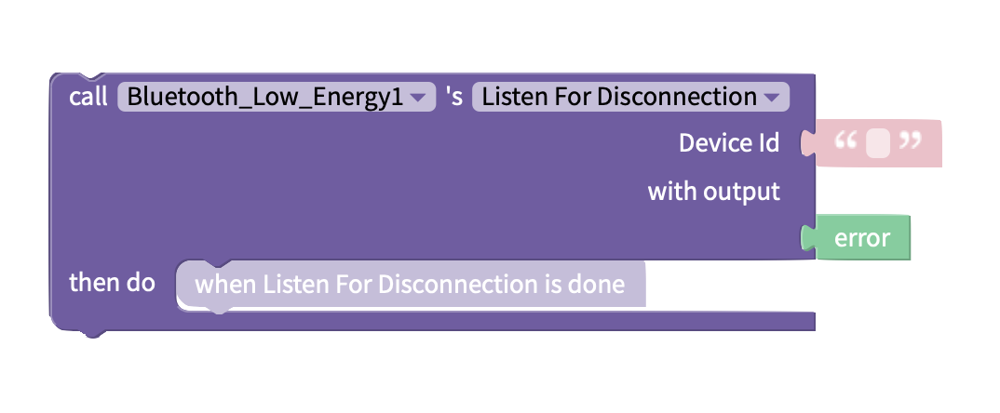<figcaption></figcaption></figure>

#### Inputs

| Input Name | Data Type | Description                                                        |
| ---------- | --------- | ------------------------------------------------------------------ |
| Device Id  | Text      | Unique ID of the bluetooth device to listen for disconnection with |

#### Outputs

| Output Name | Data Type | Description                                                             |
| ----------- | --------- | ----------------------------------------------------------------------- |
| error       | Text      | If an error message is returned, returns the error. Else returns `null` |

### Transmit String

Use this block to send data as a string of text to a BLE device.

You need to be connected to another Bluetooth device in order to use this block.

<figure>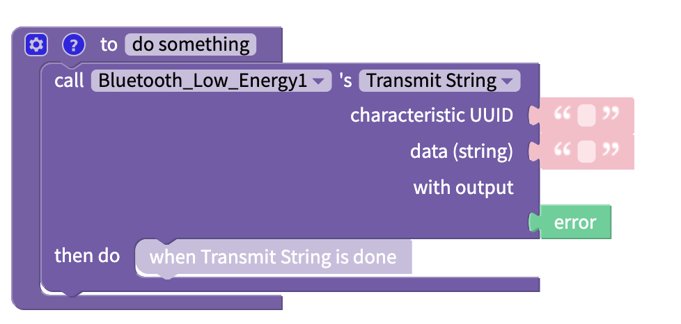<figcaption></figcaption></figure>

#### Inputs

| Input Name          | Data Type | Description                                                                               |
| ------------------- | --------- | ----------------------------------------------------------------------------------------- |
| characteristic UUID | Text      | **Expects** a text block with a 32-bit UUID for the BLE type, service or profile required |
| data                | Text      | Expects a text block with the message that you want to send to your BLE device            |

#### Outputs

| Output Name | Data Type | Description                                                             |
| ----------- | --------- | ----------------------------------------------------------------------- |
| error       | Text      | If an error message is returned, returns the error. Else returns `null` |

### Transmit Byte Array

Use this block to send data as an array ([list](../blocks/lists.md)) of bytes to a BLE device.

You need to be connected to another Bluetooth device in order to use this block.

<figure>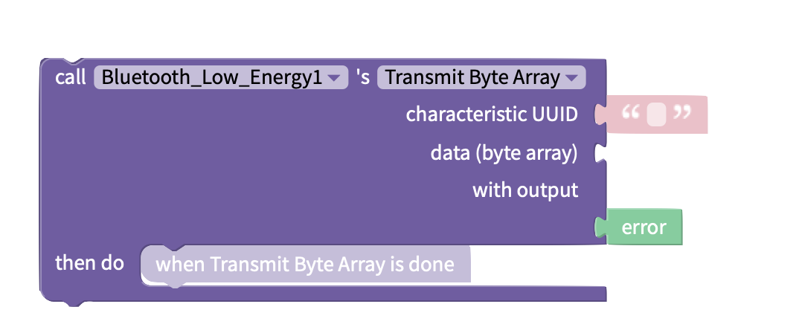<figcaption></figcaption></figure>

#### Inputs

| Input Name          | Data Type                                   | Description                                                                           |
| ------------------- | ------------------------------------------- | ------------------------------------------------------------------------------------- |
| characteristic UUID | Text                                        | Expects a text block with a 32-bit UUID for the BLE type, service or profile required |
| data                | array ([list](../blocks/lists.md)) of bytes | Expects a text block with the message that you want to send to your BLE device        |

#### Outputs

| Output Name | Data Type | Description                                                             |
| ----------- | --------- | ----------------------------------------------------------------------- |
| error       | Text      | If an error message is returned, returns the error. Else returns `null` |

### Transmit Hexadecimal

Use this block to send data in [hexadecimal](https://en.wikipedia.org/wiki/Hexadecimal) format to a BLE device.

You need to be connected to another Bluetooth device in order to use this block.

<figure>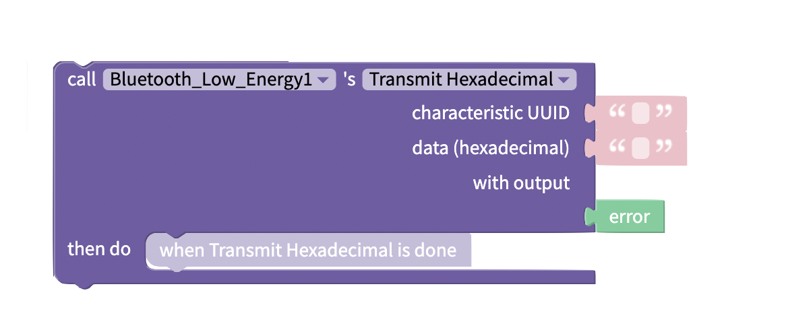<figcaption></figcaption></figure>

#### Inputs

| Input Name          | Data Type                                                               | Description                                                                           |
| ------------------- | ----------------------------------------------------------------------- | ------------------------------------------------------------------------------------- |
| characteristic UUID | Text                                                                    | Expects a text block with a 32-bit UUID for the BLE type, service or profile required |
| data (hexadecimal)  | data in [hexadecimal](https://en.wikipedia.org/wiki/Hexadecimal) format | Expects a text block with the message that you want to send to your BLE device        |

#### Outputs

| Output Name | Data Type | Description                                                             |
| ----------- | --------- | ----------------------------------------------------------------------- |
| error       | Text      | If an error message is returned, returns the error. Else returns `null` |

