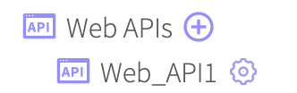
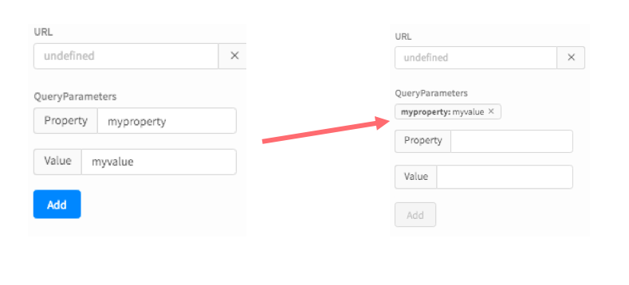
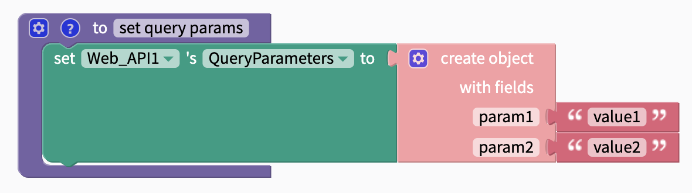
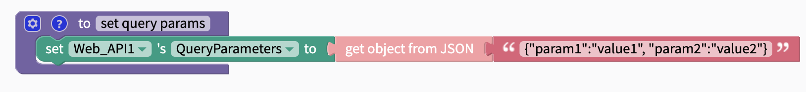
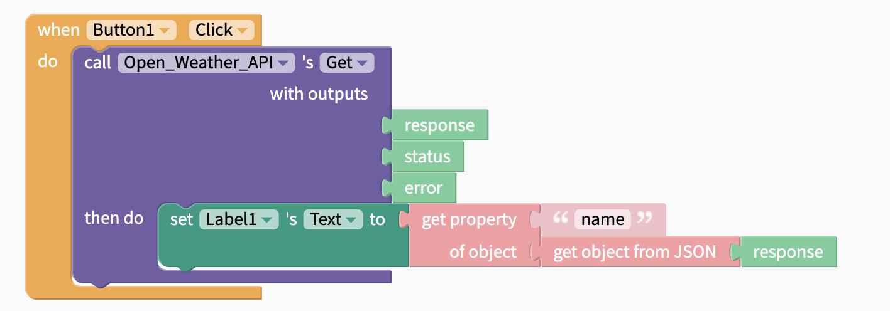
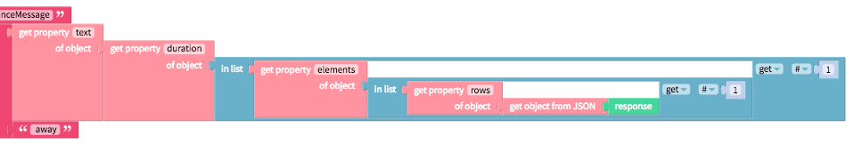
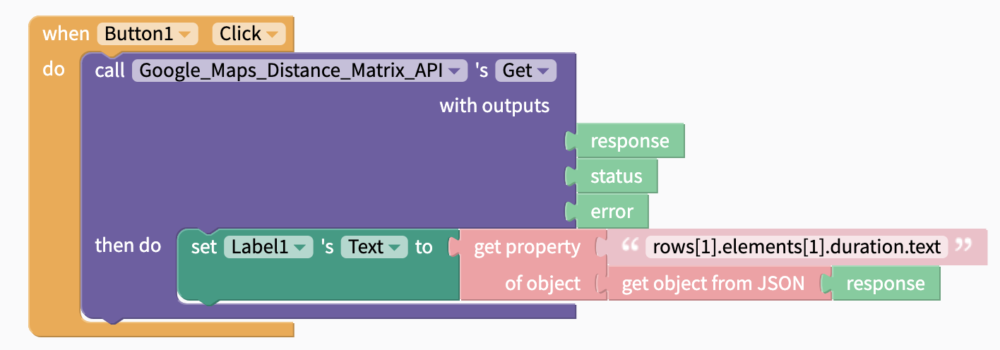

# Web APIs Blocks

Great data is an essential part of many apps built today and the Web API component enables apps to retrieve data from any public or private API (application programming interface) service on the web. For more advanced developers who have write access to a private API, this component also enables you to upload and delete data.

To see what public APIs are available, we recommend [this list from Todd Motto](https://github.com/toddmotto/public-apis)



## Adding a Web API to your app

To add a Web API component to your app:

* Go to your Blocks tab.
* Scroll to the bottom of your blocks panel on the left side and find the `Advanced` section. &#x20;
* Click the expand chevron to show the Advanced invisible components.
* Click the ⊕ icon next to `Web APIs.`\
  

A Web API component properties dialog launches. See the chart below for descriptions of the various properties. Click **Submit** to create the Web API component, or **Delete** to dismiss the dialog without creating the component.

Once you have the API key, you'll need to enter the unique URL into the property field of the Web API component.

<table><thead><tr><th width="133">Property</th><th width="494.33333333333326">Description</th><th>Required?</th></tr></thead><tbody><tr><td>URL</td><td>The url for the web request which usually contains an API key</td><td>Required</td></tr><tr><td>QueryParameters</td><td>Specifies some parameters of the data</td><td>Optional</td></tr><tr><td>Body</td><td>Body of your API call. Select from String or Multipart Form Data. </td><td>Optional</td></tr><tr><td>Headers</td><td>Specifies some meta-data, eg: usernames and passwords</td><td>Optional</td></tr></tbody></table>

<div align="left">

<figure><figcaption></figcaption></figure>

</div>

### Edit properties of your Web API

Once you have added at least one Web API component to your app, you will be able to view all of your Web API components under the `Web APIs` drawer in the Advanced section of the Blocks tab.&#x20;

To edit the properties of a Web API component, click on the ⚙ icon next to the component's name to bring up the properties dialog. You will be able to change the properties and click Submit to save your changes, or click Delete to delete the component.



## Setting Query Parameters and Headers

Query parameters and headers can be set in the designer or in the blocks editor. In the example below you can add any property:value pair you want. You can add as many params to your app as you need, but each parameter has to be added one at a time.&#x20;



In the blocks editor, it is possible to use the `create object` block to add multiple property:value pairs simultaneously.&#x20;



In addition to creating your own objects, it is also possible to use JSON to specify the property:value pairs for your query parameters or headers.&#x20;



## Get and Format (parse) Data



To retrieve data from an API, you simply need to use the `Get` block.

| Event                              | Description                                                                                                                                                              |
| ---------------------------------- | ------------------------------------------------------------------------------------------------------------------------------------------------------------------------ |
| Get (`response`, `status`,`error`) | Performs an HTTP GET request using the Url property and retrieves the `response`. Reports `status` of request and if request does not go through, will report an `error` |

Most APIs will return data in JSON format, so we'll take a few moments to walk through a few examples of how to parse this data using our [Object](../../blocks/objects.md) blocks.

### Get Simple Properties

#### Example 1: [Open Weather Map API](https://openweathermap.org/current)

One of the most common output formats for APIs is JSON, short for Javascript Object Notation. The Open Weather Map API returns a JSON file like the one below.

```
{
    "coord":{"lon":85.17,"lat":26.67},
    "weather":[{"id":804,"main":"Clouds","description":"overcast clouds","icon":"04n"}],
    "base":"stations",
    "main":{
        "temp":298.312,
        "pressure":1005.31,
        "humidity":94,
        "temp_min":298.312,
        "temp_max":298.312,
        "sea_level":1011.47,
        "grnd_level":1005.31},
    "wind":{"speed":2.96,"deg":79.5005},
    "clouds":{"all":92},
    "dt":1533157826,
    "sys":{
        "message":0.0034,
        "country":"IN",
        "sunrise":1533080664,
        "sunset":1533128790},
    "id":1273043,
    "name":"Dhaka",
    "cod":200
}
```

In your JSON response, objects can be found within the `"` quotes `"` followed by a colon `:`. The properties of the object is follows the colon `:` but is within the `{` curly brackets`}`.

In the example above, `"base"`, `"dt"`, `"id"`, `"name"` and `"cod"` are simple properties of the JSON response. `"coord"` ,   `"main"` , `"wind"`, `"clouds"` and `"sys"` are properties of the overall response, but each of these properties is also an object with properties of its own, or [nested properties, ](../../blocks/objects.md#nested-values-and-values-from-arrays)contained within the `{` curly brackets `}`.  `"weather"` is a one-item list which also contains an object.

#### **Convert JSON to Object**

The first step in parsing this response is converting the JSON response to an [Object](../../blocks/objects.md). Objects have properties (like `name`) that we can retrieve and display in our app. Objects can be embedded within another object.

<figure><figcaption></figcaption></figure>

#### **Get Property of Object**

<figure><figcaption></figcaption></figure>

Once you have converted the JSON into objects, you can then specify the `objects` and `property` that you are interested in. To get the name of the city we are viewing weather data for (`"name":` in line 22), we'll want to get the property `name` of the response:


### Get Nested Properties

If we wanted to get the temperature in Dhaka from the Open Weather API above, we would need to do the following:

* Convert the JSON response to an object
* Get the property `main` of the response object
* Get the property `temp` of `main`&#x20;

We can write this as getting the property `main.temp` of the response object:

.png>)

You can read about getting nested values from Objects [here](../../blocks/objects.md#nested-values-and-values-from-arrays).&#x20;

### Get Properties from Lists

You can read about getting nested values and values from lists in Objects [here](../../blocks/objects.md#nested-values-and-values-from-arrays). Let's work through an example.

#### Example 2: [Google Maps Distance Matrix API](https://developers.google.com/maps/documentation/distance-matrix/start)

You can find a working example of this in the sample app, [Ride](https://community.thunkable.com/t/advanced-sample-app-ride-a-private-uber-like-app-made-on-thunkable/30646).

The JSON output of the Google Maps Distance Matrix API seems similar to the Open Weather Map API with one notable exception: it includes objects, properties and _lists_. Lists are items bounded by `[` square brackets `]`.

```
{
   "destination_addresses" : [ "Los Angeles, CA, USA" ],
   "origin_addresses" : [ "San Francisco, CA, USA" ],
   "rows" : [
      {
         "elements" : [
            {
               "distance" : {
                  "text" : "617 km",
                  "value" : 616620
               },
               "duration" : {
                  "text" : "5 hours 45 mins",
                  "value" : 20680
               },
               "status" : "OK"
            }
         ]
      }
   ],
   "status" : "OK"
}
```

If you want to retrieve the `"text"` property in line 13, you'll have to:

* convert the JSON to an object&#x20;
* select the `"rows"` property of the object
* select the first item in the list
* select the `"elements"` property of the rows object
* select the first item in the list
* select the `"duration"` property of the elements object
* select the `"text"` property of the duration object

You can see the example below for how this would look using the [Object](../../blocks/objects.md) and [List](../../../lists.md) blocks



This can also be written as the property `rows[1].elements[1].duration.text` of the response:



## Upload data

Uploading and deleting data is usually reserved for a private API that you or your organization owns

| Event                               | Description                                                                                                                                                                |
| ----------------------------------- | -------------------------------------------------------------------------------------------------------------------------------------------------------------------------- |
| Put (`response`, `status`,`error`)  | Performs an HTTP PUT request using the Url property and retrieves the `response`. Reports `status` of request and if request does not go through, will report an `error`   |
| Post (`response`, `status`,`error`) | Performs an HTTP POST request using the Url property and retrieves the `response`. Reports `status` of request and if request does not go through, will report an `error`  |
| Patch (`response, status, error`)   | Performs an HTTP PATCH request using the Url property and retrieves the `response`. Reports `status` of request and if request does not go through, will report an `error` |

## Delete data

| Event                                 | Description                                                                                                                                                                 |
| ------------------------------------- | --------------------------------------------------------------------------------------------------------------------------------------------------------------------------- |
| Delete (`response`, `status`,`error`) | Performs an HTTP DELETE request using the Url property and retrieves the `response`. Reports `status` of request and if request does not go through, will report an `error` |

## See Also

You can also post and receive messages between a web page and a [Web Viewer](../../../app-design/ui-components/embed-components/web-viewer.md) using the Post Message function. Read more about that [here](../../../app-design/ui-components/embed-components/web-viewer.md#post-message-receive-message).


**Have feedback on this doc?** Please take a moment to share your feedback here: [Thunkable Docs Feedback](https://docs.google.com/forms/d/e/1FAIpQLSfCwn5L2xyla-LSLZX0DSWFcFeJ43qp-r1tELCacuVS2zduLA/viewform?usp=sf\_link). Your valuable insights will help us improve and better serve you in the future.

