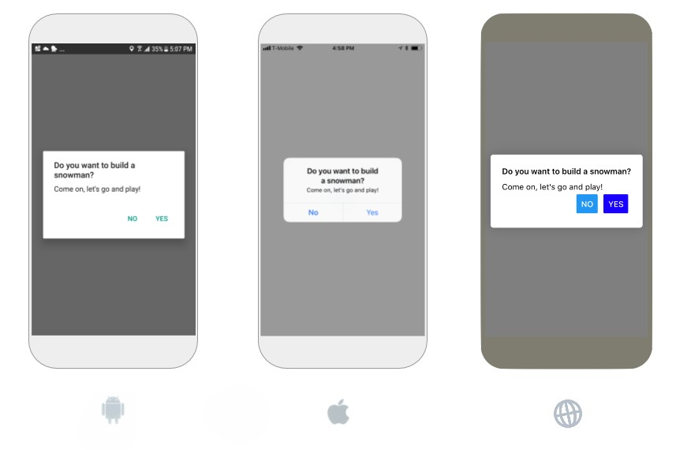
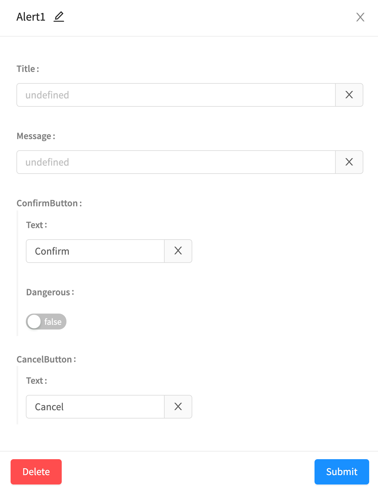
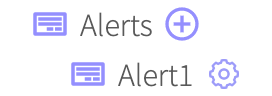
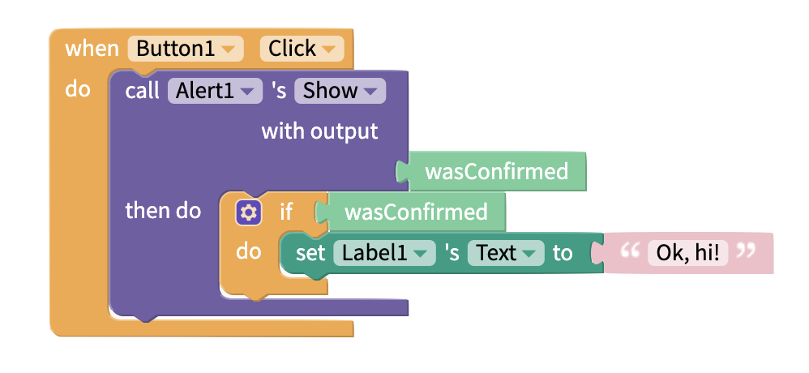
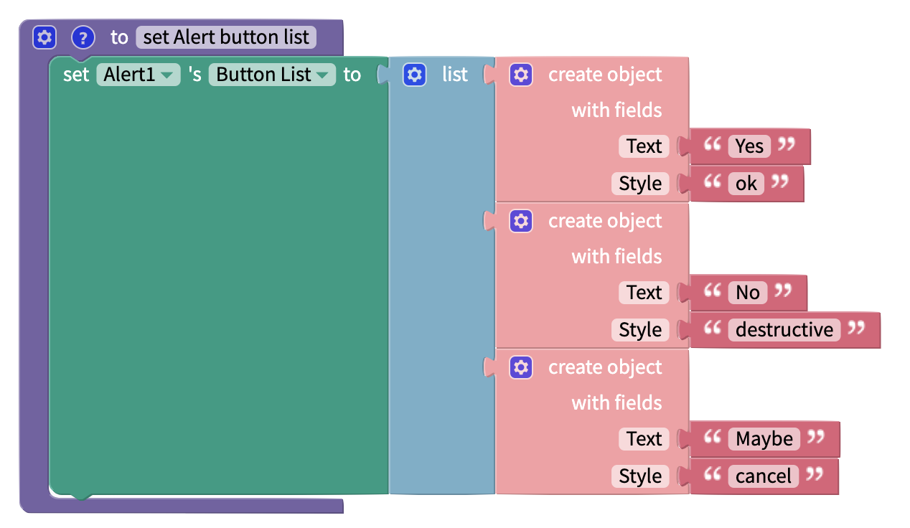
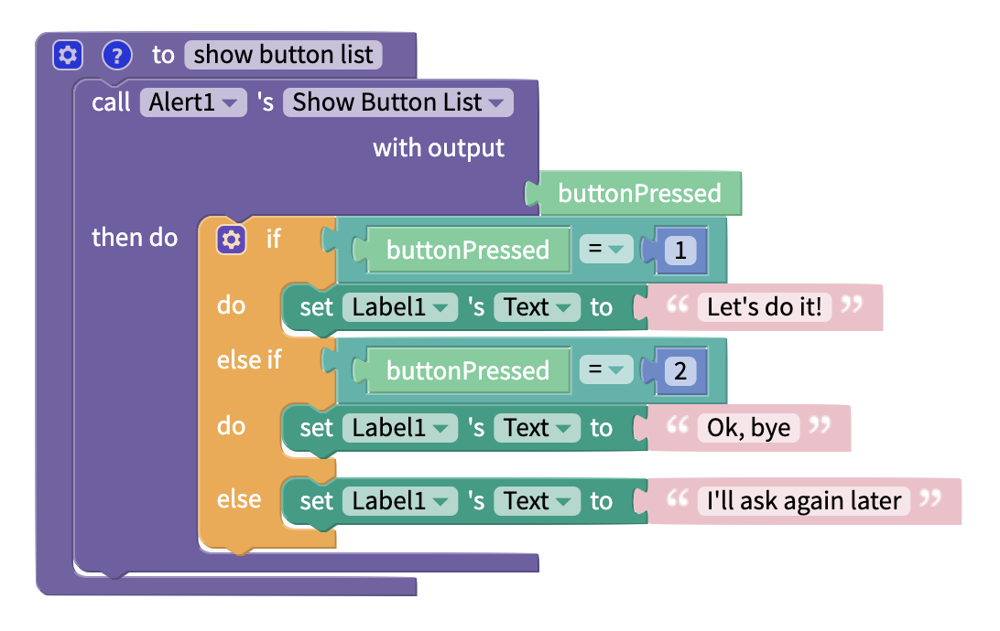

# Alert Blocks

Alerts are useful components for displaying important messages while users are in the app itself

## Adding an Alert to your app

To add an Alert component to your app:

1. Navigate to the **Blocks** tab of your project.
2. Under the App Features heading, locate **Alerts**.&#x20;
3. Click the ⊕ symbol next to Alerts.
4. Complete the properties fields as described below.&#x20;
5. Click **Submit**.

.png>)

You will see a dialog with options to enter certain properties for your Alert.&#x20;

### Change properties of your Alert

Once you have an Alert to your app, you can view it under the `Alerts` heading on the Blocks tab.&#x20;

To edit the properties of an Alert component, click on the ⚙ icon next to the component's name to bring up the properties dialog. You can change the properties and click Submit to save your changes, or click Delete to delete the component.

## One Button Alert

A one button alert, also known as a notification, displays a message and one button to confirm user has viewed the message

To set up an alert, simply fill in the following `simple` properties. The Cancel Button Text only needs to be filled out for a two-button alert. You can use blocks to start an event when

| Property            | Description               |
| ------------------- | ------------------------- |
| Title               | The title of the alert    |
| Message             | The subtitle of the alert |
| Confirm Button Text | The text of the button    |
| Cancel Button Text  | `LEAVE BLANK`             |

## Two Button Alert

Two button alerts have two buttons, one that dismisses the notification and one that can be programmed to start an event

To set one up, simply add the following `simple` properties

.png>)

| Property            | Description                                                                                                      |
| ------------------- | ---------------------------------------------------------------------------------------------------------------- |
| Title               | The title of the alert                                                                                           |
| Message             | The subtitle of the alert                                                                                        |
| Confirm Button Text | The text of the right confirm button; If the `Dangerous` switch is turned on, the text will be in red (iOS only) |
| Cancel Button Text  | The text of the left cancel button                                                                               |

## Blocks

If you want to start an event from a confirm button, you will want to add the blocks below:

## Button List: Alert with three or more buttons

It is possible to add buttons to an alert for more sophisticated use cases.\
This can be done using the `set Button List to` block by creating a [list](../../lists.md) of [objects](../blocks/objects.md).

You can set the **Text** of the Alert. You can set the **Style** of the Alert to **ok, destructive** or **cancel.**

On iOS, the Alert can show more than 3 Buttons.\
On Android, the Alert can show up to 3 buttons. If more than 3 buttons are specified, the first 3 will be shown.

| Property         | Description                                                                                                                                      |
| ---------------- | ------------------------------------------------------------------------------------------------------------------------------------------------ |
| Title            | The title of the alert                                                                                                                           |
| Message          | The subtitle of the alert                                                                                                                        |
| Text `Advanced`  | The text of the button                                                                                                                           |
| Style `Advanced` | The style of the button; `ok` is a confirm button, `cancel` is a cancel button and `destructive` is a confirm button with text in red (iOS only) |

The 'showButtonList' block will return an output called 'buttonPressed'.\
This will return the position of the Button in your Button List.\
You can take some action based on which button was pressed.

Note: the Buttons may appear in a different order when testing the app on a device. \
The number that ‘buttonPressed’ returns is the order that the Buttons are added in the app project.
