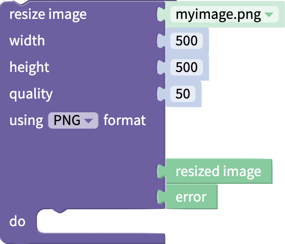

# Files Blocks

## Advanced Blocks

For each block in this drawer, you can right-click the block and select **Show advanced block** to see an expanded block with additional outputs. Both the simple and advanced blocks will be explained in this document.

## Image/Video from Photo Library

This block will open the user's photo library and allow the user to select a photo or video. The file can then be used in the app.

#### Advanced Block

| Output         | Data Type   | Function                                            |
| -------------- | ----------- | --------------------------------------------------- |
| photo or video | image/video | if a file was selected, returns the file            |
| was cancelled  | true/false  | returns whether the user cancelled selecting a file |
| error          | text        | if there was an error, returns the error            |

## File from Device

This block will open the user's file library and allow the user to select a file. The file can then be used in the app.

You can allow the user to upload any kind of file, or limit their selection by file type using the drop down menu.


Your end users may experience lags or delays if the file size they try to upload is larger than 5MB.


#### Advanced Block

<table><thead><tr><th width="150">Output</th><th width="287.76404494382024">Description</th><th>Data Type</th></tr></thead><tbody><tr><td>file</td><td>Points to the file that has been uploaded</td><td>Data type of the file that has been uploaded. Can also return address of the file as text</td></tr><tr><td>name</td><td>Name of the uploaded file</td><td>Text</td></tr><tr><td>mime type</td><td>Describes the type of file in <a href="https://developer.mozilla.org/en-US/docs/Web/HTTP/Basics_of_HTTP/MIME_types">MIME format</a></td><td>Text</td></tr><tr><td>size</td><td>Returns size of uploaded file in bytes</td><td>Number</td></tr><tr><td>was cancelled</td><td>Indicates whether the end user cancelled selecting a file</td><td>True/False</td></tr><tr><td>error</td><td>If there is an error, returns the error. Else returns <code>null</code></td><td>Text</td></tr></tbody></table>

## Upload a File to the Cloud

Thunkable integrates with [Cloudinary](https://cloudinary.com/), a service that allows you to store media files in the cloud. The upload file block allows you to send media directly from your Thunkable app to a linked Cloudinary account.

### Connect Your Cloudinary Account to Your Thunkable Project

Thunkable provides a shared Cloudinary account for your convenience, but we strongly recommend creating your own account to ensure privacy for your uploaded media. In addition, the shared Thunkable Cloudinary account has a media size limit of 10MB per app and your files will be deleted after 90 days.

To connect your Cloudinary accout to your Thunkable project:

1. Create a free Cloudinary account here: [cloudinary.com](https://cloudinary.com/).
2. From your **Cloudinary dashboard**, retrieve the following account details:&#x20;
   1. **Cloud Name**
   2. **API Key**
   3. **API Secret**
3. Return to your Thunkable project page.
4. Click the Settings icon in the left side menu.\
   
5. Scroll down until you reach the Cloudinary Settings section.
6. Input your Cloudinary Cloud Name, API Key, and API Secret.\
   

### Block: url from uploaded file / upload file

To access the `url from uploaded file` or `upload file` block:

1. Navigate to your project's **Blocks** tab.
2. Under the App Features heading, click **Files**.&#x20;
3. Drag the `url from uploaded file` block into your workspace. This is the regular version of the block.\
   
4. The `upload file` block is the advanced block. To access it, right-click the `url from uploaded file` block and select **Show advanced block**.\
   \
   \

| Output | Data Type | Function                                 |
| ------ | --------- | ---------------------------------------- |
| URL    | text      | returns a URL for the uploaded file      |
| error  | text      | if there was an error, returns the error |

To see an example of the `url from uploaded file` block in action, check out this video tutorial: [How to Create Data in a Thunkable Data Source](https://youtu.be/mxyjQRv4aDg?t=295).

## Resize Image

This block will take an image file and return it in the given dimensions, quality and format.

#### Advanced Block

| Input            | Data Type        | Function                                                                 |
| ---------------- | ---------------- | ------------------------------------------------------------------------ |
| resize image     | Any image file   | The image to be resized                                                  |
| width            | Number           | Width in pixels to resize image file to                                  |
| height           | Number           | Height in pixels to resize image file to                                 |
| quality          | Number           | Quality of resulting image, as a percentage of quality of original image |
| using ... format | Select from menu | Select image type for resulting image                                    |

| Output        | Data Type | Function                                                    |
| ------------- | --------- | ----------------------------------------------------------- |
| resized Image | Image     | The resized image in the selected format and quality level  |
| error         | Text      | If there was an error, returns the error. Else returns NULL |

