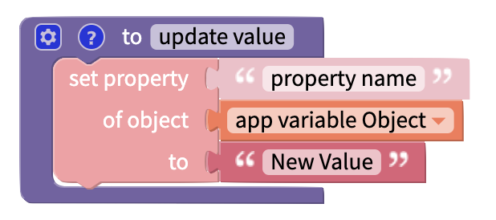

# Objects Blocks

The Object blocks pair well with the [Web API](../advanced-app-features/web-api/), [Map](../../app-design/ui-components/embed-components/map.md) and [Location Sensor](../../location-sensor.md) components which often send data in object format.&#x20;

## Creating an Object

### Create a New Object

You can use the following block to create a new object. Objects can be uploaded to your [Firebase DB](variables.md#connecting-a-firebase-realtime-db-to-your-app) as the value of a [cloud variable](variables.md#cloud-variables).

You can click on the gear icon to add properties to your object:

### Convert between Object and JSON

Sometimes, you want to convert between JSON (JavaScript Object Notation) and Objects. If an [API](../advanced-app-features/web-api/) returns a JSON value, you can convert it to an Object to use with Object blocks. Use the `get object from JSON` block:

Similarly, you may want to convert an Object to JSON to make an API POST, or set headers or query parameters for your API call. You can do this with the `generate JSON from Object` block:&#x20;

## Reading Property Values of an Object

### Get Values of an Object

You can use the `get property` block to read the value of an object's property.\
If the object does not have a property with this name, it will return `undefined`.

#### Nested values and values from Arrays 

The Get Values Of block can be used to get nested values, ie. properties of properties of an object. If you are trying to get nested property **b** of property **a** of an object, you can simply get property **a.b** of an object, instead of using multiple **get property of** blocks.

You can also get a value from an Array (or list) of values. If an object property **b** is a 3-items list, and you want to get the second item of that list, you can get property **b\[2]** of that object. The first item of the list is at index 1.

The blocks below demonstrate each of these methods, as well as a block that combines these methods by getting a value from an array that is a nested property of an object. The blocks are presented with the objects written in JSON format as well as created with Objects blocks, but both sets of blocks are doing exactly the same thing. In these blocks, `Get nested property` will return 5, `Get value from array` will return 6, and `Get value from nested array` will return 7.

.png>)

### Get Properties of an Object

You can use the `get Object properties of` block to return the names of the properties of an object.

This block returns a list of property names. This list can be used with [list](../../lists.md) blocks.

## Set Property Values of an Object

With the `set property` block, you can change the value of a single property of an object.

## Examples of using Object blocks in your app

### Getting values from an API

You can use Object blocks when making calls to an[ API.](../advanced-app-features/web-api/)

Often, when retrieving data from an API, you will get a large data dump in JSON format, as shown below.

`{ "response": { "version": "0.1", "termsofService": "http://www.wunderground.com/weather/api/d/terms.html", "features": { "conditions": 1 } }, "current_observation": { "image": { "url": "http://icons-ak.wxug.com/graphics/wu2/logo_130x80.png", "title": "Weather Underground", "link": "http://www.wunderground.com" }, "display_location": { "full": "San Francisco, CA", "city": "San Francisco", "state": "CA", "state_name": "California", "country": "US", "country_iso3166": "US", "zip": "94101", "latitude": "37.77500916", "longitude": "-122.41825867", "elevation": "47.00000000" }, "observation_location": { "full": "SOMA - Near Van Ness, San Francisco, California", "city": "SOMA - Near Van Ness, San Francisco", "state": "California", "country": "US", "country_iso3166": "US", "latitude": "37.773285", "longitude": "-122.417725", "elevation": "49 ft" }, "estimated": {}, "station_id": "KCASANFR58", "observation_time": "Last Updated on June 27, 5:27 PM PDT", "observation_time_rfc822": "Wed, 27 Jun 2012 17:27:13 -0700", "observation_epoch": "1340843233", "local_time_rfc822": "Wed, 27 Jun 2012 17:27:14 -0700", "local_epoch": "1340843234", "local_tz_short": "PDT", "local_tz_long": "America/Los_Angeles", "local_tz_offset": "-0700", "weather": "Partly Cloudy", "temperature_string": "66.3 F (19.1 C)", "temp_f": 66.3, "temp_c": 19.1, "relative_humidity": "65%", "wind_string": "From the NNW at 22.0 MPH Gusting to 28.0 MPH", "wind_dir": "NNW", "wind_degrees": 346, "wind_mph": 22.0, "wind_gust_mph": "28.0", "wind_kph": 35.4, "wind_gust_kph": "45.1", "pressure_mb": "1013", "pressure_in": "29.93", "pressure_trend": "+", "dewpoint_string": "54 F (12 C)", "dewpoint_f": 54, "dewpoint_c": 12, "heat_index_string": "NA", "heat_index_f": "NA", "heat_index_c": "NA", "windchill_string": "NA", "windchill_f": "NA", "windchill_c": "NA", "feelslike_string": "66.3 F (19.1 C)", "feelslike_f": "66.3", "feelslike_c": "19.1", "visibility_mi": "10.0", "visibility_km": "16.1", "solarradiation": "", "UV": "5", "precip_1hr_string": "0.00 in ( 0 mm)", "precip_1hr_in": "0.00", "precip_1hr_metric": " 0", "precip_today_string": "0.00 in (0 mm)", "precip_today_in": "0.00", "precip_today_metric": "0", "icon": "partlycloudy", "icon_url": "http://icons-ak.wxug.com/i/c/k/partlycloudy.gif", "forecast_url": "http://www.wunderground.com/US/CA/San_Francisco.html", "history_url": "http://www.wunderground.com/history/airport/KCASANFR58/2012/6/27/DailyHistory.html", "ob_url": "http://www.wunderground.com/cgi-bin/findweather/getForecast?query=37.773285,-122.417725" } }`

You may just want to pull out one attribute (like temp\_f or the temperature in Farenheit). To do so, you'll need to use the object blocks below:

