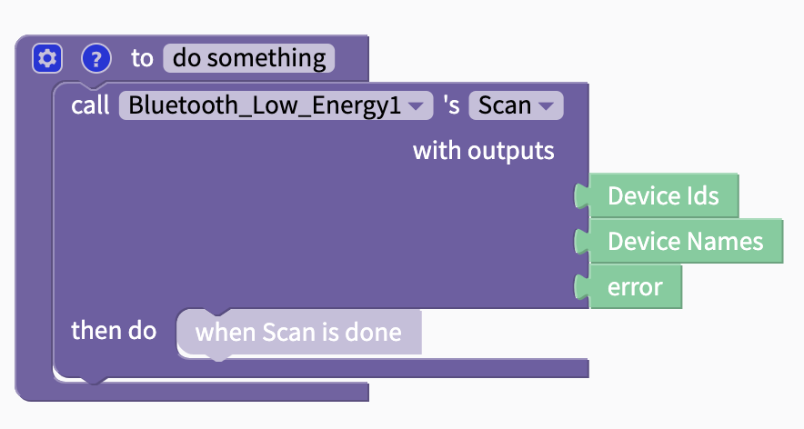
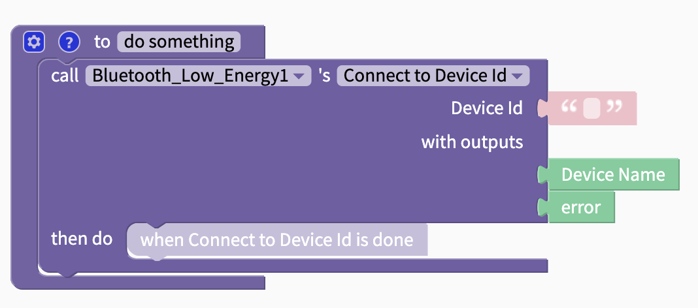
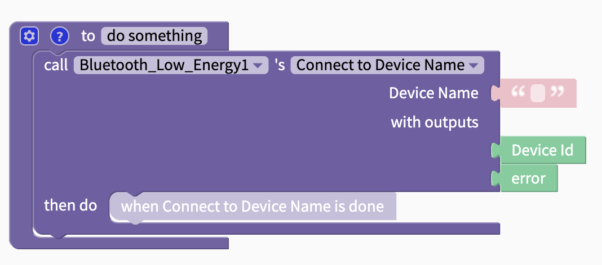
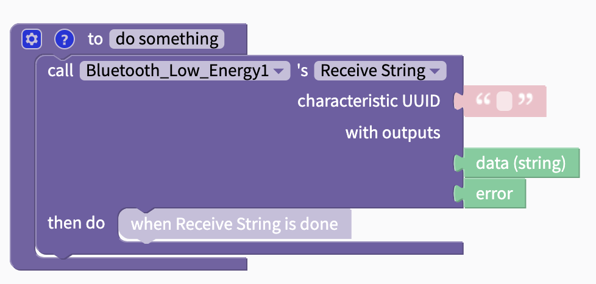
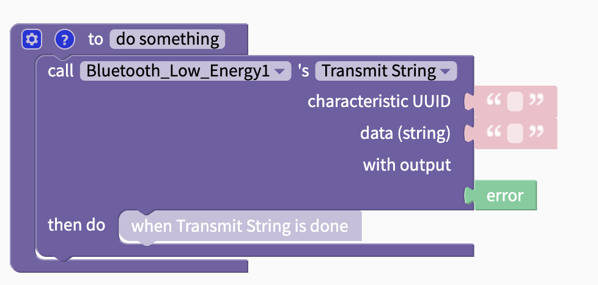
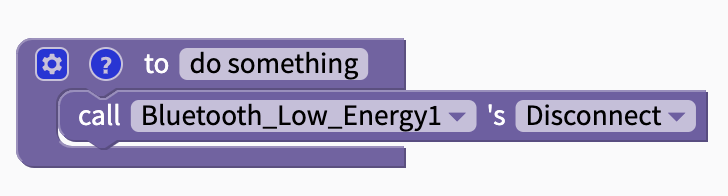

# Bluetooth Low Energy

## Description

Bluetooth Low Energy, or BLE, is used to wirelessly connect two devices to one another. The BLE component allows you to find and connect to BLE devices and to communicate directly with them.


BLE functionality can't be tested with the [Thunkable Live](https://docs.thunkable.com/get-started/live-test) app on iOS.   
To test the BLE functionality in your app on iOS, please [download](https://docs.thunkable.com/download#download-and-install-ios-app) your app.


## Add a Bluetooth component to Thunkable

To add a Bluetooth component to your app:

* Go to your Blocks tab
* Find the `Advanced` drawer of blocks. Click the drop-down menu icon to show the Advanced invisible components
* Click the ⊕ icon next to the `Bluetooth` drawer

You will see a dialog to create your Bluetooth component. Click Submit to create the component, or Delete to dismiss the dialog without creating the component.

### Deleting your Bluetooth Component

Once you have added at least one Bluetooth component to your app, you will be able to view all of your Bluetooth components under the `Bluetooth` drawer in the Advanced section of the Blocks tab. 

To delete a Bluetooth component, click on the ⚙ icon next to the component's name to bring up the properties dialog and click Delete.

## Functions

Version 1 of the BLE component in Thunkable ✕ contains 5 functions, each of which are documented in greater detail below.

* [Scan](bluetooth-low-energy.md#scan)
* [Connect to Device Id](bluetooth-low-energy.md#connect-to-device-id)
* [Connect to Device Name](bluetooth-low-energy.md#connect-to-device-name)
* [Receive](bluetooth-low-energy.md#receive)
* [Transmit](bluetooth-low-energy.md#transmit)

### Scan

This function is used to scan for nearby BLE or Bluetooth enabled devices. Scanning happens for 10 seconds. Once scanning has successfully completed then a list of the available device ids and a list of available names will be returned. If the scanning function can not be completed then an error will be returned.

| Parameter | Type | Description |
| :--- | :--- | :--- |
| Device Ids | List | **Returns** a list of the IDs of the available devices |
| Device Names | List | **Returns** a list of the names of the available devices |
| error | String | **Returns** an error message from the function |

### Connect to Device Id

The `Connect to Device Id` function allows your app to connect to a BLE enabled device based in the Id of that device.

| Parameter | Type | Description |
| :--- | :--- | :--- |
| Device Id | String | **Expects** a text string with the device id you want to connect to |
| Device Name | String | **Returns** the name of the device you have just connected to |
| error | String | **Returns** an error message from the function |

### Connect to Device Name

When you know the name of the BLE device that you want to connect to you can use the `Connect to Device Name` block to connect directly to it. Please note that device names are not unique and it is relatively easy to change the name of a BLE device.

| Parameter | Type | Description |
| :--- | :--- | :--- |
| Device Name | String | **Expects** a text block with the name of the device to connect to |
| Device Id | String | **Returns** the Id of the device that you have just connected to |
| error | String | **Returns** an error message from the function |

### Receive

If you have a BLE device that is capable of sending data to another device then you will need to use the `Receive` function in your app in order to listen to, or receive, data coming from the BLE device.

You need to be connected to another Bluetooth device in order to use this block.

You can receive a **String** or a **Byte Array**.

| Parameter | Type | Description |
| :--- | :--- | :--- |
| characteristic UUID | String | **Expects** a text block with a 32-bit UUID for the BLE type, service or profile required |
| data | String | **Returns** a string containing the information received from the BLE device |
| error | String | **Returns** an error message from the function |

### Transmit

Should you need to send data to a BLE device then you can use the `Transmit` function to send that information. 

You need to be connected to another Bluetooth device in order to use this block.

| Parameter | Type | Description |
| :--- | :--- | :--- |
| characteristic UUID | String | **Expects** a text block with a 32-bit UUID for the BLE type, service or profile required |
| data | String | **Expects** a text block with the message that you want to send to your BLE device |
| error | String | **Returns** an error message from the function |

### Disconnect

If connected to another Bluetooth device, this block will disconnect your app from the device.

