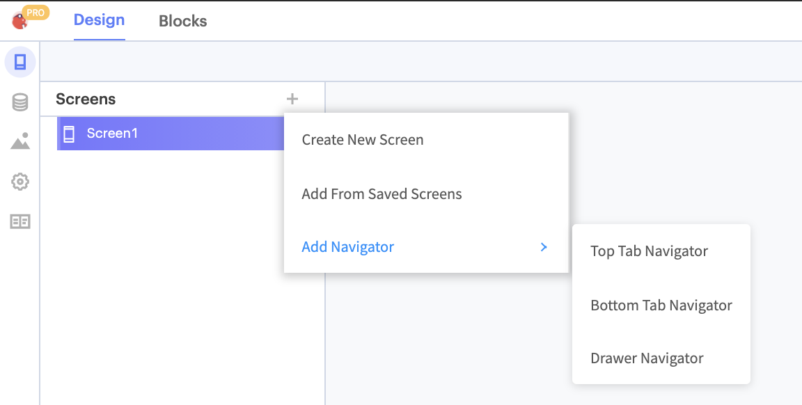

# Bottom Tab Navigator

## Video Tutorial

You can watch a video tutorial for using Navigators in your Thunkable app here:



## Adding Navigators

To add a navigator to your app, click **Screens +** at the top of your component tree.   
Select **Add Navigator** and select the Navigator you want to add.

## Tab Navigator Properties

You have many options for styling your Bottom Tab Navigator, such as changing the background color or tint color. Here are the different options for customization:

#### **Simple Properties**

* **Active Tint Color:** Select a font color for the tab currently in use.
* **Active Background Color:** Select a color for the tab currently in use.
* **Inactive Tint Color:** Select a color for the text of the tabs that are not in use. 
* **Inactive Background Color:** Select a color for the tab not currently in use.
* **ShowIcon:** Toggle whether to show icons in the Tab Navigator.
* **ShowLabel:** Toggle whether to show tab labels in the Tab Navigator.
* **Adding Labels and Icons to Your Tab**

When designing a tab, you can use words or images to guide users to different screens.  

