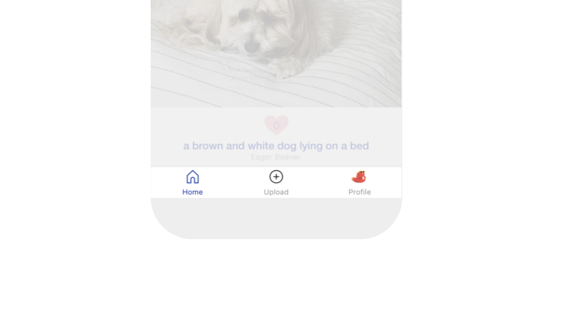

# Bottom Tab Navigator

## Video Tutorial

You can watch a video tutorial for using Navigators in your Thunkable app here:



## Adding Navigators

To add a navigator to your app, click **Screens +** at the top of your component tree. \
Select **Add Navigator** and select the Navigator you want to add.

## Bottom Tab Navigator Properties

You have many options for styling your Bottom Tab Navigator, such as changing the background color or tint color. Here are the different options for customization:

| Property                  | Description                                                         | Data Type        |
| ------------------------- | ------------------------------------------------------------------- | ---------------- |
| Active Tint Color         | Select a text color for the tab currently in use.                   | Color            |
| Active Background Color   | Select a background color for the tab currently in use.             | Color            |
| Inactive Tint Color       | Select a color for the text of the tabs that are not in use.        | Color            |
| Inactive Background Color | Select a color for the tab not currently in use.                    | Color            |
| Show Label Icon           | Select whether to show icons, labels, or both in the Tab Navigator. | Select from menu |

## Tab-Specific Properties

Click on a tab in your design to access the properties panel for that specific tab.

### Screen

| Property                           | Description                                                                                                                                                                           | Data Type                                                                                                                                                                                                    |
| ---------------------------------- | ------------------------------------------------------------------------------------------------------------------------------------------------------------------------------------- | ------------------------------------------------------------------------------------------------------------------------------------------------------------------------------------------------------------ |
| Navigation Button Name             | Text that appears in the top tab navigator.                                                                                                                                           | Text                                                                                                                                                                                                         |
| Scrollable                         | Select whether your user can scroll on this screen. For scrollable to work, the components in your screen must have heights either set in `absolute` pixels or set to `fit contents.` | True/False                                                                                                                                                                                                   |
| Background Color                   | Select the tab's background color.                                                                                                                                                    | Color                                                                                                                                                                                                        |
| Background Image                   | The image file to be shown in the tab's background                                                                                                                                    | 
PNG, JPG, GIF, SVG, etc. Can also use URL that ends in file extension (eg <a href="https://thunkable.com/static/media/logo.ba96eb83.png">https://thunkable.com/static/media/logo.ba96eb83.png</a>)
 |
| Background Image Resize Mode       | Set how image is shown if the file and the tab component have different dimensions/aspect ratio                                                                                       | 
Select from list <code>[cover, contain, stretch, repeat, center]</code> 
                                                                                                                           |
| Orientation (iOS and Android only) | Toggle whether your end user can swipe a list item to the left to view an additional Button. Reveals Left Swipe Button settings if set to `true`                                      | True/False                                                                                                                                                                                                   |

### Tab Navigation Options

| Property          | Description                                                                            | Data Type                                                                                                                                                                                                    |
| ----------------- | -------------------------------------------------------------------------------------- | ------------------------------------------------------------------------------------------------------------------------------------------------------------------------------------------------------------ |
| Tab Bar Label     | Set the Label of this Screen's tab in the Tab Navigator                                | Text                                                                                                                                                                                                         |
| Active Tab Icon   | Set the Icon of this Screen's tab in the Tab Navigator for when the Screen is active   | 
PNG, JPG, GIF, SVG, etc. Can also use URL that ends in file extension (eg <a href="https://thunkable.com/static/media/logo.ba96eb83.png">https://thunkable.com/static/media/logo.ba96eb83.png</a>)
 |
| Inactive Tab Icon | Set the Icon of this Screen's tab in the Tab Navigator for when the Screen is inactive | 
PNG, JPG, GIF, SVG, etc. Can also use URL that ends in file extension (eg <a href="https://thunkable.com/static/media/logo.ba96eb83.png">https://thunkable.com/static/media/logo.ba96eb83.png</a>)
 |
| Tab Bar Visible   | Set whether the Tab Navigator is visible when this Screen is open                      | True/False                                                                                                                                                                                                   |

### Status Bar

The status bar is located at the top of a phone's screen. The status bar displays information regarding signal strength, battery, and whether or not things like the alarm or wi-fi are enabled.

| Property                   | Description                                                                                                                    | Data Type                                               |
| -------------------------- | ------------------------------------------------------------------------------------------------------------------------------ | ------------------------------------------------------- |
| Visibility                 | Decide whether you want the status bar visible on the screen.                                                                  | True/False                                              |
| Style                      | Default is best practice, but you can select light-content or dark-content to potentially override the user's phone settings.  | Select from menu (default, light-content, dark-content) |
| Color (Android only)       | Color of the status bar.                                                                                                       | Color                                                   |
| Translucent (Android only) | When translucent is set to true, the app will appear under the status bar.                                                     | True/False                                              |

