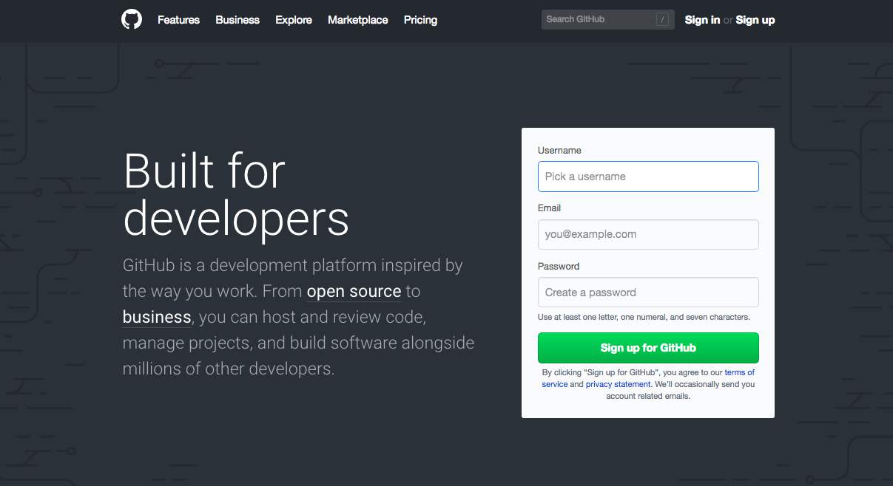
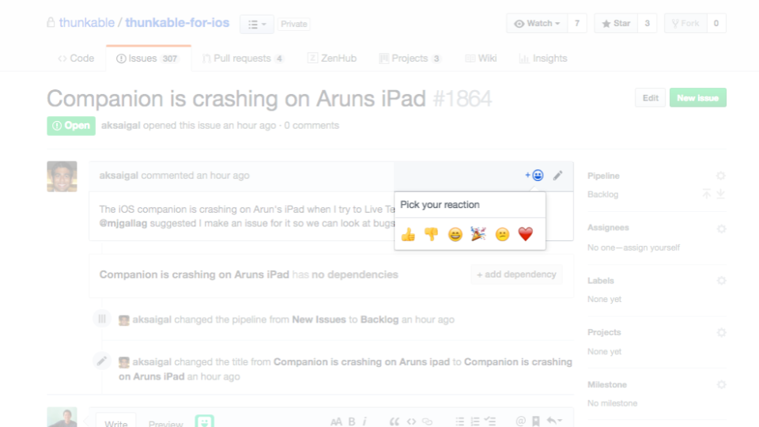

# 📝 Bugs and Feature Requests


Bugs are things on our platform that don't work as expected. Feature requests are new functionality that you will like to see added in the near future.


**One of our chief design principles at Thunkable is that our platform should be community-driven by our amazing group of developers**.

In the past, it's been hard for us to organize and prioritize your requests on the community forum so we are testing out a new way for users to submit us your bugs and feature requests on Github, the same infrastructure our developer team uses to fix the bugs and build the features that will help you build the apps that you want.

To submit a bug or feature request, please follow the steps below.

## Create your free account on [Github](https://github.com/)

## Check to see if your bug or feature request has already been reported in our [Thunkable public repository](https://github.com/thunkable/thunkable-issues/issues)

.png>)

## If you find your issue on the list, you can add a reaction like a Thumbs up or add additional comments and details

## If you don't see your bug or feature request, [create a new issue](https://github.com/thunkable/thunkable-issues/issues/new/choose)

.png>)

## For bug reports, please describe your problem in as much detail as possible and if possible, how to reproduce it exactly. Share copy links are always welcome!

.png>)

## For feature requests, please tell us how you would like to use the features in as much detail as possible such as what kind of app you are trying to build. This will help us define the feature to match your needs.

.png>)

## Congrats!

That's it. Our hope is to use your voice as the basis for how we take our platform into the future.
