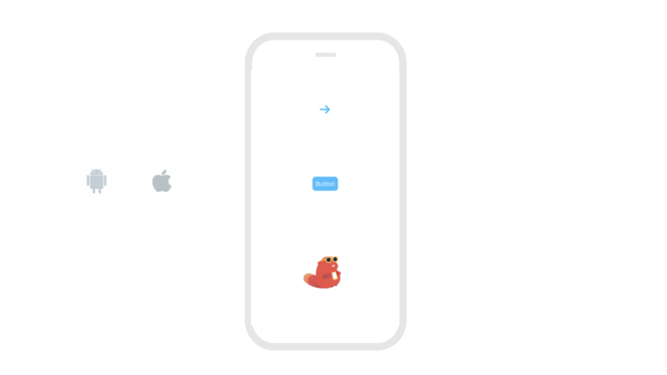
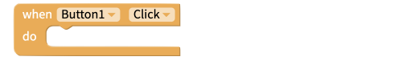
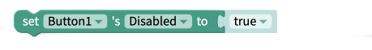
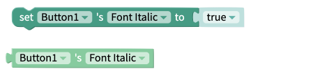
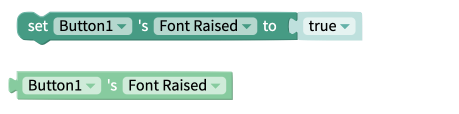
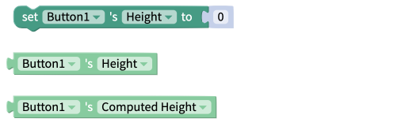
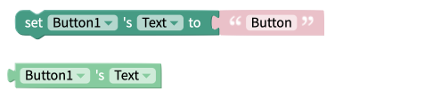
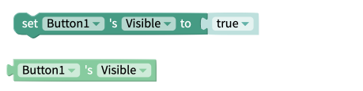
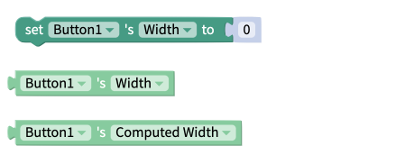

# Button

## Button Overview

A button is just something you can click on to perform an action. This action can be anything from navigating to a different screen, saving information to a database, or playing a sound.

## Properties

### Button

| Property                    | Description                                    | Data Type              |
| --------------------------- | ---------------------------------------------- | ---------------------- |
| Text                        | Text of the Button                             | Text                   |
| Font                        | Font used to display Button's text             | Select from menu       |
| Custom Font (mobile only)\* | Font used to display Button's text             | Upload TTF or OTF file |
| Text Color                  | Color of Button's text                         | Color                  |
| Font Bold                   | Toggle whether Button's text is **bold**       | True/False             |
| Font Italic                 | Toggle whether Button's text is _italic_       | True/False             |
| Raised                      | Toggle whether Button has shadow               | True/False             |
| Font Size                   | Size of Button's text                          | Number                 |
| Disabled                    | Toggle whether Button is disabled for end user | True/False             |


Uploading a custom font is available on Thunkable's Business and Enterprise plans.\
[Read more about our pricing plans here.](https://thunkable.com/#/pricing)


### Layout

<table><thead><tr><th width="173.33333333333331">Property</th><th>Description</th><th>Data Type</th></tr></thead><tbody><tr><td>X</td><td>Position of top left corner of Button on X-axis, where the left hand side is X=0</td><td>Number</td></tr><tr><td>Y</td><td>Position of top left corner of Button on Y-axis, where the top hand side is X=0</td><td>Number</td></tr><tr><td>Height</td><td>Height of Button in pixels</td><td>Number</td></tr><tr><td>Width</td><td>Width of Button in pixels</td><td>Number</td></tr><tr><td>Resize Mode</td><td>Stretch the button to fit the device screen or render it the same as the design, regardless of the device (float in place).</td><td>Select from menu (Stretch or Float in place)</td></tr></tbody></table>

### Style

| Property                    | Description                                                           | Data Type                                  |
| --------------------------- | --------------------------------------------------------------------- | ------------------------------------------ |
| Visible                     | Toggle whether your end users can see the Button                      | True/False                                 |
| Background (Color or Image) | Button's background color or the image displayed on the button        | Color or uploaded image file               |
| Border Style                | Style of Button's border                                              | Select from list `[solid, dotted, dashed]` |
| Border Color                | Color of Button's border                                              | Color                                      |
| Border Width                | Width of Button's border in pixels                                    | Number                                     |
| Border Radius               | Radius of corners of Button's border in pixels                        | Number                                     |
| Shadow Color                | Color of Button's shadow                                              | Color                                      |
| Shadow Opacity              | Opacity of Button's shadow                                            | Number between 0 and 100                   |
| Shadow Radius               | Radius of corners of Button's shadow in pixels                        | Number                                     |
| Shadow Offset               | How far the Button's shadow is offset, in Height and Width, in pixels | Number                                     |

## Blocks

### Events

You can use the following blocks to listen for when a specific event occurs

#### Click

Performs an action when the user taps the button.

#### Long Click

Performs an action when the user holds down the button.

#### Touch Down

Performs an action when a user pressed down on the button

#### Touch Up

Performs an action after the user releases the button

### Properties

#### Background Color

.png>)

The get and set background color properties work with the color of the button itself i.e. the region behind the button text. Best practice is to use one of the built [color blocks](color.md) to set this value, but you can use HEX and RGB values too.

#### Background Picture

#### Background Picture Resize Mode

The set and get resize mode blocks work with how the background picture is scaled within the button component. Acceptable values are:

* Cover
* Contain
* Stretch
* Repeat
* Center

#### Disabled

The disabled property is used to set whether or not the button is "clickable". Expected values for this property are:

* True
* False

#### Font

.png>)

The font style properties of the button text can be "**Bold**",  "_Italic",_ or Raised. Expected values for each property are:

* True
* False

#### Font Size

The get and set font size blocks are used to work with the size of the text that is displayed in the button. This value must be a number.

#### Height

The set and get height blocks work with the Height property of the button component. Acceptable input values are.&#x20;

* Number of Pixels
* Percentage Height
* "Fit Contents"
* "Fill Container"

The `Computed Height`block returns the on-screen dimensions of the button, after it has been rendered on-screen. The value returned is an integer, representing the size of the button in pixels.

#### Text

This property corresponds to the text that is displayed in the button component.

#### Text Color

The get and set text color properties can be used to work with the color of the text displayed on the button. Best practice is to use one of the [color blocks](color.md) to set this value but you can use HEX and RGB values too.

#### Visible

The set and get visible blocks are used to show or hide the entire button component. Acceptable values are:

* True
* False

#### Width

The set and get width blocks work with the Width property of the button component. Acceptable input values are.&#x20;

* Number of Pixels
* Percentage Width
* "Fit Contents"
* "Fill Container"

The `Computed Width`block returns the on-screen dimensions of the button, after it has been rendered on-screen. The value returned is an integer, representing the size of the button in pixels.

