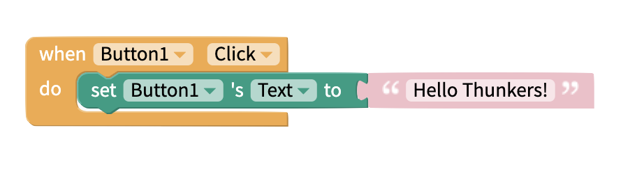
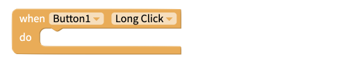
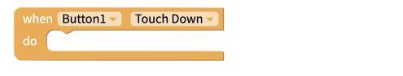
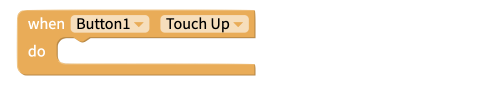
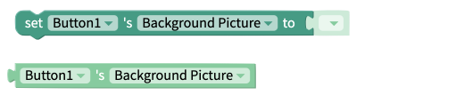
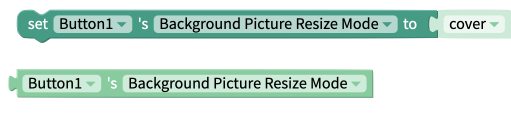
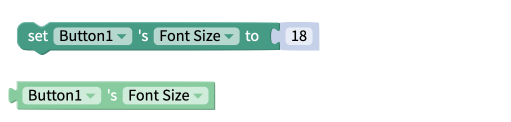
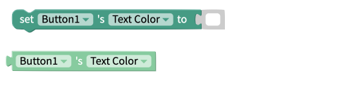

# Button

## Button Overview

A button is just something you can click on to perform an action. This action can be anything from navigating to a different screen, saving information to a database, or playing a sound.

## Style the Button

You have many options for styling your button, such as changing the background color or text color. Here are the different options for customization:

* **Text:** Text that appears on the button
* **Text Color:** Color of the text that appears on the button
* **Background Color:** Sets the background color of the button
* **Font Size:** Size of the text that appears on the button
* **Background Picture:** Upload a picture that appears on the button. ****
* **Background Picture Resize Mode**
  * **Cover:** Fills the entire button without changing the height and width ratio of the image
  * **Contain:** The entire image will be scaled down to fit inside the button, without changing the height and width ratio of the image
  * **Stretch:** The image's height will change to fill the button length-wise
  * **Repeat:** Repeat the image to cover the button. The image's height and width ratio will not change
  * **Center:** Positions the image in the middle of the button
* **Visible:** To see the button in your app, set the switch to true
* **Border**
  * **Width:** Enter how wide you want the border outline of the button to be
  * **Color:** Pick a color for the border of the button
  * **Style:** Select if you want the border to be a dotted, dashed or solid line
  * **Radius:** Enter how round you want the edges of the border for the button to be
* **Font Bold:** To make the text on the button bold, set the switch to true
* **Font Italic:**  To make the text on the button italic, set the switch to true
* **Raised:** To cast a shadow around the button, set the switch to true
* **Disabled:** To prevent the button from performing an option when it is clicked, set the switch to true

## Edit size and position

You can drag and drop your component into position, and set its size.   
You can set exact values for the component's Height and Width, and X and Y coordinates, in its properties.

**Height:** Height of Button in pixels  
**Width:** Width of Button in pixels

**X:** position of top left corner of Button on X-axis  
**Y:** position of top right corner of component on Y-axis

## Events

You can use the following blocks to listen for when a specific event occurs

### Click

Performs an action when the user taps the button.

### Long Click

Performs an action when the user holds down the button.

### Touch Down

Performs an action when a user pressed down on the button

### Touch Up

Performs an action after the user releases the button

## Properties

### Background Color

The get and set background color properties work with the color of the button itself i.e. the region behind the button text. Best practice is to use one of the built [color blocks](colour.md) to set this value, but you can use HEX and RGB values too.

### Background Picture

### Background Picture Resize Mode

The set and get resize mode blocks work with how the background picture is scaled within the button component. Acceptable values are:

* Cover
* Contain
* Stretch
* Repeat
* Center

### Disabled

The disabled property is used to set whether or not the button is "clickable". Expected values for this property are:

* True
* False

### Font

The font style properties of the button text can be "**Bold**",  "_Italic",_ or Raised. Expected values for each property are:

* True
* False

### Font Size

The get and set font size blocks are used to work with the size of the text that is displayed in the button. This value must be a number.

### Height

The set and get height blocks work with the Height property of the button component. Acceptable input values are. 

* Number of Pixels
* Percentage Height
* "Fit Contents"
* "Fill Container"

The `Computed Height`block returns the on-screen dimensions of the button, after it has been rendered on-screen. The value returned is an integer, representing the size of the button in pixels.

### Text

This property corresponds to the text that is displayed in the button component.

### Text Color

The get and set text color properties can be used to work with the color of the text displayed on the button. Best practice is to use one of the [color blocks](colour.md) to set this value but you can use HEX and RGB values too.

### Visible

The set and get visible blocks are used to show or hide the entire button component. Acceptable values are:

* True
* False

### Width

The set and get width blocks work with the Width property of the button component. Acceptable input values are. 

* Number of Pixels
* Percentage Width
* "Fit Contents"
* "Fill Container"

The `Computed Width`block returns the on-screen dimensions of the button, after it has been rendered on-screen. The value returned is an integer, representing the size of the button in pixels.

