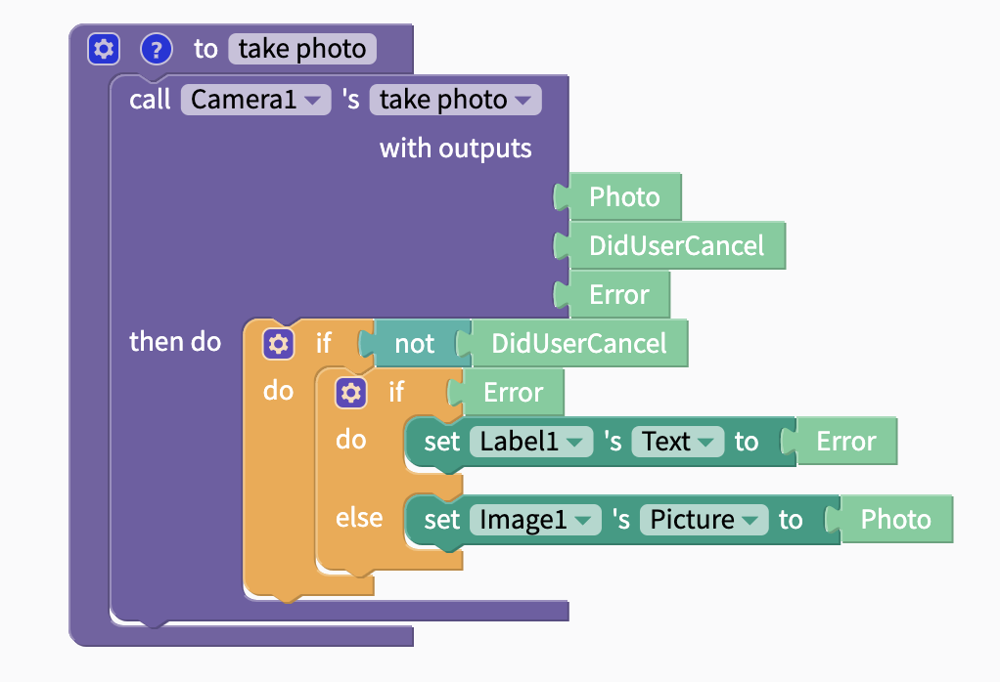

# Camera

## Blocks

### Take Photo

| Output Name | Data Type | Function |
| :--- | :--- | :--- |
| Photo | image | if a photo was taken, returns the photo |
| DidUserCancel | true/false | returns whether the user cancelled taking the photo |
| Error | text | if there was an error, returns the error |

