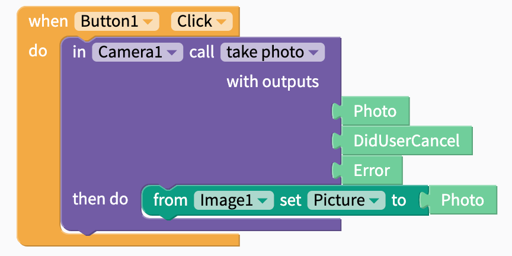

# Camera

## Video Tutorial



## Overview

* [Take Photo](camera.md#take-photo)

## Take Photo

The camera block has three outputs:

 **i\) Photo:** This saves the photo taken by the user.

**ii\) DidUserCancel:** This is either true or false depending on whether the user cancelled taking the picture

**iii\) Error:** Indicates if there was an error when the photo was taken

