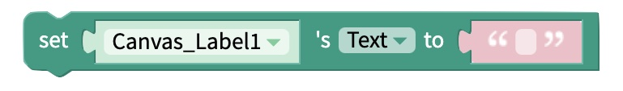
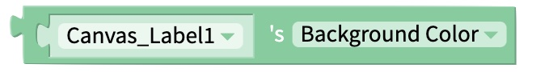

# Canvas Label

## Text

### Set Text

Set the text being displayed in the Canvas Label.

### Get Text

Get the text of the Canvas Label.

## Position

### X Co-ordinate

#### Set X

Set the X Co-ordinate of the top-left pixel of the Canvas Label.

#### Get X

Get the X Co-ordinate of the top-left pixel of the Canvas Label.

### Y Co-ordinate

#### Set Y

Set the Y Co-ordinate of the top-left pixel of the Canvas Label.

#### Get Y

Get the Y Co-ordinate of the top-left pixel of the Canvas Label.

## Appearance

### Font Size

#### Set Font size

Set the font size of the text of the Canvas Label.

#### Get Font Size

Get the font size of the text of the Canvas Label.

### Text Color

#### Set color

Set the color of the text of the Canvas Label.

#### Get Color

Get the color of the text of the Canvas Label.

### Background Color

#### Set Background Color

Set the color of the background of the Canvas Label.

#### Get Background Color

Get the color of the background of the Canvas Label.

## Location

### Move to Stage

Move the Canvas Label to the named Stage.

