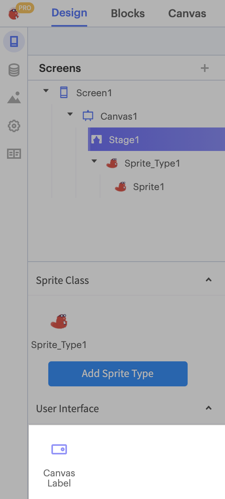

# Canvas Label

The Canvas Label is a piece of text that can be placed onto your [Stage](canvas.md#the-stage). 

## Adding a Canvas Label to your app

To add a Canvas Label to your app, click on the Stage of your Canvas. This will automatically bring you to the Canvas tab. Underneath your component tree, where you would see a component menu in the Design tab, you will see your Sprite Type menu and a User Interface menu. You can find the Canvas Label in the Unser Interface menu.

You can drag and drop the Canvas Label onto your Stage.

## Canvas Label Properties

**Text:** The Text being displayed on your Canvas Label  
**X:** The X-co-ordinate of the top-left pixel of the Canvas Label  
**Y:** The Y-co-ordinate of the top-left pixel of the Canvas Label  
**Font Size:** The size of the font of the Canvas Label  
**Color:** The Color of the text of the Canvas Label  
**Background Color:** The color of the background of the Canvas Label  
**Stage Selection:** Select a Stage to display the current Canvas Label on

