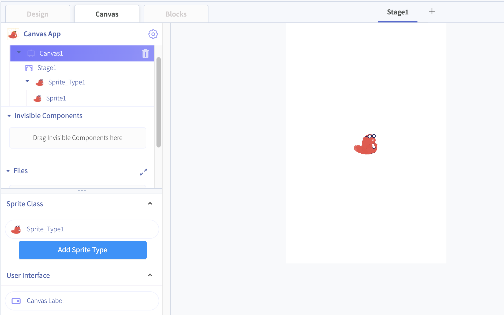
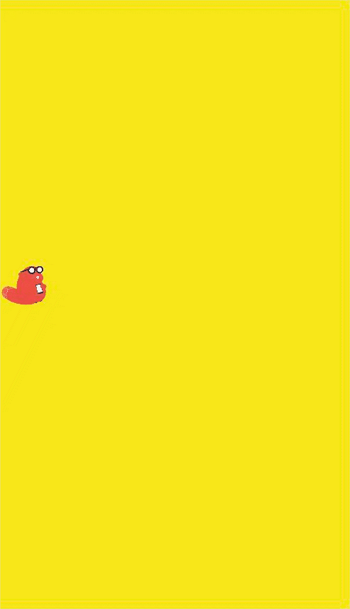
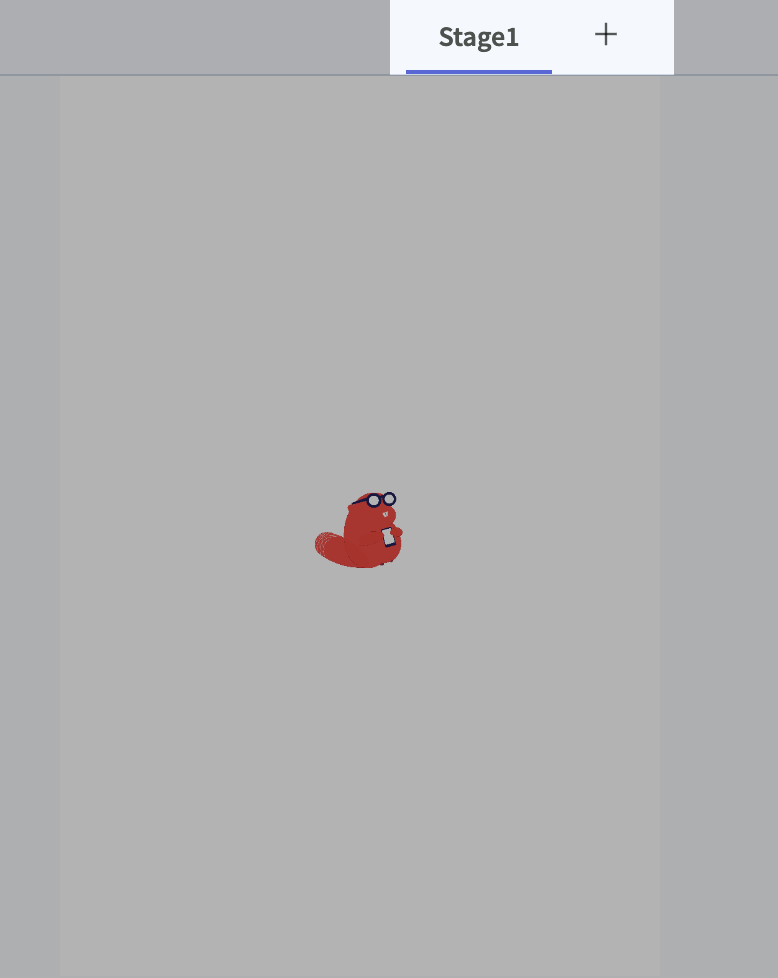

# Canvas

The canvas component is a touch-sensitive panel that enables the movement of items. 

You can use this component to create a variety of games and experiences that involve different methods of touching a screen.

* [Adding a Canvas](canvas.md#adding-a-canvas)
* [The Stage](canvas.md#the-stage)
  * [Gravity](canvas.md#gravity)
  * [Touch Drawing](canvas.md#touch-drawing)

## Adding a Canvas 

To add a canvas to your app, drag and drop the canvas component into the app builder. 

When you click on the Canvas in your component tree, Canvas tab will appear. Click on this tab to customize your canvas

The three elements of a Canvas are the **Stage,** the **Sprites**, and the **Canvas Label**.

## The Stage

The Stage is the background of your Canvas. You can set a background color or background picture, a border color, and the stage's Height and Width. You can click and drag your **Sprites** on the stage in the Canvas tab.

### Gravity

You can set **Gravity** of the Stage along the X and Y axis. The Sprites on the stage can be toggled to **ignore** gravity or not. If a Sprite is affected by gravity, it will be pulled in the direction of the gravity. 















### Stage Scaling Mode

Your Canvas Stage will automatically scale up in order to match the size of the device screen. If the aspect ratio of the Stage does not match the aspect ratio of the device, you can use **Stage Scaling Mode** to resize the background to fill the device screen.

**Scale:** The aspect ratio of the background will be maintained, and the background will be scaled up. May result in some of the background being cropped.

**Stretch:** The background image will be stretch in order to fill the screen. May result in the background image being distorted.

#### Stage Alignment

Select how you want your background image to be centered when it is scaled to match the device screen.

Can be set to **center, center horizontally only, center vertically only,** or **none.**

### Touch Drawing

You can enable **Touch Drawing** on your Screen.   
You can set the **Drawing Color** to choose the color you draw in.   
You can set the **Drawing Width** to choose the thickness of the line you draw on the stage.

### Multiple Stages

You can add multiple stages to a Canvas component, in the same way you can add multiple Screens to an app project. when you have selected your Canvas tab, click on the + next to your Stage name to add another Stage to the Canvas.

Each Stage has its own Sprites, background color, gravity, etc. 

