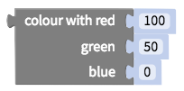

# Color

## Select Color

There is a predefined set of colors in the blocks palette

.png>)

Clicking on this color will bring up a menu:

## Set RGB Color

You can use this block to select a color with [RGB values](https://www.w3schools.com/colors/colors\_rgb.asp):

## Set RGBA Color

You can use a [Text](text.md#text-value) block to set a color with [RGBA syntax](https://www.w3schools.com/css/css\_colors\_rgb.asp): `rgba(r,g,b,a)`

## Set HSV Color

You can use this block to set a color with [HSV (Hue saturation, value)](https://en.wikipedia.org/wiki/HSL\_and\_HSV):

## Set Hex Color

You can use a [Text](text.md) block to include a [hex value](https://htmlcolorcodes.com/) for your preferred color:

## Blend Colors

You can create a color by blending two together with a selected ratio of color 1 to color 2:

## Random Color

This block will return a random color (with an Alpha value of 100%):

.png>)
