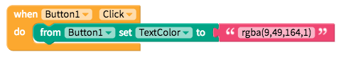
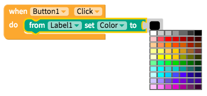
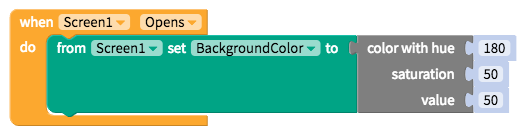

# Color

* [Set RGBA color](colour.md#set-rgba-color) 
* [Set RGB color](colour.md#set-rgb-color)
* [Set HSV color](colour.md#set-hsv-color)

There is a predefined set of colors in the blocks palette

## Set RGBA Color

As pictured below, the easiest way to set a specific color is using a text block with the syntax `rgba(r,g,b,a)`

## Set RGB Color

If you want to select specific colors, use the RGB block below

Strangely, you can also create a color by blending two together

or you can choose one at random

## Set HSV Color

A popular alternative to setting RGB color is to set Hue, Saturation and Value colors with the block below

