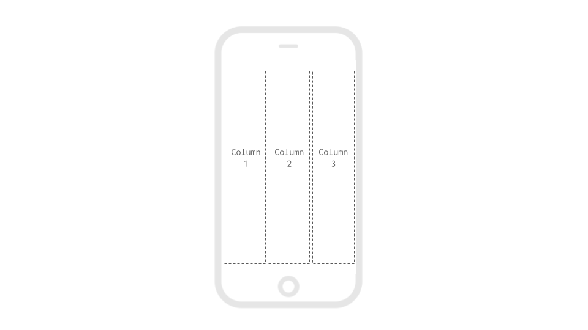
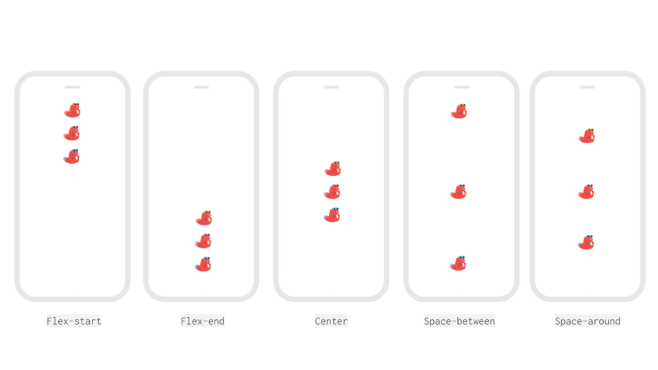
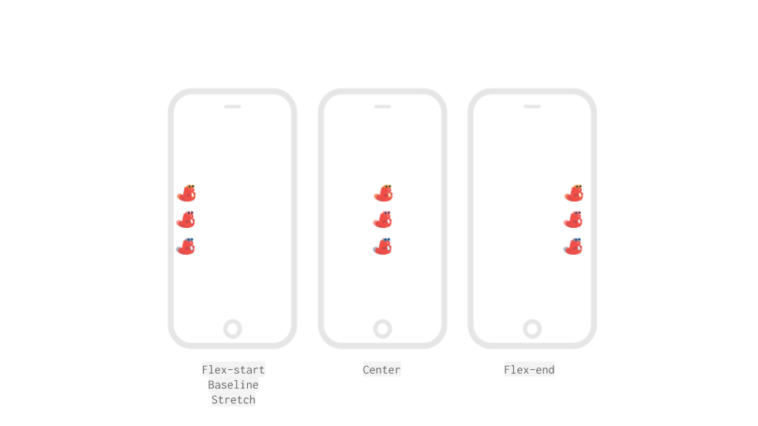

# Column

## Set the Size of a Column

For more information on sizing in your app, please see our [introduction here​](intro-to-sizing.md)

<table>
  <thead>
    <tr>
      <th style="text-align:left"><b>Property</b>
      </th>
      <th style="text-align:left"><b>Description</b>
      </th>
    </tr>
  </thead>
  <tbody>
    <tr>
      <td style="text-align:left">Height</td>
      <td style="text-align:left">
        <ul>
          <li>Fill container - The column fills the entire screen vertically</li>
          <li>Fit contents - The column&#x2019;s height changes to fit the components
            it contains</li>
          <li>Relative size - The column fills the specified percentage of the screen</li>
          <li>Absolute size - Sizes the column to a specified number of pixels</li>
        </ul>
      </td>
    </tr>
    <tr>
      <td style="text-align:left">Width</td>
      <td style="text-align:left">
        <ul>
          <li>Fill container - The column fills the entire screen horizontally</li>
          <li>Fit contents - The column&#x2019;s width changes to fit the components
            it contains</li>
          <li>Relative size - The column fills the specified percentage of the screen</li>
          <li>Absolute - Sizes the column to a specified number of pixels</li>
        </ul>
      </td>
    </tr>
  </tbody>
</table>## Space the elements vertically

The `Vertical Alignment` property allows you to space elements in a Column vertically

## Space the elements horizontally

The `Horizontal Alignment` property allows you to space elements in a Column horizontally

## Add a background color or picture

| Property | Description |
| :--- | :--- |
| Background Color | Default \(`none`\). Select any color using the color picker, RGBA or HEX value |
| Background Picture | You can upload a background image to your app or reference an image url e.g.`beaver-yellow.png` |

## Background Picture Resize Mode

This determines how to resize the image when the frame doesn't match the raw image dimensions.

* Cover: Fills the entire screen without changing the height and width ratio of the image 
* Contain: The entire image will be scaled down to fit inside the screen, without changing the height and width ratio of the image 
* Stretch: The image's height will change to fill the screen length-wise 
* Repeat: Repeat the image to cover the screen. The image's height and width ratio

   will not change    

* Center: Positions the image in the middle of the frame

## Enable scrolling

| Property | Description |
| :--- | :--- |
| Scrollable | Default \(`false`\). Indicates whether the column is scrollable. For scrollable to work, you must also set your screen height to `fit contents`  and the components in your column must have heights set in `absolute` pixels |

