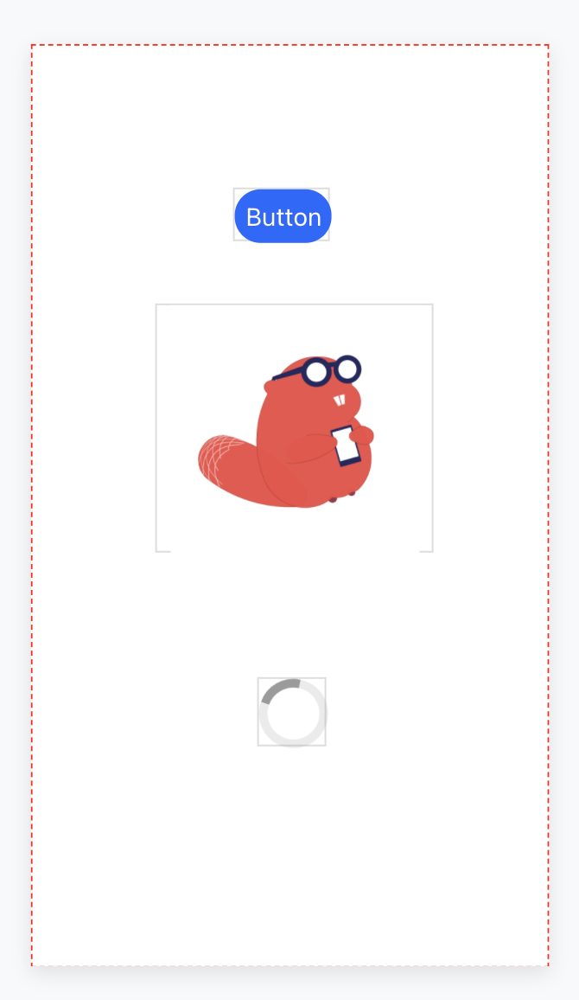

# 🛠️ Components

## What's a Component?

Apps contain many different features. 

On Thunkable, you get to drag & drop which features - which we call components - go into your app. 

Some features you can see. Let's call these features visible components. Examples include buttons, loading icons, and images. 

Some features you can't see. Let's call these features invisible components. Examples include sounds, timers, and databases. 

* [Visible Components](components.md#visible-components)
* [Invisible Components](components.md#invisible-or-api-components)

## Visible Components

To put it simply, visible components are features that you can see on your app screen - like the ones pictured above.  

Visible components can be styled by size, text, space, and location. 

When adding visible components into your app, please note that they can only exist on one screen at a time. For example, if you want to add a button to three different screens, each screen will require its own button.

## Invisible Components

[Invisible components](invisible-components.md) are features on your app that you can't see. 

They often relate to your app's functionality, and are quietly running in the background. When you add an invisible component to your app, that component can work on any screen. 

For example, if you add a [Camera](camera.md) to your app, the database can be accessed from any screen. You do not need to add a Camera component to each screen.

## Finding Components

Components are organized into 8 different categories. For a more detailed description of each category and an outline of the components they contain, click on one of the pages below.













To find a component, you can look in the **Add Components** section on the Thunkable app builder. You can also expand and collapse categories depending on your needs.

You can use the Search bar to search for components.

## The Component Tree

The component tree can be found at the top left corner of your screen, just below your project name. The component tree contains a list of the visible components in your app. 

Components that are nested can also be expanded and collapsed by clicking on the ▾ icon. 

