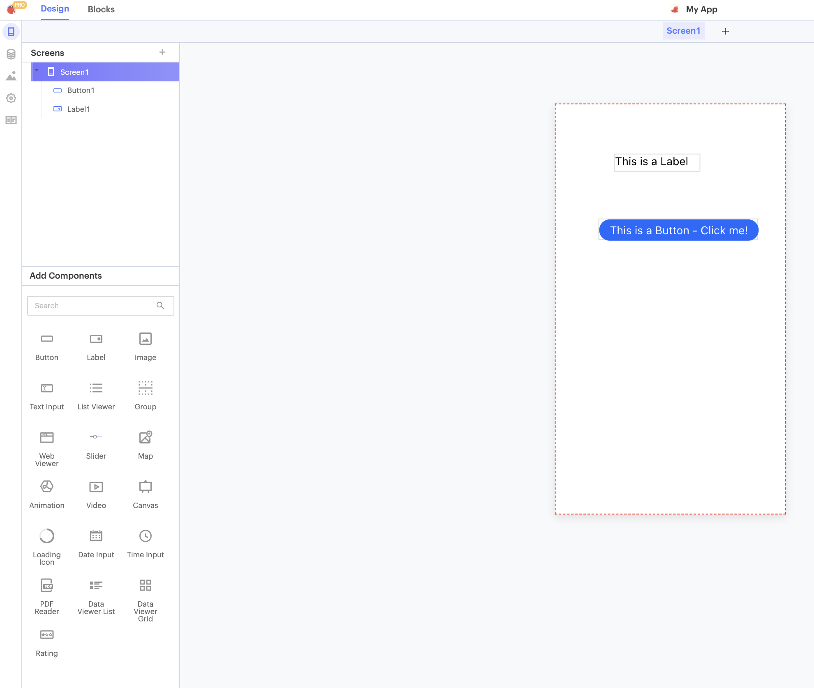

# 🛠️ Components and Features

## What's a Component?

Components are the building blocks of your Thunkable app. They can help your app look a certain way or have a certain functionality.&#x20;

UI Components (User Interface Components) are components which you can see on the screen. Examples include buttons, loading icons, and images.&#x20;

Thunkable also offer interactivity for App Features. These App Features offer control of mobile specific functions as well as non-UI components. Examples include sounds, timers, camera, and sensors to name a few.

## UI Components

.png>)

[UI Components](ui-components.md) make up the visual aspect of your user interface. Combine, style and customize Thunkable UI components to give your app personality and style that best suits your brand.

.png>)

Each UI component has unique properties that you can use to customize it. You can find this at the top of the **Properties panel**. All UI components have a section called **Layout** and **Style**.&#x20;

In the example above, a **Label** has been selected. Note its unique properties such as its font, color, alignment, etc.&#x20;

## App Features

[App Features](app-features.md) are features offer non-UI functionality.&#x20;

They often relate to your app's functionality, and are quietly running in the background. Add App Features in the Blocks tab of your project.

.png>)

## Finding Components

Components are organized into 8 different categories. For a more detailed description of each category and an outline of the components they contain, click on one of the pages below.


[ui-components.md](ui-components.md)



[data-viewers.md](data-viewers.md)



[screens-and-navigators.md](screens-and-navigators.md)



[monetization.md](monetization.md)



[gaming.md](gaming.md)



[app-features.md](app-features.md)


To find a component, you can look in the **Add Components** section on the Thunkable app builder. You can also expand and collapse categories depending on your needs.

You can use the Search bar to search for components.

## The Component Tree

The component tree can be found at the top left corner of your screen, just below your project name. The component tree contains a list of the visible components in your app.&#x20;

Components that are nested can also be expanded and collapsed by clicking on the ▾ icon.&#x20;

