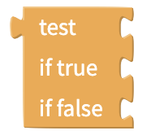
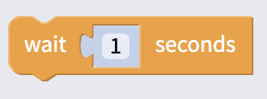
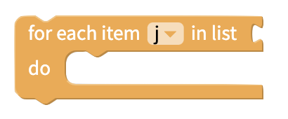

# Control

## Navigate to a Screen

You can manage much of your screen navigation through our [Top Tab](top-tab-navigator.md), [Bottom Tab](bottom-tab-navigator.md), [Drawer](drawer-navigator.md) and [Stack]() navigator components but for simple screen navigation, you can use the very popular block below

## If `this`, do `that`

In most apps, one event leads to another event if a **condition** is met. To specify these scenarios, the `this`, do `that` block is commonly used with [Logic](logic.md) blocks that define the conditions that lead one event to the next.

The if `this`, do `that` block can be transformed to support more complex logic

### Test

The Test block can be used to return a value based on a given condition. If the condition is true, one value is returned. If the condition is false, a different value is returned.

## Wait

Wait the specified amount of time before performing the next action.

## Loops

Repeat a set of blocks for a specified amount of time

Repeat an action for an unlimited period of time

Repeat an action the specified number of times

Repeat an action for a certain amount of times, with the incrementer index _i_

Repeat an action over every item in a list

Repeats an action while a condition is true

Break out of an existing loop

## Open an Installed App or Website by Link

You can prompt a user to open a page within an app installed on their phone or a url in their browser using the block above.

Thanks to the development of universal links for iOS and Android app links, you simply need to enter the url of the webpage for your app to automatically open to the app if it's installed or open the web browser if it is not.

You can see this block featured in the sample app, [New Market Goods](control.md).

