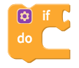
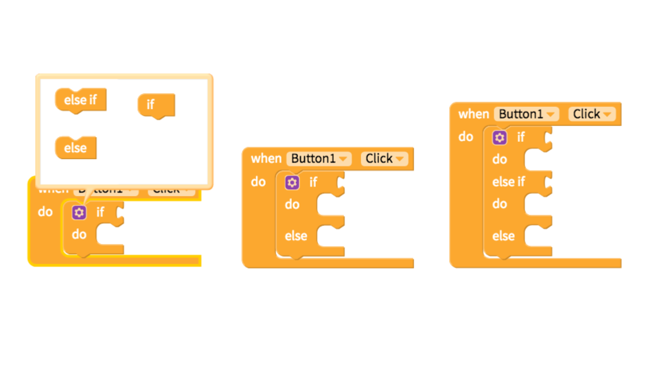
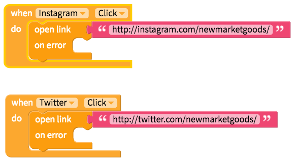
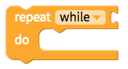
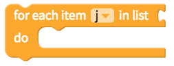
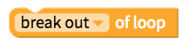

# Control

## If `this`, do `that`

In most apps, one event leads to another event if a condition is met. To specify these scenarios, the `this`, do `that` block is commonly used with [Logic](logic.md) blocks that define the conditions that lead one event to the next.

The if `this`, do `that` block can be transformed to support more complex logic

## Open a screen

You can manage much of your screen navigation through our [Tab](tab-navigator.md), [Drawer](drawer-navigator.md) and [Stack](stack-navigator.md) navigator components but for simple screen navigation, you can use the very popular block below

## Open an installed app or website by link

You can prompt a user to open a page within an app installed on their phone or a url in their browser using the block above.

Thanks to the development of universal links for iOS and Android app links, you simply need to enter the url of the webpage for your app to automatically open to the app if it's installed or open the web browser if it is not.

You can see this block featured in the sample app, [New Market Goods](control.md).

## Repeat an event

## Repeat an event with a loop

