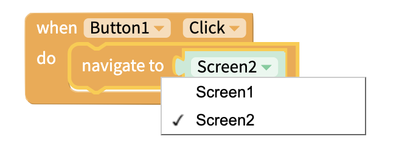
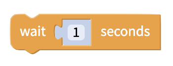
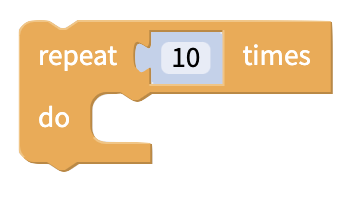
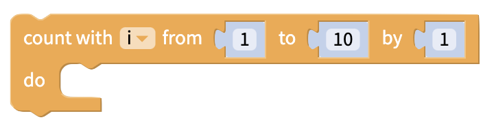

# Control

## Navigate to a Screen

You can manage much of your screen navigation through our [Top Tab](top-tab-navigator.md), [Bottom Tab](bottom-tab-navigator.md), [Drawer](drawer-navigator.md) and [Stack](broken-reference) navigator components but for simple screen navigation, you can use the very popular block below

## If `this`, do `that`

.png>)

In most apps, one event leads to another event if a **condition** is met. To specify these scenarios, the `this`, do `that` block is commonly used with [Logic](logic.md) blocks that define the conditions that lead one event to the next.

The if `this`, do `that` block can be transformed to support more complex logic

.png>)

### Test

The Test block can be used to return a value based on a given condition. If the condition is true, one value is returned. If the condition is false, a different value is returned.

## Wait

Wait the specified amount of time before performing the next action.

## Loops

Repeat a set of blocks for a specified amount of time

### Forever

Repeat an action for an unlimited period of time

### Repeat \[10] Times

Repeat an action the specified number of times

### Count with i from \[1] to \[10] by \[1]

Repeat an action for a certain amount of times, with the incrementer index _i_

### For each item j in list

Repeat an action over every item in a list

### Repeat while

Repeats an action while a condition is true

### Break out of loop

Break out of an existing loop

## Open an Installed App or Website by Link

You can prompt a user to open a page within an app installed on their phone or a url in their browser using the block above.

If the device has the relevant app installed, the link will open in the app. Otherwise, the link will open in the browser.
