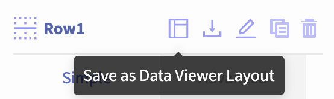
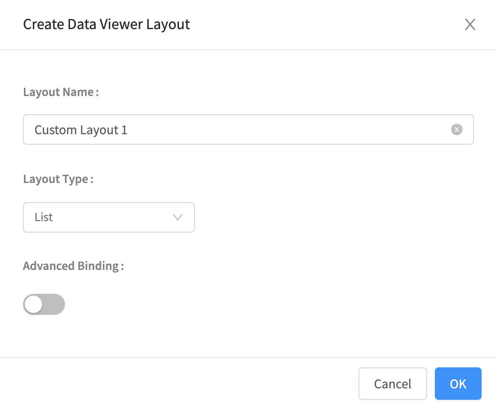
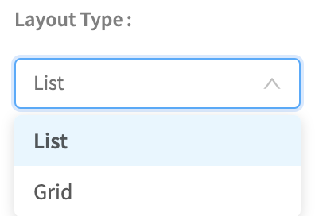
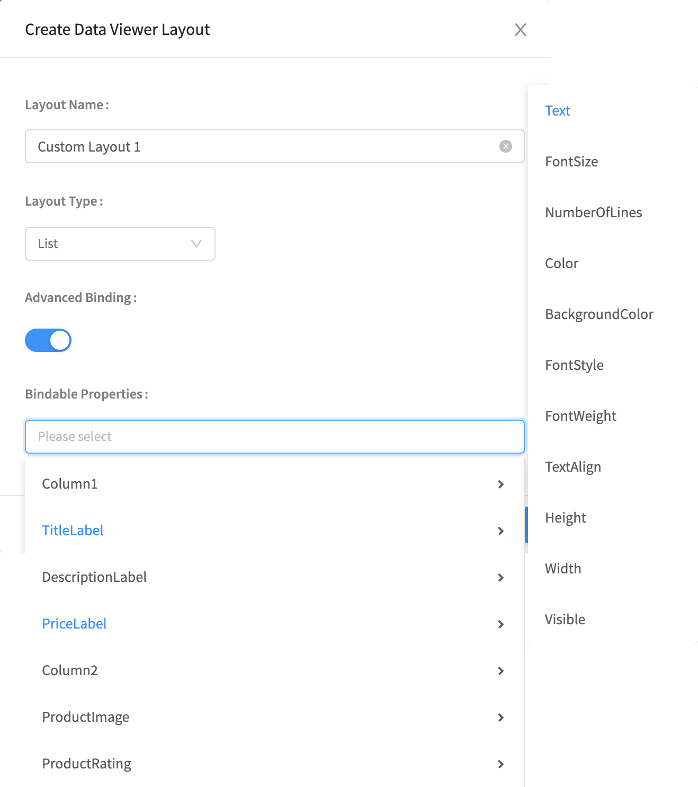
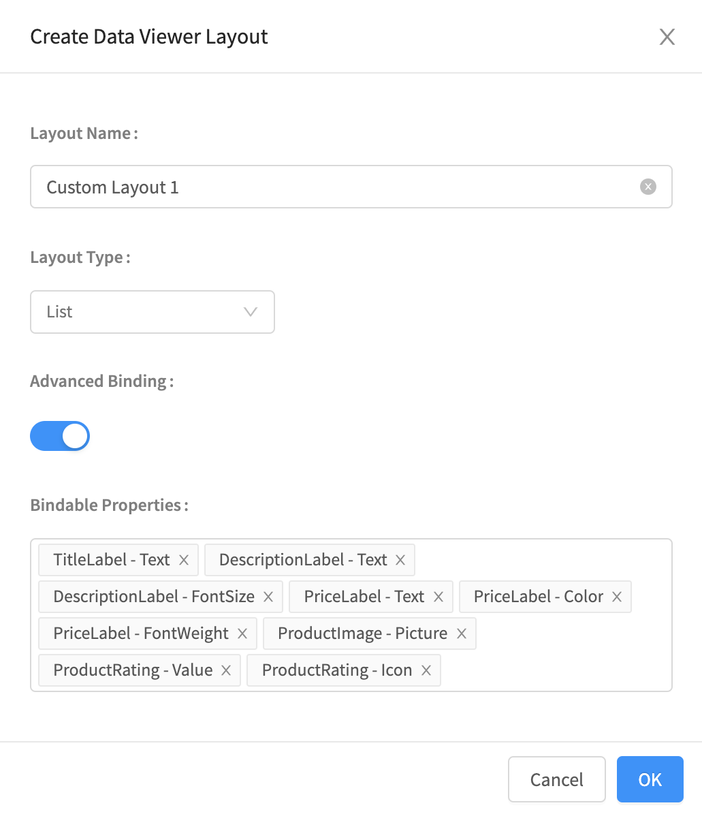
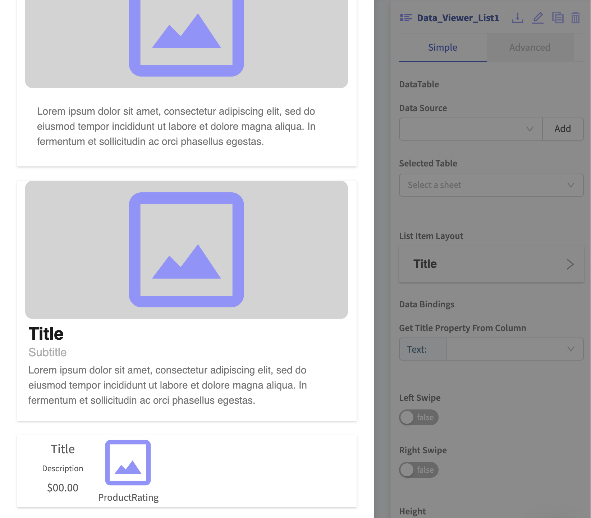
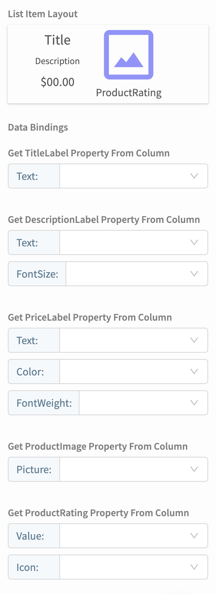
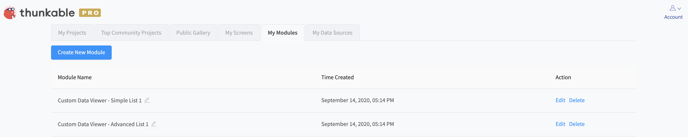

# Custom Data Viewer Layout

## Overview

While the [Data Viewer List](data-viewer-list.md) and [Data Viewer Grid](data-viewer-grid.md) have different layout options, you may want to design a custom layout for your data. This can be achieved with [Row](row.md) and [Column](column.md) components.

## Video Tutorial



## How To Use a Custom Layout in Your App

### Design your Custom Layout

Use a [Row](row.md) or [Column](column.md) to create the custom layout you want. We will refer to this as the 'Parent Row/Column' for the rest of this doc. 

This layout is a Row that contains two Columns. The first Column contains 3 [Labels](label.md): **TitleLabel**, **DescriptionLabel**, and **PriceLabel**. The second Column contains an [Image](image-1.md), **ProductImage**, and a Rating, called **ProductRating**. These components will be referenced in subsequent screenshots in this document.


If you want to set the height or width of your parent row/column to fill the container, we recommend setting it to **Relative Size - 100%** for best results.


### Save your Custom Layout

Select your Parent Row/Column and click the 'Save as Data Viewer Layout' button.

#### Basic

When you click **Save as Data Viewer Layout**, you will see the following dialog:

To save a basic Data Viewer Layout:

* Enter a **Layout Name**
* Select if your **Layout Type** is **List** or **Grid**

* Let **Advanced Binding** be set to **false**
* Click **OK**

#### Advanced

To save an advanced Data Viewer Layout:

* Enter a **Layout Name**
* Select if your **Layout Type** is **List** or **Grid**
* Set **Advanced Binding** to **true**

You can now select which properties of the components in your Parents Row/Column you want to bind to the values in your Data Source.

Once you have selected all of the properties that you want bound to the values in your Data Source, click **OK** to save your custom Data Viewer layout.

### Use Your Custom Layout

Once you have saved your custom layout, you can select it as a layout for your Data Viewer. If your layout was saved with the Layout Type List, it can be used with the [Data Viewer List](data-viewer-list.md). If it was saved with the Layout Type Grid, it can be used with the [Data Viewer Grid](data-viewer-grid.md).

### Bind Your Data to Your Custom Layout

You can bind the properties of your data to a [Data Source](data-sources.md).

#### Basic

With Basic Data Binding, Thunkable will automatically select basic properties of your components to bind to values in your data source.

#### Advanced

With Advanced Data Binding, Thunkable will allow you to bind the properties that you specified to your data source:

## Managing your Custom Data Layouts

You can manage your custom data layouts by going to your Thunkable homepage at [x.thunkable.com/projects](https://x.thunkable.com/projects) and clicking on the **My Modules** tab at the top of the page. From here, you can edit and delete your custom data layouts.

