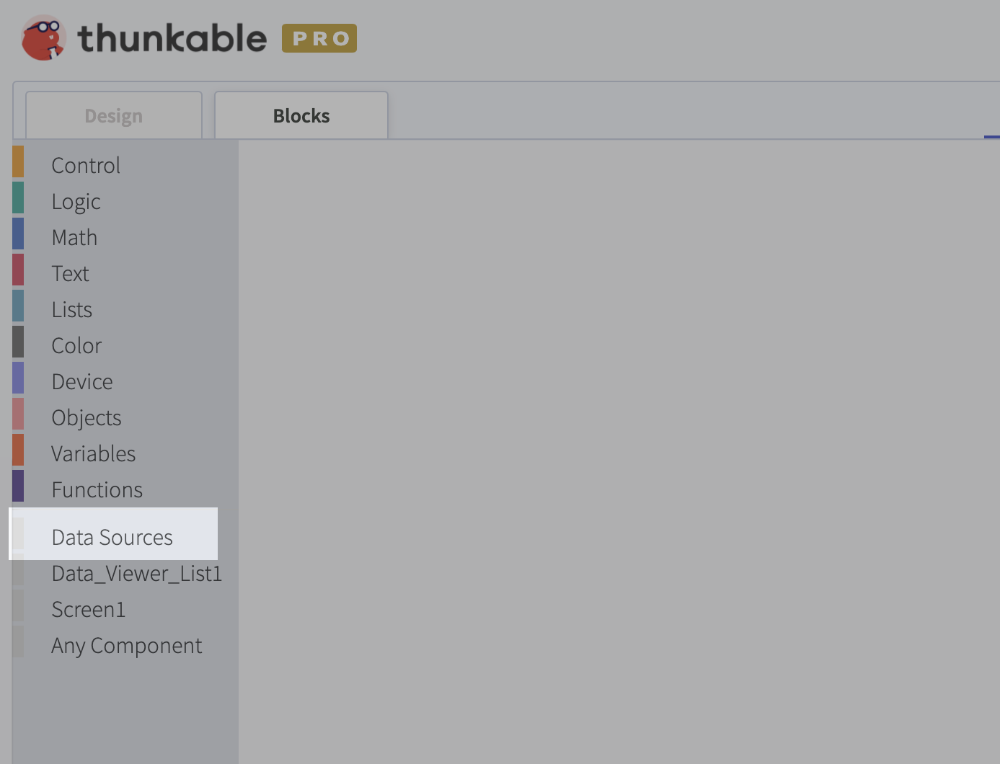
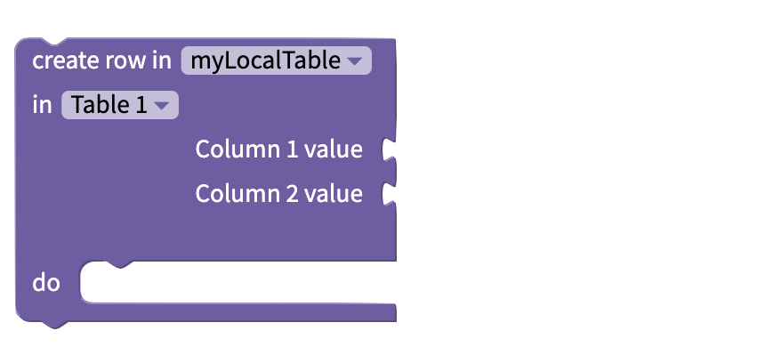
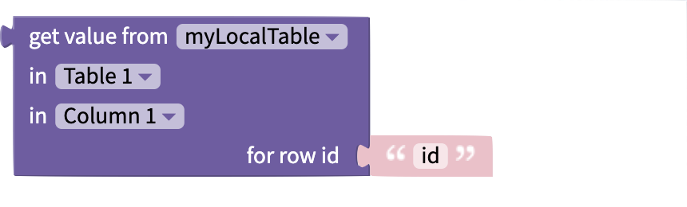
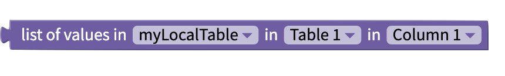
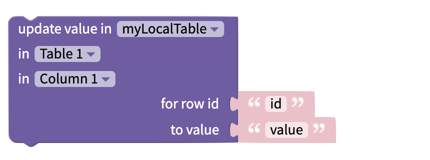

# Data Sources

The Data Sources blocks allow you to perform a variety of CRUD \(**C**reate, **R**ead, **U**pdate, **D**elete\) operations on records that you have stored in Airtable, Google Sheets or Local Tables.

To access the Data Sources blocks you need to add a [Data Viewer List](data-viewer-list.md) or a [Data Viewer Grid](data-viewer-grid.md) to your project.

### Create 

The `create row in`block allows you to append new rows to the end of your data tables. 

The inputs are dynamic so if you change the name of Column 1 or Column 2 in the designer these changes will be reflected in the block too.

### Read 

The `get value from` blocks allows you get read one value from a specific cell in your data table. You can specify the column name in the block itself and pass the unique row id as an input. 

Note that each row has its own unique 24 character ID so passing an integer such as 0 or 1 will not work in this block.

The `list of values in` block allows you to read an entire column of data from a table and returns it as a list that you can then manipulate with the built-in [List blocks](lists.md).

The `number of rows in` block returns an integer corresponding to how many rows are in a given table.

### Update 

You can use the `update value in` block to modify or update an existing cell in your data table. The column name is specified in the block itself. Both the **row id** and new **value** are passed as inputs. 

### Delete

In the initial release of the [Data Viewer List](data-viewer-list.md) and the [Data Viewer Grid](data-viewer-grid.md) there are currently no blocks for removing data or deleting data from a table.

We are planning on adding more features and blocks, including delete blocks, in future updates to these components. 

