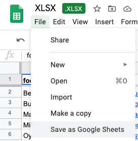
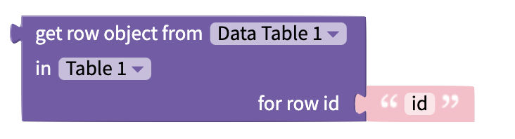
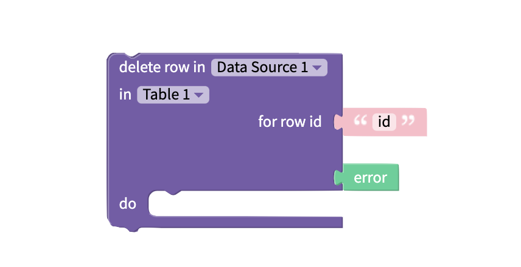
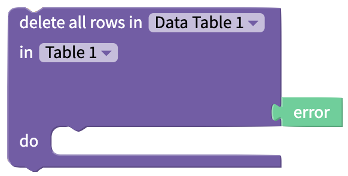

# Data Sources

The data sources blocks allow you to perform a variety of CRUD (**C**reate, **R**ead, **U**pdate, **D**elete) operations on records you have stored in Airtable, Google Sheets, Weblow or a local tables.

## 1. Connect Your App to a Data Source

There are two ways to connect your app to a source:

1. Add a Data Viewer (list or grid) to your project. More on Data Viewers is available here: [data-viewers.md](data-viewers.md "mention"), OR
2. Click the Data Sources icon in the menu on the far left and click the ⊕ icon.
3. In the modal that appears, select a previously connected Data Source, or add a new one.&#x20;
4. When connecting to a new data source, select from one of the following options: \
   •  [Create your own table](data-sources.md#create-your-own-table)\
   •  [Airtable](data-sources.md#airtable)\
   •  [Google Sheets](data-sources.md#google-sheets)\
   •  [Webflow](data-sources.md#webflow)

## 2. Create your Own Table



To create your own table as a data source:

1. Follow the steps above: [Connect Your App to a Data Source](data-sources.md#1.-connect-your-app-to-a-data-source) and select **Create your own table**.
2. Give your local data source table a name.
3. Click **Create**.
4.  To add data to your local table, copy and paste it from another source or click into a cell and type to input the data. \

    

    

    

5. To modify the table's columns:
   * To **update** the table’s column headers, click their names and typ a new header name.
   * To **add** additional columns, click the **+ New Column** button.
   * To **delete** columns, click the **x** in the column’s title box.
6. To modify the table's rows:
   * To **add** additional rows, with your cursor in the bottom row, press your keyboard’s enter or return key.&#x20;
   * To **delete** a row, right-click on it and select **Remove row**.
7. When your table is complete, click the **X** in the upper right.
8. The newly created local data source is now listed in your project's list of data sources.
   * Click the pencil icon to **rename** the data source.&#x20;
   * Click the data source's name to review and **edit** the data.
   *   Click the trash can icon to **delete** the data source from your project.\

       

       

       

## 3. Airtable&#x20;



In Airtable, a base in considered to be the data source. Adding an [Airtable](https://www.airtable.com/) database is simple.&#x20;

To start, copy your API key from your Airtable account page. An Airtable API key is a 14 character code that begins with the three letters "key". Paste this key into Thunkable and click the `Refresh` button to see a list of your Airtable bases.&#x20;

Choose the base you want to use as your data source and click `Create`.

### Google Sheets



In Google Sheets, the entire document is considered to be the data source.

In order to use a Google Sheet as a data source, the first row in your Sheet must be a **header** row.

Your Google Sheet must be [sharable](https://support.google.com/docs/answer/2494822?hl=en\&co=GENIE.Platform%3DDesktop) for Thunkable to access its data.&#x20;

To connect a Google Sheet, sign in and grant permission for your Thunkable project to access your Google Drive.


Some users have reported issues connecting to Google Sheets if they are using G Suite for Education accounts. You may need to contact your G Suite administrator to review your security settings.&#x20;


Once you have allowed this, you will see a list of spreadsheets in your Google Drive. If you don't see the sheet you are looking for you can switch to list view, sort alphabetically or search for the one you need. Click `Select` to return to your Thunkable project.

At this time, connecting to **.xlsx** files that are hosted on Google Sheets is not supported. You can convert your .xlsx file to a Google Sheet before connecting it to your Thunkable app project. Simply open your .xlsx file on Google Sheets, then click **File > Save as Google Sheets**.


Looking to reset your Google Sheets connection? [Click here](troubleshooting/#how-can-i-reset-my-google-sheets-connection-in-thunkable) for instructions


### Webflow



When using Weblow as the data source for your Thunkable app, you’ll connect to a Webflow CMS or Content Management System collection.&#x20;

To connect your Webflow CMS to your Thunkable project, you have two options:

* API Key
* OAuth

#### Connecting by API Key

Within the Webflow platform:

1. Navigate to your site settings.
2. Click the Integrations tab
3. Under the **API access** header, click Generate API token.&#x20;
4. Copy the Webflow API token.

Within the Thunkable platform:

1. Paste the copied Webflow API token into the corresponding field.&#x20;
2. Click **Refresh** to see your Webflow sites.&#x20;
3. Select the site you want to use as your data source.
4. Click Create.&#x20;


To protect the quality of its service, the Webflow CMS API default rate limit is 60 requests/minute.  Exceeding this limit will result in an error on the Thunkable platform, so please keep this in mind as you build your app.


#### Connecting by OAuth

1. Click **Connect to Webflow**.
2. A Webflow authorization screen opens.
3. Select the sites or Workspaces you want to authorize access to.
4.  Click **Authorize app**.\

    <figure><figcaption></figcaption></figure>

## Data Source blocks

### Create&#x20;



The `create row in`block allows you to append new rows to the end of your data tables.&#x20;

The inputs are dynamic so if you change the name of Column 1 or Column 2 in the designer these changes will be reflected in the block too.

### Read&#x20;



The `get value from` blocks allows you get read one value from a specific cell in your data table. You can specify the column name in the block itself and pass the unique row id as an input.&#x20;

Note that each row has its own unique 24 character ID. You must use this ID to refer to rows of your Airtable and Local data sources in the blocks below.

If your data source is a **Google Sheet**, you can refer to the row by its integer position (1 for the first row, 2 for the second row, etc.)

`Get row object` will return the row object of the specified row ID. The row object can be used with [Objects blocks.](objects.md)

The `list of values in` block allows you to read an entire column of data from a table and returns it as a list that you can then manipulate with the built-in [List blocks](lists.md).

The `number of rows in` block returns an integer corresponding to how many rows are in a given table.

### Update&#x20;



You can use the `update value in` block to modify or update an existing cell in your data table. The column name is specified in the block itself. Both the **row id** and new **value** are passed as inputs.&#x20;

### Delete



#### Delete Row

You can use the `Delete Row` block to delete a row of data from your Data source. \
The `row id` is passed as an input.\
If there is an `error`, the error message is passed as an output.&#x20;

#### Delete All Rows

You can use the `delete all rows` block to delete all rows in your data source.\
If there is an `error`, the error message is passed as an output.

