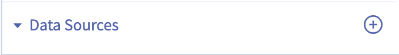
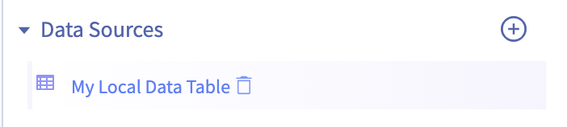

# Data Sources

The Data Sources blocks allow you to perform a variety of CRUD \(**C**reate, **R**ead, **U**pdate, **D**elete\) operations on records that you have stored in Airtable, Google Sheets or Local Tables.

## Add a Data Source to your App

To access the Data Sources blocks you need to add a Data Source to your app. There are two ways to do this:

* Add a [Data Viewer List](data-viewer-list.md) or a [Data Viewer Grid](data-viewer-grid.md) to your project
* Click on the ⊕ icon in the Data Sources section of your component tree:

In the modal that appears, you can choose a previously connected Data Source, or add a new Data Source. 

### Adding a New Data Source

When adding a new Data Source, you can choose between [Create your own table](data-viewer-list.md#create-your-own-table), [Airtable](data-viewer-list.md#airtable) or [Google Sheets](data-viewer-list.md#google-sheets) as the source of your data.

### Create your Own Table

Start by naming your data source.

You can now see this Data Source from your Data Sources section. Click on the Data Source name to edit it.

The data editor allows you to edit, add, and delete columns of information. To change any of the individual values simply click on the cell and type whatever you like. 

### Airtable 

In Airtable, a base in considered to be the data source. Adding an [Airtable DB]() is really simple. 

To start, copy your API key from your Airtable [account page](https://airtable.com/account). An Airtable API key is a 14 character code that begins with the three letters "key". Paste this key into Thunkable and click the `Refresh` button to see a list of your Airtable bases. 

Choose the base you want to use as your data source and click `Create`.

### Google Sheets

In Google Sheets, the entire document is considered to be the data source.

In order to use a Google Sheet as a Data Source, the first row in your Sheet must be a **header** row. 

To connect a Google Sheet, sign in and grant permission for your Thunkable project to access your Google Drive.

Once you have allowed this, you will see a list of spreadsheets in your Google Drive. If you don't seen the sheet you are looking for you can switch to list view, sort alphabetically or search for the one you need. Click `Select` to return to your Thunkable project.

At this time, connecting to **.xlsx** files that are hosted on Google Sheets is not supported. You can convert your .xlsx file to a Google Sheet before connecting it to your Thunkable app project. Simply open your .xlsx file on Google Sheets, then click **File &gt; Save as Google Sheets**.


Some users have reported issues connecting to Google Sheets if they are using G Suite for Education accounts. The quickest way around this, for now, is to user a personal Gmail account. If you need a large group or class to use this feature then you may need to contact your G Suite administrator to review your security settings. 


## Data Source blocks

### Create 

The `create row in`block allows you to append new rows to the end of your data tables. 

The inputs are dynamic so if you change the name of Column 1 or Column 2 in the designer these changes will be reflected in the block too.

### Read 

The `get value from` blocks allows you get read one value from a specific cell in your data table. You can specify the column name in the block itself and pass the unique row id as an input. 

Note that each row has its own unique 24 character ID. You must use this ID to refer to rows of your Airtable and Local data sources in the blocks below.

If your data source is a **Google Sheet**, you can refer to the row by its integer position \(1 for the first row, 2 for the second row, etc.\)

`Get row object` will return the row object of the specified row ID. The row object can be used with [Objects blocks.](objects.md)

The `list of values in` block allows you to read an entire column of data from a table and returns it as a list that you can then manipulate with the built-in [List blocks](lists.md).

The `number of rows in` block returns an integer corresponding to how many rows are in a given table.

### Update 

You can use the `update value in` block to modify or update an existing cell in your data table. The column name is specified in the block itself. Both the **row id** and new **value** are passed as inputs. 

### Delete

#### Delete Row

You can use the `Delete Row` block to delete a row of data from your Data source.   
The `row id` is passed as an input.  
If there is an `error`, the error message is passed as an output. 

#### Delete All Rows

You can use the `delete all rows` ****block to delete all rows in your data source.  
If there is an `error`, the error message is passed as an output.

